---
## Front matter
lang: ru-RU
title: Упражнение
subtitle: Моделирование в xcos
author:
  - Демидова Е. А.
institute:
  - Российский университет дружбы народов, Москва, Россия
date: 3 мая 2024

## i18n babel
babel-lang: russian
babel-otherlangs: english

## Formatting pdf
toc: false
toc-title: Содержание
slide_level: 2
aspectratio: 169
section-titles: true
theme: metropolis
header-includes:
 - \metroset{progressbar=frametitle,sectionpage=progressbar,numbering=fraction}
 - '\makeatletter'
 - '\beamer@ignorenonframefalse'
 - '\makeatother'
---

# Вводная часть

## Цели 

Построить с помощью xcos фигуры Лиссажу.

## Задачи

Построить с помощью xcos фигуры Лиссажу со следующими параметрами:

1) $A = B = 1$, $a = 2$, $b = 2$, $\delta = 0$; 
                $\pi/4$; $\pi/2$; $3 \pi/4$; $\pi$;
2) $A = B = 1$, $a = 2$, $b = 4$, $\delta = 0$; 
                $\pi/4$; $\pi/2$; $3 \pi/4$; $\pi$;
3) $A = B = 1$, $a = 2$, $b = 6$, $\delta = 0$; 
                $\pi/4$; $\pi/2$; $3 \pi/4$; $\pi$;
4) $A = B = 1$, $a = 2$, $b = 3$, $\delta = 0$; 
                $\pi/4$; $\pi/2$; $3 \pi/4$; $\pi$;

# Выполнение лабораторной работы

## Математическая модель

$$
\begin{cases}
	x(t) = A sin(at+\delta), \\
	y(t) = B sin(bt),
\end{cases}
$$

где $A$, $B$ -- амплитуды колебаний, $a$, $b$ -- частоты, $\delta$ -- сдвиг фаз.

## Реализация модели в xcos

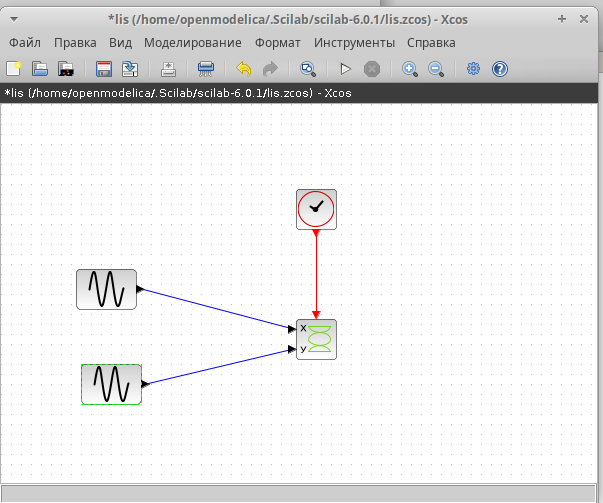{#fig:001 width=50%}

## Реализация модели в xcos

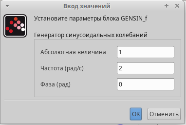{#fig:002 width=70%}

## Реализация модели в xcos

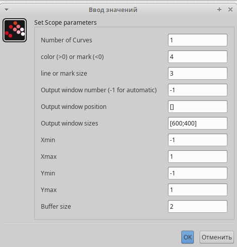{#fig:003 width=50%}

## Реализация модели в xcos

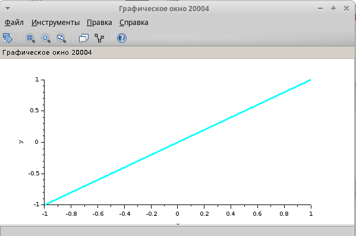{#fig:004 width=70%}

## Реализация модели в xcos

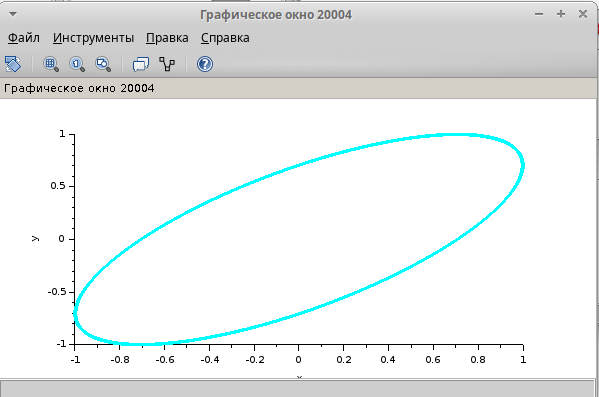{#fig:005 width=70%}

## Реализация модели в xcos

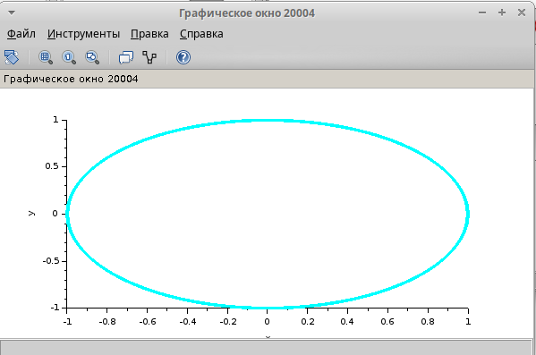{#fig:006 width=70%}

## Реализация модели в xcos

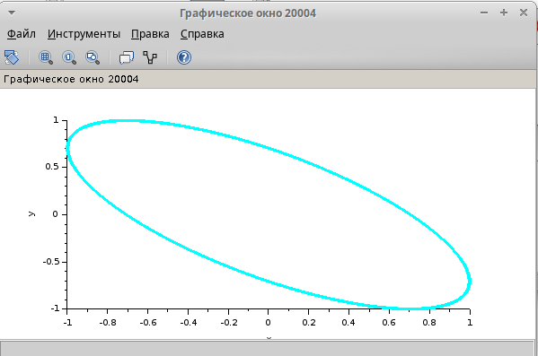{#fig:007 width=70%}

## Реализация модели в xcos

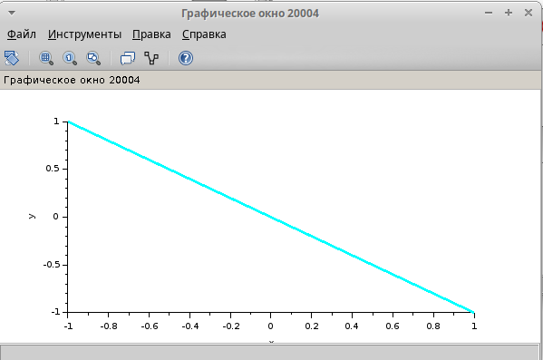{#fig:008 width=70%}

## Реализация модели в xcos

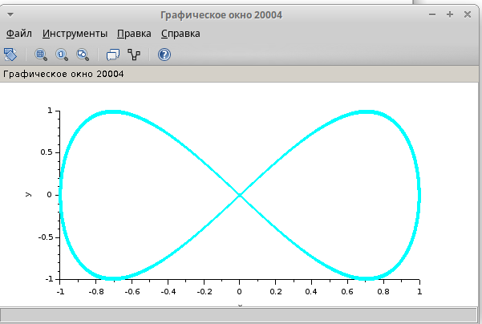{#fig:009 width=70%}

## Реализация модели в xcos

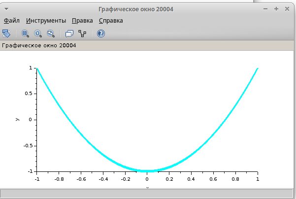{#fig:010 width=70%}

## Реализация модели в xcos

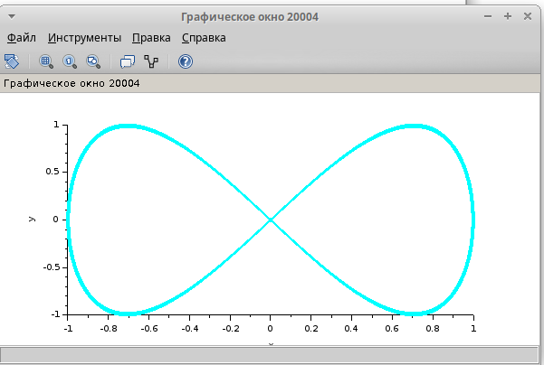{#fig:011 width=70%}

## Реализация модели в xcos

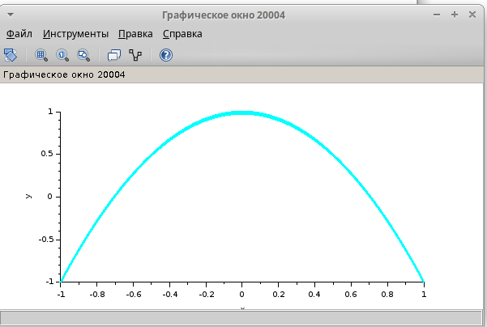{#fig:012 width=65%}

## Реализация модели в xcos

{#fig:013 width=70%}

## Реализация модели в xcos

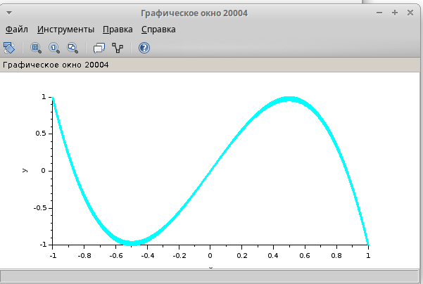{#fig:014 width=70%}

## Реализация модели в xcos

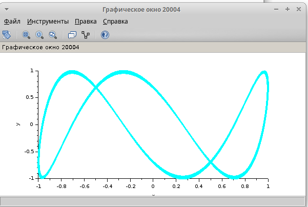{#fig:015 width=70%}

## Реализация модели в xcos

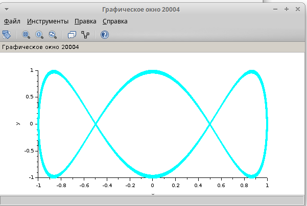{#fig:016 width=70%}

## Реализация модели в xcos

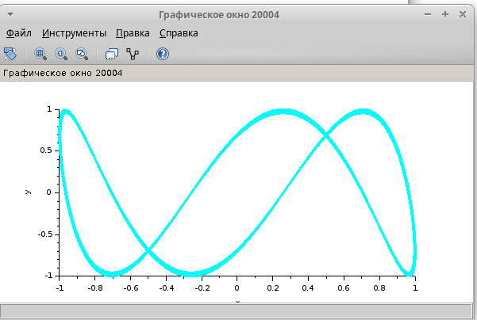{#fig:017 width=70%}

## Реализация модели в xcos

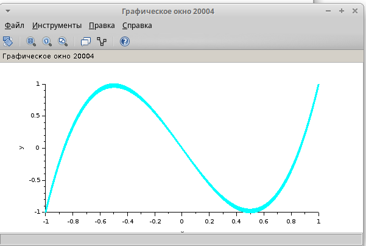{#fig:018 width=70%}

## Реализация модели в xcos

{#fig:019 width=70%}

## Реализация модели в xcos

{#fig:020 width=70%}

## Реализация модели в xcos

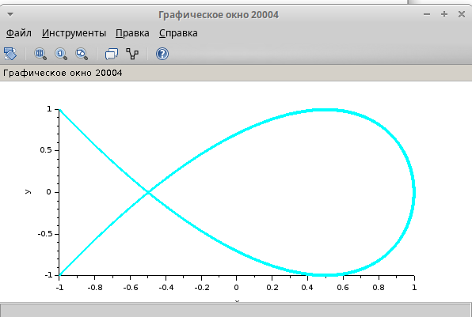{#fig:021 width=70%}

## Реализация модели в xcos

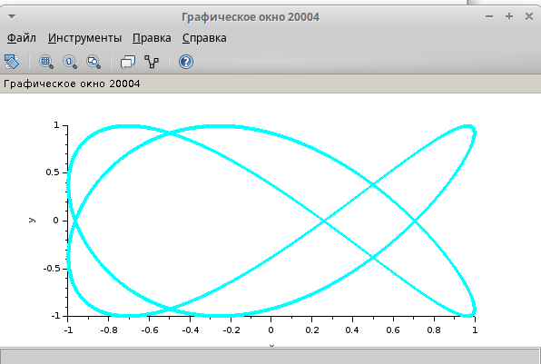{#fig:022 width=70%}

## Реализация модели в xcos

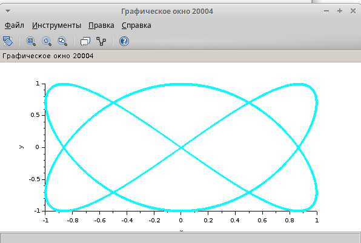{#fig:023 width=70%}

# Выводы

В результате выполнения работы были построены с помощью xcos фигуры Лиссажу.

