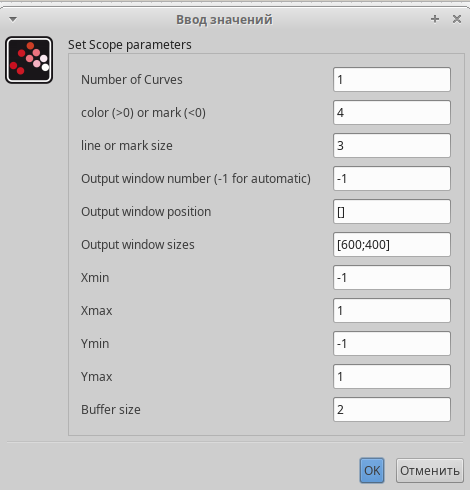

---
## Front matter
title: "Упражнение"
subtitle: "Моделирование в xcos"
author: "Демидова Екатерина Алексеевна"

## Generic otions
lang: ru-RU
toc-title: "Содержание"

## Bibliography
bibliography: bib/cite.bib
csl: pandoc/csl/gost-r-7-0-5-2008-numeric.csl

## Pdf output format
toc: true # Table of contents
toc-depth: 2
lof: true # List of figures
lot: false # List of tables
fontsize: 12pt
linestretch: 1.5
papersize: a4
documentclass: scrreprt
## I18n polyglossia
polyglossia-lang:
  name: russian
  options:
	- spelling=modern
	- babelshorthands=true
polyglossia-otherlangs:
  name: english
## I18n babel
babel-lang: russian
babel-otherlangs: english
## Fonts
mainfont: PT Serif
romanfont: PT Serif
sansfont: PT Sans
monofont: PT Mono
mainfontoptions: Ligatures=TeX
romanfontoptions: Ligatures=TeX
sansfontoptions: Ligatures=TeX,Scale=MatchLowercase
monofontoptions: Scale=MatchLowercase,Scale=0.9
## Biblatex
biblatex: true
biblio-style: "gost-numeric"
biblatexoptions:
  - parentracker=true
  - backend=biber
  - hyperref=auto
  - language=auto
  - autolang=other*
  - citestyle=gost-numeric
## Pandoc-crossref LaTeX customization
figureTitle: "Рис."
tableTitle: "Таблица"
listingTitle: "Листинг"
lofTitle: "Список иллюстраций"
lotTitle: "Список таблиц"
lolTitle: "Листинги"
## Misc options
indent: true
header-includes:
  - \usepackage{indentfirst}
  - \usepackage{float} # keep figures where there are in the text
  - \floatplacement{figure}{H} # keep figures where there are in the text
---

# Цель работы

Построить с помощью xcos фигуры Лиссажу.

# Задание

Построить с помощью xcos фигуры Лиссажу со следующими параметрами:

1) $A = B = 1$, $a = 2$, $b = 2$, $\delta = 0$; 
                $\pi/4$; $\pi/2$; $3 \pi/4$; $\pi$;
2) $A = B = 1$, $a = 2$, $b = 4$, $\delta = 0$; 
                $\pi/4$; $\pi/2$; $3 \pi/4$; $\pi$;
3) $A = B = 1$, $a = 2$, $b = 6$, $\delta = 0$; 
                $\pi/4$; $\pi/2$; $3 \pi/4$; $\pi$;
4) $A = B = 1$, $a = 2$, $b = 3$, $\delta = 0$; 
                $\pi/4$; $\pi/2$; $3 \pi/4$; $\pi$;

# Выполнение лабораторной работы

## Математическая модель

$$
\begin{cases}
	x(t) = A sin(at+\delta), \\
	y(t) = B sin(bt),
\end{cases}
$$

где $A$, $B$ -- амплитуды колебаний, $a$, $b$ -- частоты, $\delta$ -- сдвиг фаз.

## Реализация модели в xcos

Построим модель при помощи блоков моделирования(рис. [-@fig:001]).

{#fig:001 width=50%}

В модели использованы следующие блоки xcos:
- CLOCK_c -- запуск часов модельного времени;
- GENSIN_f -- блок генератора синусоидального сигнала;
- CSCOPXY -- регистрирующее устройство для построения графика типа y = f (x);
- TEXT_f -- задаёт текст примечаний.

Затем будем зададавать разные значения для параметров блоков генераторов синусоидального сигнала, фаза меняется только у блока, описывающего изменение $x$(верхний). На рис. [-@fig:002] изображен пример для одного из них

{#fig:002 width=70%}

Также зададим параметры устройства для построения графика(рис. [-@fig:003]).

{#fig:003 width=70%}

Построим графики для варианта 1 (рис. [-@fig:004] - [-@fig:008]). 

{#fig:004 width=70%}

{#fig:005 width=70%}

{#fig:006 width=70%}

{#fig:007 width=70%}

{#fig:008 width=70%}

Построим графики для варианта 2 (рис. [-@fig:009] - [-@fig:013]). 

{#fig:009 width=70%}

{#fig:010 width=70%}

{#fig:011 width=70%}

{#fig:012 width=65%}

{#fig:013 width=70%}

Построим графики для варианта 3 (рис. [-@fig:014] - [-@fig:018]). 

{#fig:014 width=70%}

{#fig:015 width=70%}

{#fig:016 width=70%}

{#fig:017 width=70%}

{#fig:018 width=70%}

Построим графики для варианта 4 (рис. [-@fig:019] - [-@fig:023]). 

{#fig:019 width=70%}

{#fig:020 width=70%}

{#fig:021 width=70%}

{#fig:022 width=70%}

{#fig:023 width=70%}

# Выводы

В результате выполнения работы были построены с помощью xcos фигуры Лиссажу.