---
## Front matter
lang: ru-RU
title: Лабораторная работа 1
subtitle: Простые модели компьютерной сети
author:
  - Демидова Е. А.
institute:
  - Российский университет дружбы народов, Москва, Россия
date: 18 апреля 2024

## i18n babel
babel-lang: russian
babel-otherlangs: english

## Formatting pdf
toc: false
toc-title: Содержание
slide_level: 2
aspectratio: 169
section-titles: true
theme: metropolis
header-includes:
 - \metroset{progressbar=frametitle,sectionpage=progressbar,numbering=fraction}
 - '\makeatletter'
 - '\beamer@ignorenonframefalse'
 - '\makeatother'
---

# Информация

## Цель

Приобретение навыков моделирования сетей передачи данных с помощью средства имитационного моделирования NS-2, а также анализ полученных результатов моделирования.

## Задачи

- Создать шаблон сценария для NS-2
- Рассмотреть простой пример описания топологии сети, состоящей из двух узлов и одного соединения
- Рассмотреть пример с усложнённой топологией сети
- Рассмотреть пример с кольцевой топологией сети
- Выполнить упражнение

# Выполнение лабораторной работы

## Шаблон сценария для NS-2

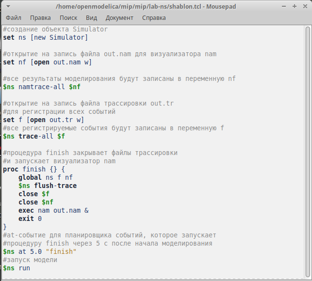{#fig:001 width=50%}

## Шаблон сценария для NS-2

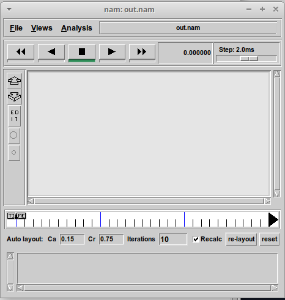{#fig:002 width=40%}

## Простой пример описания топологии сети, состоящей из двух узлов и одного соединения

{#fig:003 width=40%}

## Простой пример описания топологии сети, состоящей из двух узлов и одного соединения

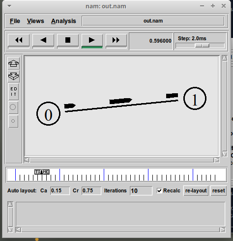{#fig:004 width=40%}

## Пример с усложнённой топологией сети

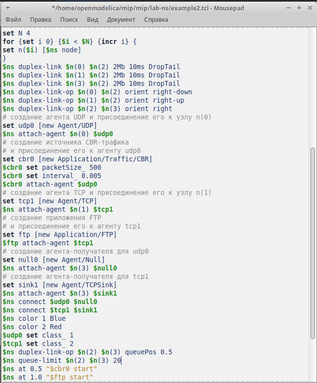{#fig:005 width=40%}

## Пример с усложнённой топологией сети

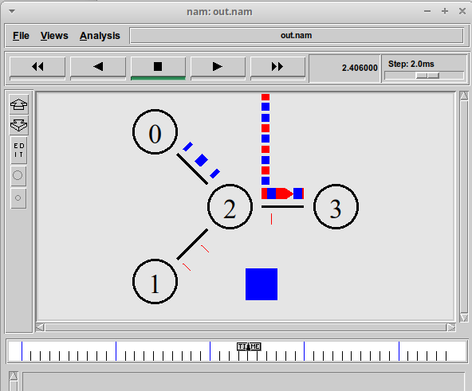{#fig:006 width=50%}

## Пример с кольцевой топологией сети

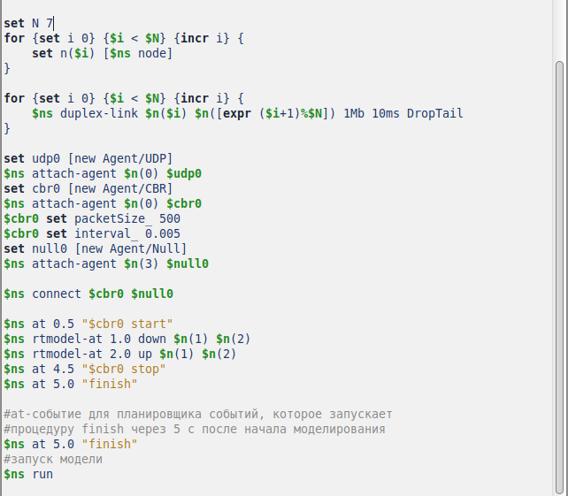{#fig:007 width=50%}

## Пример с кольцевой топологией сети

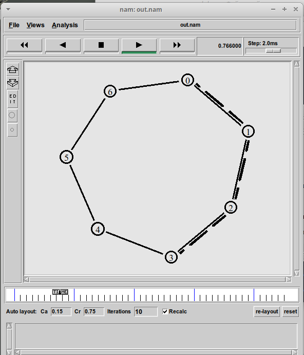{#fig:008 width=40%}

## Пример с кольцевой топологией сети

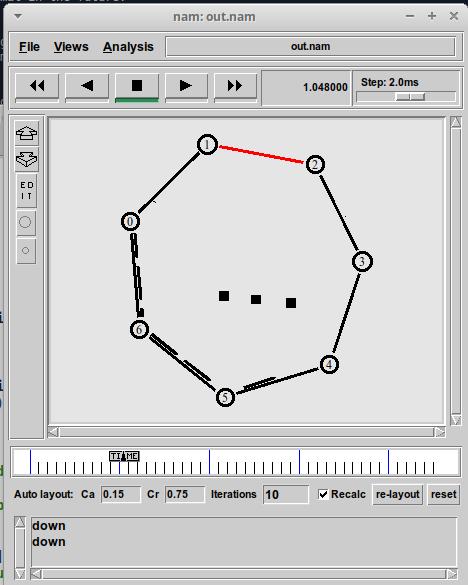{#fig:009 width=40%}

## Упражнение

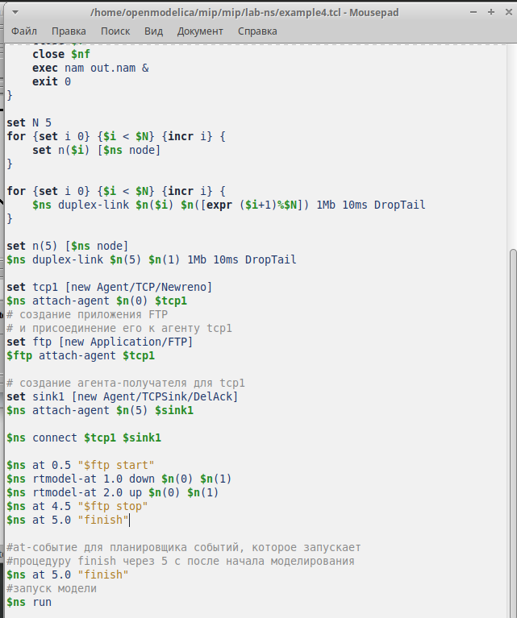{#fig:010 width=40%}

## Упражнение

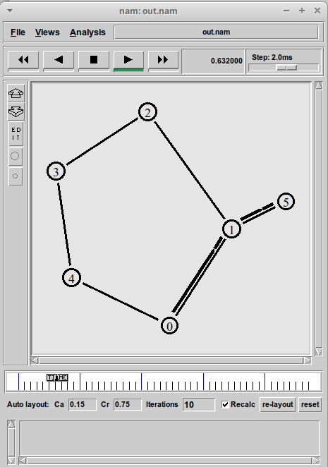{#fig:011 width=35%}

## Упражнение

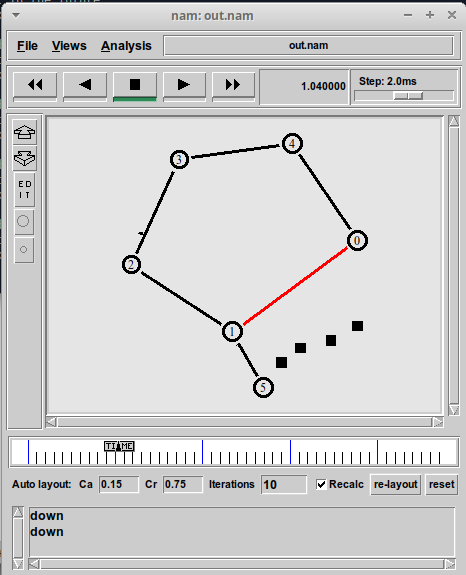{#fig:012 width=40%}

## Упражнение

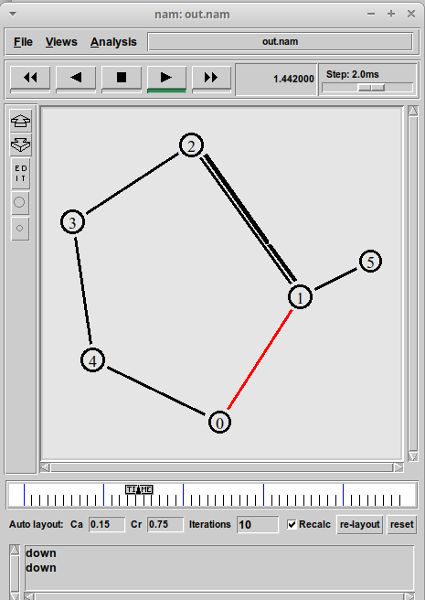{#fig:013 width=35%}

# Заключение

## Выводы

В результате выполнения работы были приобретены навыки моделирования сетей передачи данных с помощью средства имитационного моделирования NS-2, а также провелен анализ полученных результатов моделирования.