---
## Front matter
title: "Лабораторная работа 1"
subtitle: "Простые модели компьютерной сети"
author: "Демидова Екатерина Алексеевна"

## Generic otions
lang: ru-RU
toc-title: "Содержание"

## Bibliography
bibliography: bib/cite.bib
csl: pandoc/csl/gost-r-7-0-5-2008-numeric.csl

## Pdf output format
toc: true # Table of contents
toc-depth: 2
lof: true # List of figures
lot: false # List of tables
fontsize: 12pt
linestretch: 1.5
papersize: a4
documentclass: scrreprt
## I18n polyglossia
polyglossia-lang:
  name: russian
  options:
	- spelling=modern
	- babelshorthands=true
polyglossia-otherlangs:
  name: english
## I18n babel
babel-lang: russian
babel-otherlangs: english
## Fonts
mainfont: PT Serif
romanfont: PT Serif
sansfont: PT Sans
monofont: PT Mono
mainfontoptions: Ligatures=TeX
romanfontoptions: Ligatures=TeX
sansfontoptions: Ligatures=TeX,Scale=MatchLowercase
monofontoptions: Scale=MatchLowercase,Scale=0.9
## Biblatex
biblatex: true
biblio-style: "gost-numeric"
biblatexoptions:
  - parentracker=true
  - backend=biber
  - hyperref=auto
  - language=auto
  - autolang=other*
  - citestyle=gost-numeric
## Pandoc-crossref LaTeX customization
figureTitle: "Рис."
tableTitle: "Таблица"
listingTitle: "Листинг"
lofTitle: "Список иллюстраций"
lotTitle: "Список таблиц"
lolTitle: "Листинги"
## Misc options
indent: true
header-includes:
  - \usepackage{indentfirst}
  - \usepackage{float} # keep figures where there are in the text
  - \floatplacement{figure}{H} # keep figures where there are in the text
---

# Цель работы

Приобретение навыков моделирования сетей передачи данных с помощью средства имитационного моделирования NS-2, а также анализ полученных результатов моделирования.

# Задание

- Создать шаблон сценария для NS-2
- Рассмотреть простой пример описания топологии сети, состоящей из двух узлов и одного соединения
- Рассмотреть пример с усложнённой топологией сети
- Рассмотреть пример с кольцевой топологией сети
- Выполнить упражнение

# Выполнение лабораторной работы

# Шаблон сценария для NS-2

В своём рабочем каталоге создадим директорию mip, в которой будут выполняться лабораторные работы. Внутри mip создадим директорию lab-ns, а в ней файл
shablon.tcl. В него запишем шаблон для программ в NS-2.

Сощдадим объект типа Simulator. Затем создадим переменную nf и укажем, что требуется открыть на запись nam-файл для регистрации выходных результатов моделирования и дадим команду симулятору записывать все данные о динамике модели
в файл out.nam. Далее создадим переменную f и откроем на запись файл трассировки для регистрации всех событий модели. После этого добавим процедуру finish, которая закрывает файлы трассировки и запускает nam. Наконец, с помощью команды at указываем планировщику событий, что процедуру finish следует запустить через 5 с после начала моделирования, после чего запустить симулятор ns(рис. [-@fig:001]).

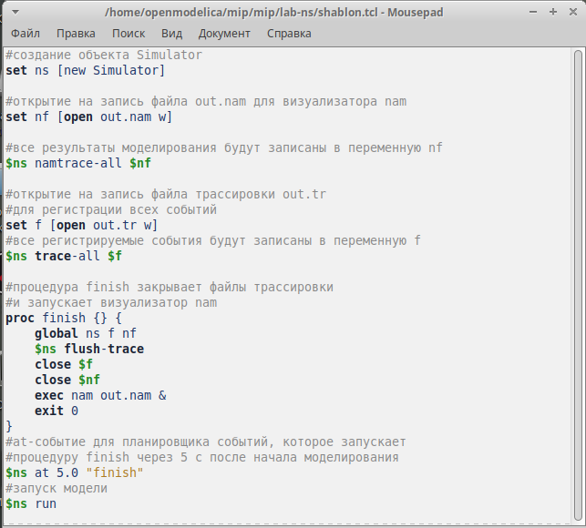{#fig:001 width=70%}

Запустив файл шаблона увидим пустую область моделирования(рис. [-@fig:002]).

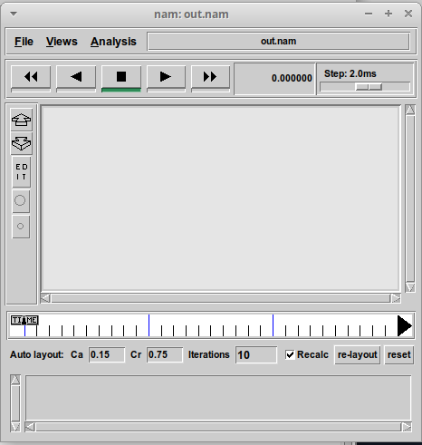{#fig:002 width=70%}

# Простой пример описания топологии сети, состоящей из двух узлов и одного соединения

Смоделирем сеть передачи данных, состоящую из двух узлов, соединённых дуплексной линией связи с полосой пропускания 2 Мб/с и задержкой 10 мс, очередью с обслуживанием типа DropTail. От одного узла к другому по протоколу UDP осуществляется передача пакетов, размером 500 байт, с постоянной скоростью 200 пакетов в секунду. Создадим узлы n0, к котором прикрепим агент UDP с приложением CBR(источник с постоянной скоростью), и n1, к которому прикрепим  Null-агент, который работает как приёмник трафика. И соединим эти агенты между собой(рис. [-@fig:003]).

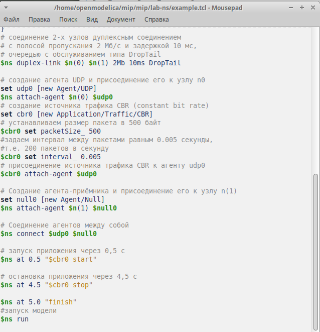{#fig:003 width=70%}

При нажатии на кнопку play в окне nam через 0.5 секунды из узла 0 данные начнут
поступать к узлу 1(рис. [-@fig:004]).

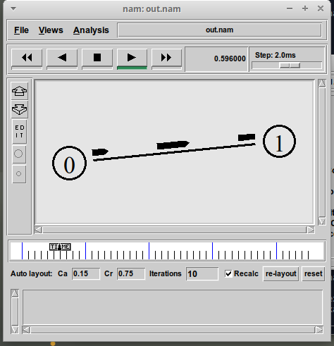{#fig:004 width=70%}

# Пример с усложнённой топологией сети

Описание моделируемой сети:
- сеть состоит из 4 узлов (n0, n1, n2, n3);
–-между узлами n0 и n2, n1 и n2 установлено дуплексное соединение с пропускной способностью 2 Мбит/с и задержкой 10 мс;
- между узлами n2 и n3 установлено дуплексное соединение с пропускной способностью 1,7 Мбит/с и задержкой 20 мс;
- каждый узел использует очередь с дисциплиной DropTail для накопления пакетов, максимальный размер которой составляет 10;
- TCP-источник на узле n0 подключается к TCP-приёмнику на узле n3 (по-умолчанию, максимальный размер пакета, который TCP-агент может генерировать, равняется 1KByte)
- TCP-приёмник генерирует и отправляет ACK пакеты отправителю и откидывает полученные пакеты;
- UDP-агент, который подсоединён к узлу n1, подключён к null-агенту на узле n3 (null-агент просто откидывает пакеты);
- генераторы трафика ftp и cbr прикреплены к TCP и UDP агентам соответственно;
- генератор cbr генерирует пакеты размером 1 Кбайт со скоростью 1 Мбит/с;
- работа cbr начинается в 0,1 секунду и прекращается в 4,5 секунды, а ftp начинает работать в 1,0 секунду и прекращает в 4,0 секунды.

Создадим 4 узла и 3 дуплексных соединения с указанием направления. Создадим агент UDP с прикреплённым к нему источником CBR и агент TCP с прикреплённым к нему приложением FTP. Также создадим агентов-получателей и соединим агенты udp0 и tcp1 и их получателей. Зададим описание цвета каждого потока и введём отслеживание очереди, ограничение на размер очереди(рис. [-@fig:005]).

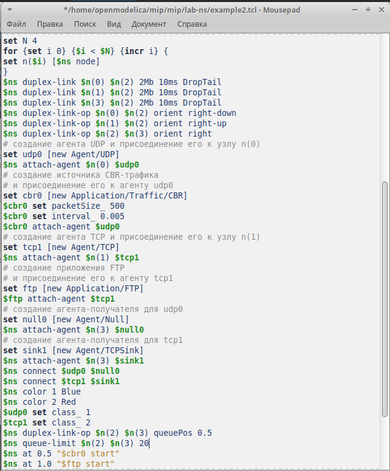{#fig:005 width=70%}

При запуске скрипта можно заметить, что по соединениям между узлами n(0) -- n(2) и n(1) -- n(2) к узлу n(2) передаётся данных больше, чем способно передаваться по соединению от узла n(2) к узлу n(3). Действительно, мы передаём 200 пакетов в секунду от каждого источника данных в узлах n(0) и n(1), а каждый пакет имеет размер 500 байт. Таким образом, полоса каждого соединения 0, 8 Mb, а суммарная -- 1,6 Mb. Но соединение n(2)–n(3) имеет полосу лишь 1 Mb. Следовательно, часть пакетов должна теряться. В окне аниматора можно видеть пакеты в очереди, а также те пакеты, которые отбрасываются при переполнении(рис. [-@fig:006]).

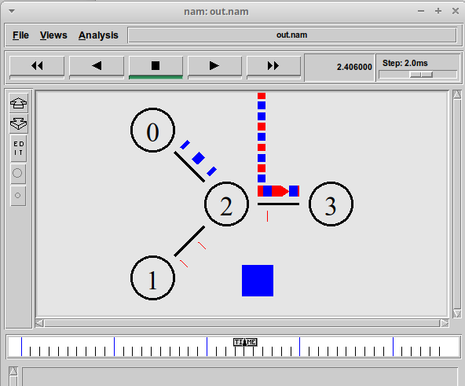{#fig:006 width=70%}

# Пример с кольцевой топологией сети

Требуется построить модель передачи данных по сети с кольцевой топологией и динамической маршрутизацией пакетов:
- сеть состоит из 7 узлов, соединённых в кольцо;
- данные передаются от узла n(0) к узлу n(3) по кратчайшему пути;
- с 1 по 2 секунду модельного времени происходит разрыв соединения между узлами n(1) и n(2);
- при разрыве соединения маршрут передачи данных должен измениться на резервный.

Создадим семь узлов и соединим их в форме кольца. Зададим передачу данных от узла n(0) к узлу n(3) с помощью UDP агента и источника CBR. Добавим команду разрыва соединения между узлами n(1) и n(2) на время в одну секунду, а также время начала и окончания передачи данных. Добавим в начало скрипта после команды создания объекта Simulator, благодаря этому сразу после записка в сети тправляется небольшое количество маленьких пакетов, используемых для обмена информацией, необходимой для маршрутизации между узлами(рис. [-@fig:007]).

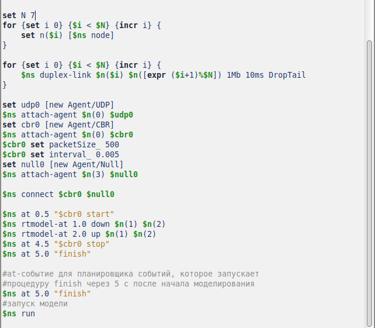{#fig:007 width=70%}

При запуске можно увидеть, что пакеты идут по кратчайшему пути через узлы n(1) и n(2)(рис. [-@fig:008]).

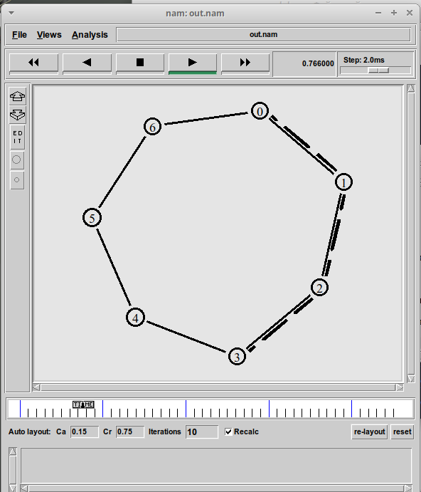{#fig:008 width=70%}

Можно увидеть, что при разрыве часть пакетов теряется. Когда соединение разорвано, информация о топологии обновляется, и пакеты отсылаются по новому маршруту через узлы n(6), n(5) и n(4)(рис. [-@fig:009]).

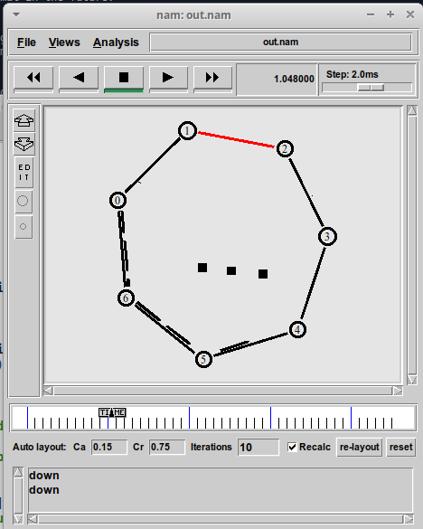{#fig:009 width=70%}

# Упражнение

Упражнение Внесите следующие изменения в реализацию примера с кольцевой топологией сети:
- топология сети должна соответствовать представленной на рис. 1.7;
- передача данных должна осуществляться от узла n(0) до узла n(5) по кратчай- шему пути в течение 5 секунд модельного времени;
- передача данных должна идти по протоколу TCP (тип Newreno), на принимающей стороне используется TCPSink-объект типа DelAck; поверх TCP работает протокол FTP с 0,5 до 4,5 секунд модельного времени;
- с 1 по 2 секунду модельного времени происходит разрыв соединения между узлами n(0) и n(1);
- при разрыве соединения маршрут передачи данных должен измениться на резервный, после восстановления соединения пакеты снова должны пойти по кратчайшему пути

Изменим количество узлов в колце на 5, а 6 узел n(5) отдельно присоединим к узлу n(1). Вместо агента UDP содадим агента  TCP (тип Newreno), на принимающей стороне используется TCPSink-объект типа DelAck; поверх TCP работает протокол FTP с 0,5 до 4,5 секунд модельного времени Также зададим с 1 по 2 секунду модельного времени разрыв соединения между узлами n(0) и n(1)(рис. [-@fig:010]).

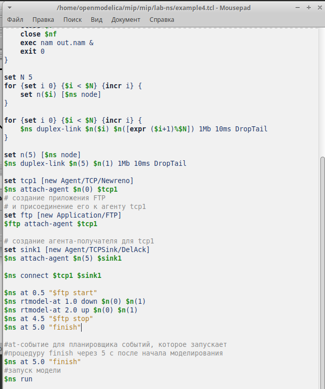{#fig:010 width=70%}

При запуске можно увидеть, что пакеты идут по кратчайшему пути через узел n(1)(рис. [-@fig:011]).

{#fig:011 width=70%}

При разрыве соединения часть пакетов теряется(рис. [-@fig:012]).

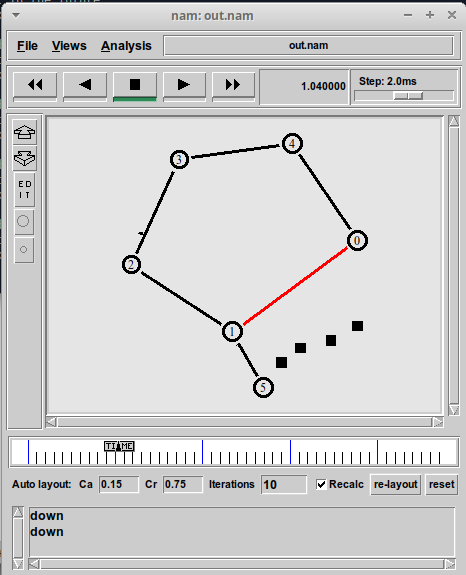{#fig:012 width=70%}

Когда соединение разорвано, информация о топологии обновляется, и пакеты отсылаются по новому маршруту через узлы n(4), n(3), n(2) и n(1)(рис. [-@fig:013]).

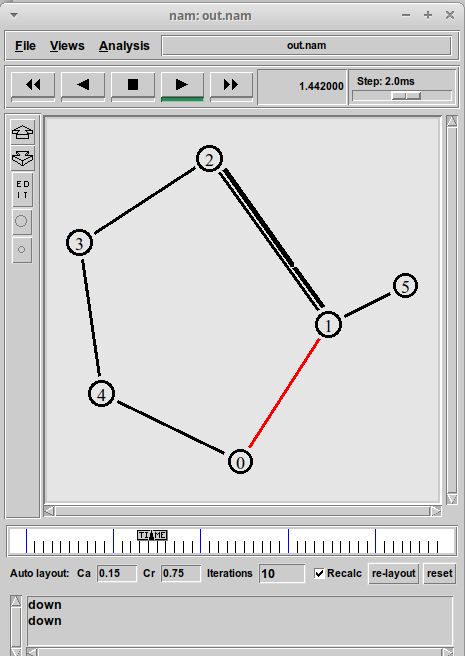{#fig:013 width=70%}

# Выводы

В результате выполнения работы были приобретены навыки моделирования сетей передачи данных с помощью средства имитационного моделирования NS-2, а также провелен анализ полученных результатов моделирования.