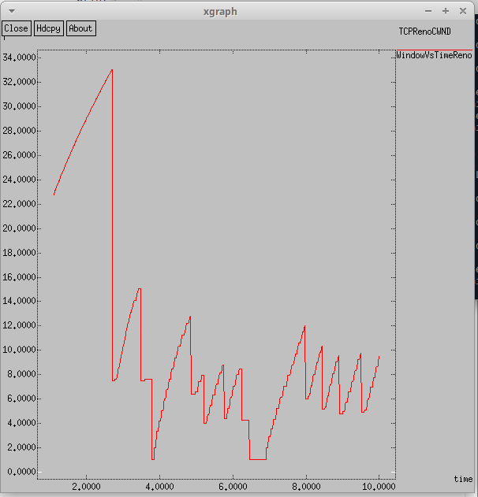
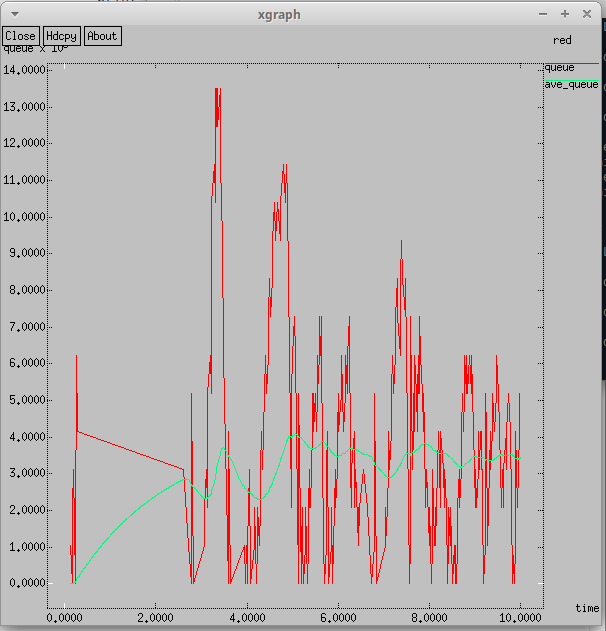
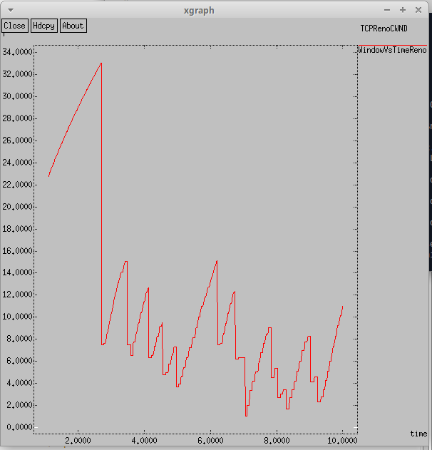
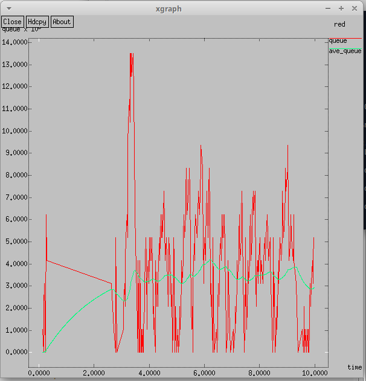
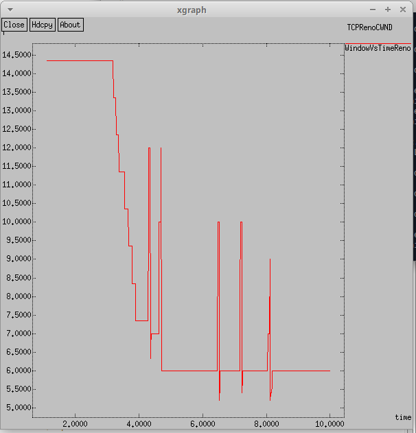
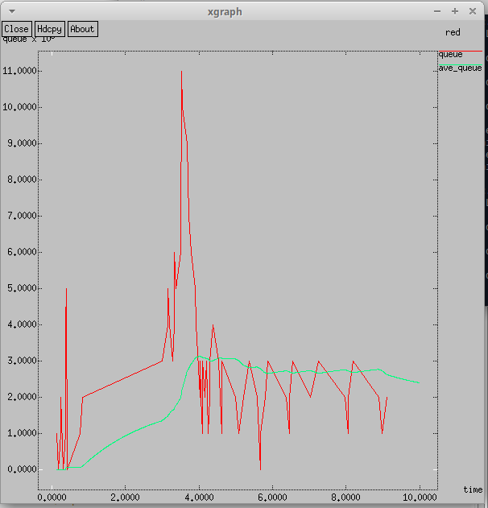
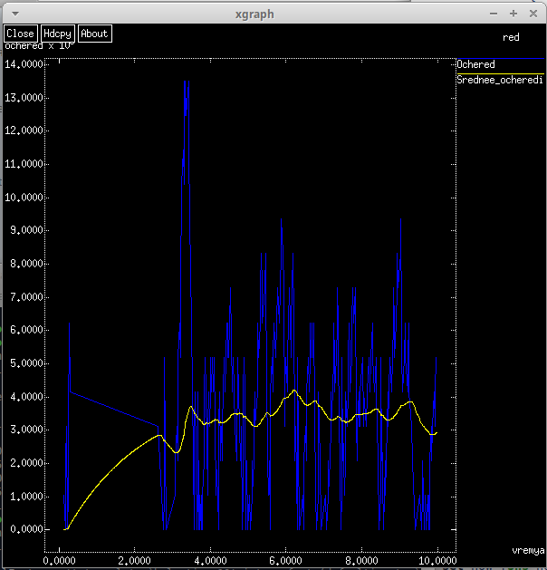
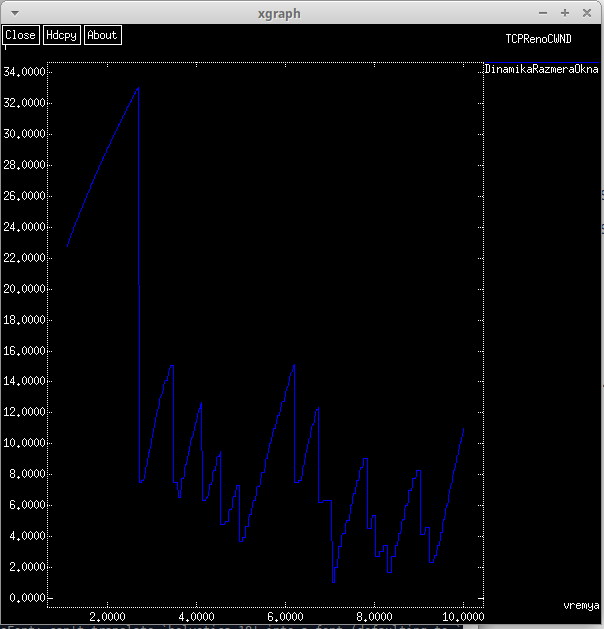

---
## Front matter
lang: ru-RU
title: Лабораторная работа № 2
subtitle: Исследование протокола TCP и алгоритма управления очередью RED
author:
  - Демидова Е. А.
institute:
  - Российский университет дружбы народов, Москва, Россия
date: 18 апреля 2024

## i18n babel
babel-lang: russian
babel-otherlangs: english

## Formatting pdf
toc: false
toc-title: Содержание
slide_level: 2
aspectratio: 169
section-titles: true
theme: metropolis
header-includes:
 - \metroset{progressbar=frametitle,sectionpage=progressbar,numbering=fraction}
 - '\makeatletter'
 - '\beamer@ignorenonframefalse'
 - '\makeatother'
---

# Информация

## Цель

Исследование протокола TCP и алгоритма управления очередью RED.

## Описание моделируемой сети

Описание моделируемой сети:

- сеть состоит из 6 узлов;
- между всеми узлами установлено дуплексное соединение с различными пропускной способностью и задержкой 10 мс;
- узел r1 использует очередь с дисциплиной RED для накопления пакетов, максимальный размер которой составляет 25;
- TCP-источники на узлах s1 и s2 подключаются к TCP-приёмнику на узле s3;
- генераторы трафика FTP прикреплены к TCP-агентам.

## Задачи

- разработать сценарий, реализующий описанную модель 
- построить в Xgraph график изменения TCP-окна, график изменения длины очереди и средней длины очереди

# Выполнение лабораторной работы

## Пример с дисциплиной RED

```
# Узлы сети:
set N 5
for {set i 1} {$i < $N} {incr i} {
	set node_(s$i) [$ns node]
}
set node_(r1) [$ns node]
set node_(r2) [$ns node]
```

## Пример с дисциплиной RED

```
# Соединения:
$ns duplex-link $node_(s1) $node_(r1) 10Mb 2ms DropTail
$ns duplex-link $node_(s2) $node_(r1) 10Mb 3ms DropTail
$ns duplex-link $node_(r1) $node_(r2) 1.5Mb 20ms RED
$ns queue-limit $node_(r1) $node_(r2) 25
$ns queue-limit $node_(r2) $node_(r1) 25
$ns duplex-link $node_(s3) $node_(r2) 10Mb 4ms DropTail
$ns duplex-link $node_(s4) $node_(r2) 10Mb 5ms DropTail
```
## Пример с дисциплиной RED

```
# Агенты и приложения:
set tcp1 [$ns create-connection TCP/Reno $node_(s1) TCPSink $node_(s3) 0]
$tcp1 set window_ 15
set tcp2 [$ns create-connection TCP/Reno $node_(s2) TCPSink $node_(s3) 1]
$tcp2 set window_ 15
set ftp1 [$tcp1 attach-source FTP]
set ftp2 [$tcp2 attach-source FTP]
```

## Пример с дисциплиной RED

```
# Мониторинг размера окна TCP:
set windowVsTime [open WindowVsTimeReno w]
puts $windowVsTime \"DinamikaRazmeraOkna
set qmon [$ns monitor-queue $node_(r1) $node_(r2) [open qm.out w] 0.1];
[$ns link $node_(r1) $node_(r2)] queue-sample-timeout;
# Мониторинг очереди:
set redq [[$ns link $node_(r1) $node_(r2)] queue]
set tchan_ [open all.q w]
$redq trace curq_
$redq trace ave_
$redq attach $tchan_
```

## Пример с дисциплиной RED

```
#at-событие для планировщика событий, которое запускает
#процедуру finish через 5 с после начала моделирования
# Добавление at-событий:
$ns at 0.0 "$ftp1 start"
$ns at 1.1 "plotWindow $tcp1 $windowVsTime"
$ns at 3.0 "$ftp2 start"
$ns at 10 "finish"
#запуск модели
$ns run
```

## Пример с дисциплиной RED

```
# Процедура finish:
proc finish {} {
	global tchan_
	# подключение кода AWK:
	set awkCode {
		{
			if ($1 == "Q" && NF>2) {
				print $2, $3 >> "temp.q";
				set end $2
			}
			else if ($1 == "a" && NF>2)
			print $2, $3 >> "temp.a";
		}
	}
...  

```

## Пример с дисциплиной RED

```
...
	set f [open temp.queue w]
	puts $f "TitleText: red"
	puts $f "Device: Postscript"
	if { [info exists tchan_] } {
		close $tchan_
	}
	exec rm -f temp.q temp.a
	exec touch temp.a temp.q
...

```

## Пример с дисциплиной RED

```
...
	# выполнение кода AWK
	exec awk $awkCode all.q
	puts $f \"queue
	exec cat temp.q >@ $f
	puts $f \n\"ave_queue
	exec cat temp.a >@ $f
	close $f
	# Запуск xgraph с графиками окна TCP и очереди:
	exec xgraph -bb -tk -x time -t "TCPRenoCWND" WindowVsTimeReno &
	exec xgraph -bb -tk -x time -y queue temp.queue &
	exit 0
	}

```

## Пример с дисциплиной RED

```
# Формирование файла с данными о размере окна TCP:
proc plotWindow {tcpSource file} {
	global ns
	set time 0.01
	set now [$ns now]
	set cwnd [$tcpSource set cwnd_]
	puts $file "$now $cwnd"
	$ns at [expr $now+$time] "plotWindow $tcpSource $file"
}
```

## Результаты моделирования

{#fig:001 width=45%}

## Результаты моделирования

{#fig:002 width=45%}

## Изменение типа TCP

```
Агенты и приложения:
set tcp1 [$ns create-connection TCP/Newreno $node_(s1) TCPSink $node_(s3) 0]
$tcp1 set window_ 15
set tcp2 [$ns create-connection TCP/Newreno $node_(s2) TCPSink $node_(s3) 1]
$tcp2 set window_ 15
set ftp1 [$tcp1 attach-source FTP]
set ftp2 [$tcp2 attach-source FTP]
```
## Изменение типа TCP

{#fig:003 width=45%}

## Изменение типа TCP

{#fig:004 width=45%}

## Изменение типа TCP

```
Агенты и приложения:
set tcp1 [$ns create-connection TCP/Vegas $node_(s1) TCPSink $node_(s3) 0]
$tcp1 set window_ 15
set tcp2 [$ns create-connection TCP/Vegas $node_(s2) TCPSink $node_(s3) 1]
$tcp2 set window_ 15
set ftp1 [$tcp1 attach-source FTP]
set ftp2 [$tcp2 attach-source FTP]
```

## Изменение типа TCP

{#fig:005 width=45%}

## Изменение типа TCP

{#fig:006 width=45%}

## Изменение отображения графиков

```
set f [open temp.queue w]
puts $f "TitleText: red"
puts $f "Device: Postscript"
puts $f "0.Color: Blue"
puts $f "1.Color: Yellow"
if { [info exists tchan_] } {
	close $tchan_
}
exec rm -f temp.q temp.a
exec touch temp.a temp.q
```

## Изменение отображения графиков

```
 # выполнение кода AWK
exec awk $awkCode all.q
puts $f \"Ochered"
exec cat temp.q >@ $f
puts $f \n\"Srednee_ocheredi"
exec cat temp.a >@ $f
close $f
# Запуск xgraph с графиками окна TCP и очереди:
exec xgraph -fg white -bg black -bb -tk -x  vremya -t 
                   "TCPRenoCWND" WindowVsTimeReno &
exec xgraph -fg white -bg black -bb -tk -x  vremya -y ochered 
                                             temp.queue &
exit 0
}
```

## Изменение отображения графиков

```
# Мониторинг размера окна TCP:
set windowVsTime [open WindowVsTimeReno w]
puts $windowVsTime "0.Color: Blue"
puts $windowVsTime \"DinamikaRazmeraOkna
```

## Изменение типа TCP отображения графиков

{#fig:007 width=45%}

## Изменение типа TCP отображения графиков

{#fig:008 width=45%}


# Заключение

## Выводы

В результате выполнения работы был исследован протокола TCP и алгоритм управления очередью RED, нарисованы и проанализированы графики динамики размера окна и длины очереди для разных типов TCP.