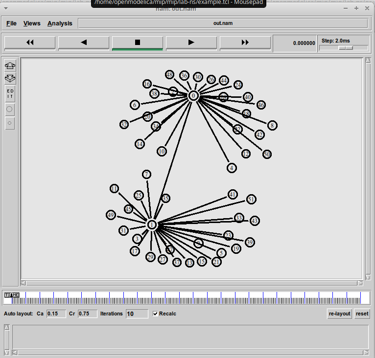
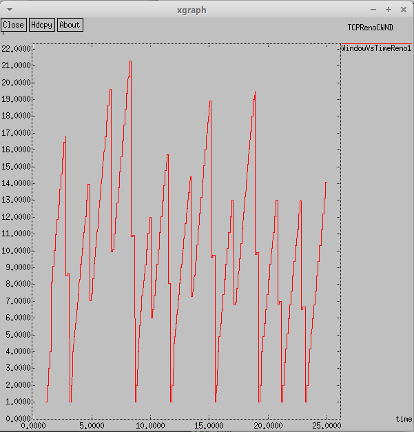
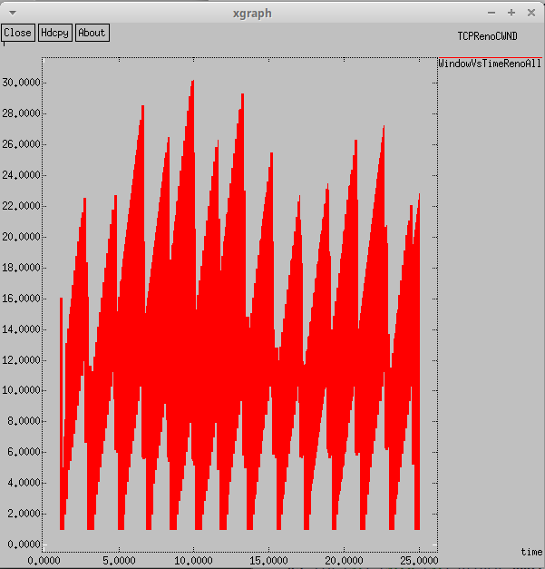
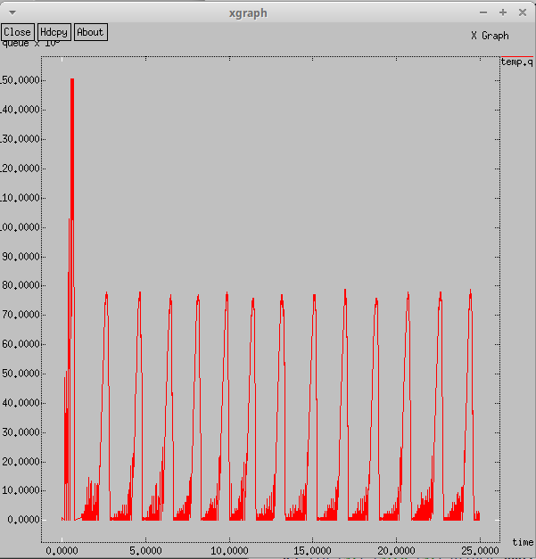
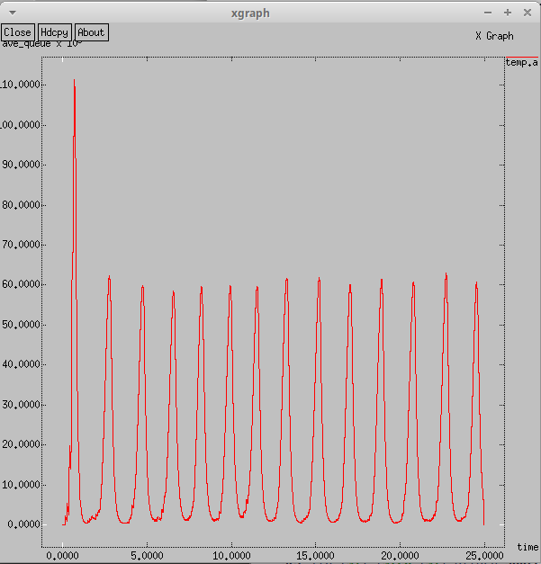
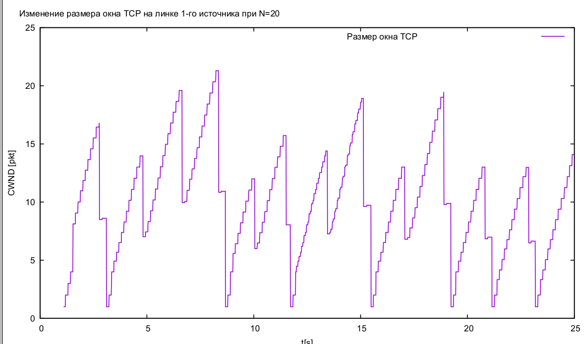
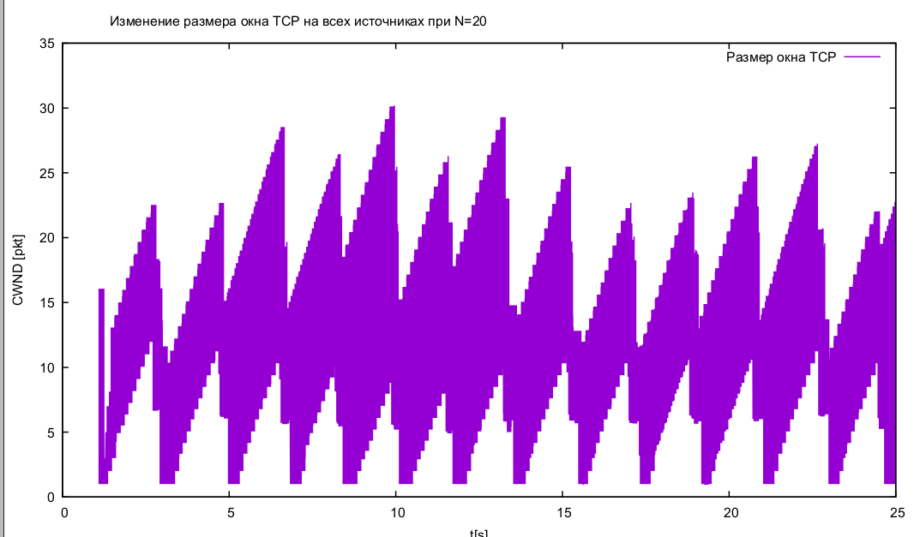
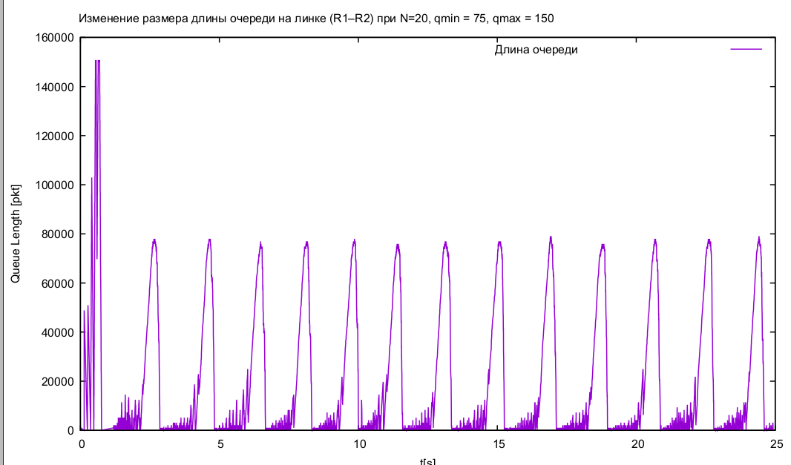
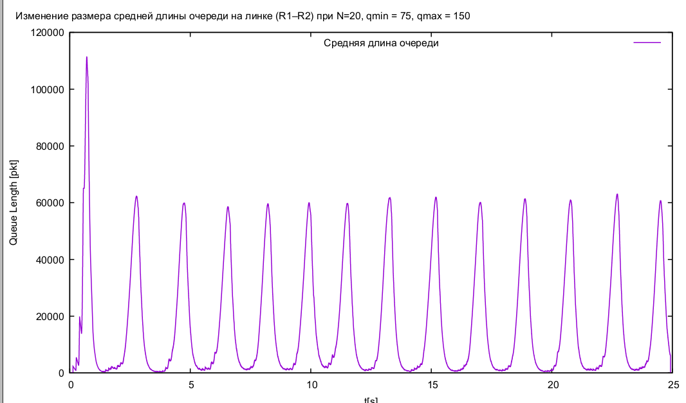

---
## Front matter
title: "Лабораторная работа № 4"
subtitle: "Задание для самостоятельного выполнения"
author: "Демидова Екатерина Алексеевна"

## Generic otions
lang: ru-RU
toc-title: "Содержание"

## Bibliography
bibliography: bib/cite.bib
csl: pandoc/csl/gost-r-7-0-5-2008-numeric.csl

## Pdf output format
toc: true # Table of contents
toc-depth: 2
lof: true # List of figures
lot: false # List of tables
fontsize: 12pt
linestretch: 1.5
papersize: a4
documentclass: scrreprt
## I18n polyglossia
polyglossia-lang:
  name: russian
  options:
	- spelling=modern
	- babelshorthands=true
polyglossia-otherlangs:
  name: english
## I18n babel
babel-lang: russian
babel-otherlangs: english
## Fonts
mainfont: PT Serif
romanfont: PT Serif
sansfont: PT Sans
monofont: PT Mono
mainfontoptions: Ligatures=TeX
romanfontoptions: Ligatures=TeX
sansfontoptions: Ligatures=TeX,Scale=MatchLowercase
monofontoptions: Scale=MatchLowercase,Scale=0.9
## Biblatex
biblatex: true
biblio-style: "gost-numeric"
biblatexoptions:
  - parentracker=true
  - backend=biber
  - hyperref=auto
  - language=auto
  - autolang=other*
  - citestyle=gost-numeric
## Pandoc-crossref LaTeX customization
figureTitle: "Рис."
tableTitle: "Таблица"
listingTitle: "Листинг"
lofTitle: "Список иллюстраций"
lotTitle: "Список таблиц"
lolTitle: "Листинги"
## Misc options
indent: true
header-includes:
  - \usepackage{indentfirst}
  - \usepackage{float} # keep figures where there are in the text
  - \floatplacement{figure}{H} # keep figures where there are in the text
---

# Цель работы

Разработать имитационную модель в пакете NS-2 и построить график изменения размера окна и TCP и график изменения длины очереди и средней длины очереди на первом маршрутизаторе (в Xgraph и в GNUPlot);

# Описание моделируемой сети

Описание моделируемой сети:

- сеть состоит из N TCP-источников, N TCP-приёмников, двух маршрутизаторов R1 и R2 между источниками и приёмниками (N — не менее 20);
- между TCP-источниками и первым маршрутизатором установлены дуплексные соединения с пропускной способностью 100 Мбит/с и задержкой 20 мс очередью типа DropTail;
- между TCP-приёмниками и вторым маршрутизатором установлены дуплексные соединения с пропускной способностью 100 Мбит/с и задержкой 20 мс очередью типа DropTail;
- между маршрутизаторами установлено симплексное соединение (R1–R2) с пропускной способностью 20 Мбит/с и задержкой 15 мс очередью типа RED, размером буфера 300 пакетов; в обратную сторону - симплексное соединение (R2–R1) с пропускной способностью 15 Мбит/с и задержкой 20 мс очередью типа DropTail;
- данные передаются по протоколу FTP поверх TCPReno;
- параметры алгоритма RED: qmin = 75, qmax = 150, qw = 0, 002, pmax = 0.1;
- максимальный размер TCP-окна 32; размер передаваемого пакета 500 байт; время моделирования -- не менее 20 единиц модельного времени.

# Задание

1. Для приведённой схемы разработать имитационную модель в пакете NS-2.
2. Построить график изменения размера окна TCP (в Xgraph и в GNUPlot);
3. Построить график изменения длины очереди и средней длины очереди на первом маршрутизаторе.
4. Оформить отчёт о выполненной работе.

# Выполнение лабораторной работы

Создадим сеть. Зададим N = 25 TCP-источников, N = 25 TCP-приёмников, два маршрутизатора r1 и r2 между источниками и приёмниками. Между TCP-источниками и первым маршрутизатором установим дуплексные соединения с пропускной способностью 100 Мбит/с и задержкой 20 мс очередью типа DropTail; между TCP-приёмниками и вторым маршрутизатором установлены дуплексные соединения с пропускной способностью 100 Мбит/с и задержкой 20 мс очередью типа DropTail; между маршрутизаторами установлено симплексное соединение (R1–R2) с пропускной способностью 20 Мбит/с и задержкой 15 мс очередью типа RED, размером буфера 300 пакетов; в обратную сторону - симплексное соединение (R2–R1) с пропускной способностью 15 Мбит/с и задержкой 20 мс очередью типа DropTail. Данные передаются по протоколу FTP поверх TCPReno. Параметры алгоритма RED: qmin = 75, qmax = 150, qw = 0, 002, pmax = 0.1 задаются соответствено следующим образом:
```
# Мониторинг очереди:
set redq [[$ns link $node_(r1) $node_(r2)] queue]
$redq set thresh_ 75
$redq set maxthresh_ 150
$redq set q_weight_ 0.002
$redq set linterm_ 10
```

- `thresh_` -- минимальная граница для среднего размера очереди в пакетах;
- `maxthresh_` -- максимальная граница для среднего размера очереди в пакетах;
- `q_weight_` -- вес очереди, используется для вычисления среднего размера очереди;
- `linterm_ `-- как средний размер очереди варьируется между `thresh_` и `maxthresh_`, так и вероятность отбрасывания пакета варьируется между 0 и 1/linterm_;

Также задаем максимальный размер TCP-окна 32; размер передаваемого пакета 500 байт; время моделирования -- 25 единиц модельного времени. Ниже приведён листинг реализации описанной модели:

```
#создание объекта Simulator
set ns [new Simulator]

#открытие на запись файла out.nam для визуализатора nam
set nf [open out.nam w]

#все результаты моделирования будут записаны в переменную nf
$ns namtrace-all $nf

#открытие на запись файла трассировки out.tr
#для регистрации всех событий
set f [open out.tr w]
#все регистрируемые события будут записаны в переменную f
$ns trace-all $f

# Процедура finish:
proc finish {} {
	global tchan_
	# подключение кода AWK:
	set awkCode {
		{
			if ($1 == "Q" && NF>2) {
				print $2, $3 >> "temp.q";
				set end $2
			}
			else if ($1 == "a" && NF>2)
			print $2, $3 >> "temp.a";
		}
	}

	exec rm -f temp.q temp.a
	exec touch temp.a temp.q
	 # выполнение кода AWK
	exec awk $awkCode all.q

	# Запуск xgraph с графиками окна TCP и очереди:
	exec xgraph -bb -tk -x time -t "TCPRenoCWND" WindowVsTimeRenoAll &
	exec xgraph -bb -tk -x time -t "TCPRenoCWND" WindowVsTimeReno1 &
	exec xgraph -bb -tk -x time -y queue temp.q &
	exec xgraph -bb -tk -x time -y ave_queue temp.a &
	exit 0
	}

# Формирование файла с данными о размере окна TCP:
proc plotWindow {tcpSource file} {
	global ns
	set time 0.01
	set now [$ns now]
	set cwnd [$tcpSource set cwnd_]
	puts $file "$now $cwnd"
	$ns at [expr $now+$time] "plotWindow $tcpSource $file"
}
# маршрутизаторы
set node_(r1) [$ns node]
set node_(r2) [$ns node]
# Соединения:
$ns simplex-link $node_(r1) $node_(r2) 20Mb 15ms RED
$ns simplex-link $node_(r2) $node_(r1) 15Mb 20ms RED
$ns queue-limit $node_(r1) $node_(r2) 300
set N 25
for {set i 0} {$i < $N} {incr i} {
	set node_(s$i) [$ns node]
	$ns duplex-link $node_(s$i) $node_(r1) 100Mb 20ms DropTail
	set node_(d$i) [$ns node]
	$ns duplex-link $node_(d$i) $node_(r2) 100Mb 20ms DropTail

    set tcp_($i) [$ns create-connection TCP/Reno $node_(s$i) TCPSink $node_(d$i) $i]
	$tcp_($i) set window_ 32
	$tcp_($i) set pktSize_ 500
	set ftp_($i) [$tcp_($i) attach-source FTP]
}

# Мониторинг размера окна TCP:
set windowVsTimeAll [open WindowVsTimeRenoAll w]
set windowVsTime1 [open WindowVsTimeReno1 w]

set qmon [$ns monitor-queue $node_(r1) $node_(r2) [open qm.out w] 0.1];
[$ns link $node_(r1) $node_(r2)] queue-sample-timeout;
# Мониторинг очереди:
set redq [[$ns link $node_(r1) $node_(r2)] queue]
$redq set thresh_ 75
$redq set maxthresh_ 150
$redq set q_weight_ 0.002
$redq set linterm_ 10

set tchan_ [open all.q w]
$redq trace curq_
$redq trace ave_
$redq attach $tchan_

#at-событие для планировщика событий, которое запускает
#процедуру finish через 5 с после начала моделирования
# Добавление at-событий:
for {set i 0} {$i < $N} {incr i} {
	$ns at 0.0 "$ftp_($i) start"
	$ns at 1.1 "plotWindow $tcp_($i) $windowVsTimeAll"
}
$ns at 1.1 "plotWindow $tcp_(1) $windowVsTime1"

$ns at 25 "finish"
#запуск модели
$ns run
```

Сеть имеет вид(рис. [-@fig:001]).

{#fig:001 width=70%}

В результате получим следующие графики(рис. [-@fig:001] - [-@fig:004]).

{#fig:002 width=70%}

{#fig:003 width=70%}

{#fig:004 width=70%}

{#fig:005 width=70%}

Теперь нарисуем график поведения длины очереди с помощью graph_plot. Ниже приведен листинг для отрисовки:

```
#!/usr/bin/gnuplot -persist
# задаём текстовую кодировку,
# тип терминала, тип и размер шрифта
set encoding utf8
set term pdfcairo font "Arial,9"
# задаём выходной файл графика
set out 'WvsT1.pdf'
# задаём название графика
set title "Изменение размера окна TCP на линке 1-го источника при N=20"
# задаём стиль линии
set style line 2
# подписи осей графика
set xlabel "t[s]"
set ylabel "CWND [pkt]"
# построение графика, используя значения
plot "WindowVsTimeReno1" using ($1):($2) with lines title "Размер окна TCP"

# задаём выходной файл графика
set out 'WvsTAll.pdf'
# задаём название графика
set title "Изменение размера окна TCP на всех источниках при N=20"
# построение графика, используя значения
plot "WindowVsTimeRenoAll" using ($1):($2) with lines title "Размер окна TCP"

# задаём выходной файл графика
set out 'queue.pdf'
# задаём название графика
set title "Изменение размера длины очереди на линке (R1–R2) при N=20, qmin = 75, qmax = 150"
# подписи осей графика
set xlabel "t[s]"
set ylabel "Queue Length [pkt]"
# построение графика, используя значения
plot "temp.q" using ($1):($2) with lines title "Длина очереди"

# задаём выходной файл графика
set out 'ave_queue.pdf'
# задаём название графика
set title "Изменение размера средней длины очереди на линке (R1–R2) при N=20, qmin = 75, qmax = 150"
# подписи осей графика
set xlabel "t[s]"
set ylabel "Queue Length [pkt]"
# построение графика, используя значения
plot "temp.a" using ($1):($2) with lines title "Средняя длина очереди"
```
Сделаем этот файл исполняемым и запустим скрипт, который создаст pdf-файлы с результатами моделирования(рис. [-@fig:006] - [-@fig:009]).

{#fig:006 width=70%}

{#fig:007 width=70%}

{#fig:008 width=70%}

{#fig:009 width=70%}

# Выводы

В результате выполнения работы была разработана имитационная модель в пакете NS-2 и построены график изменения размера окна и TCP и график изменения длины очереди и средней длины очереди на первом маршрутизаторе (в Xgraph и в GNUPlot).