---
## Front matter
lang: ru-RU
title: Лабораторная работа № 5
subtitle: Модель эпидемии
author:
  - Демидова Е. А.
institute:
  - Российский университет дружбы народов, Москва, Россия
date: 3 мая 2024

## i18n babel
babel-lang: russian
babel-otherlangs: english

## Formatting pdf
toc: false
toc-title: Содержание
slide_level: 2
aspectratio: 169
section-titles: true
theme: metropolis
header-includes:
 - \metroset{progressbar=frametitle,sectionpage=progressbar,numbering=fraction}
 - '\makeatletter'
 - '\beamer@ignorenonframefalse'
 - '\makeatother'
---

# Вводная часть

## Цели 

Исследование модели эпидемии (SIR) с помощью xcos и OpenModelica.

## Задачи

- Реализовать классическую модель SIR с помощью xcos(в том числе с помощью блока Modelica) и OpenModelica.
- Реализовать модель SIR с учетом демографических признаков с помощью xcos(в том числе с помощью блока Modelica) и OpenModelica.
- Исследовать модель SIR с учетом демографических признаков, изменяя параметры.

# Выполнение лабораторной работы

## Теоретическое введение

$$
\begin{cases}
\frac{dS}{dt} = - \frac{\beta I S}{N}, \\
\frac{dI}{dt} = \frac{\beta I S}{N} - \gamma I, \\
\frac{dR}{dt} = \gamma I,
\end{cases}
$$

где $S$ -- численность восприимчивой популяции, $I$ -- численность инфицированных, $R$ -- численность удаленной популяции (в результате смерти или выздоровления), и $N$ — это сумма этих трёх, а $\beta$ и $\gamma$ - это коэффициенты заболеваемости и выздоровления соответственное

## Реализация модели в xcos

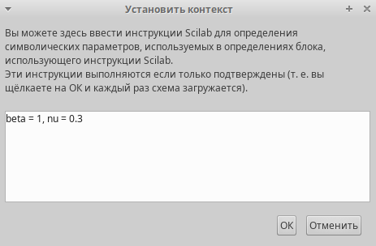{#fig:001 width=60%}

## Реализация модели в xcos

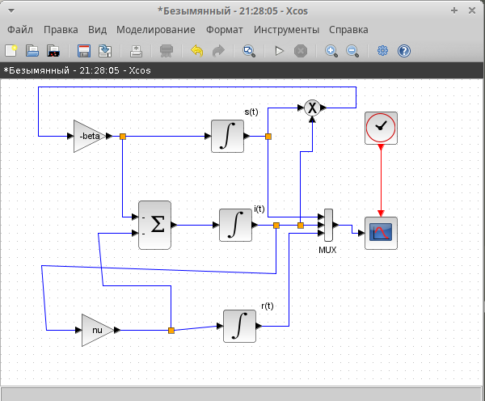{#fig:002 width=70%}

## Реализация модели в xcos

:::::::::::::: {.columns align=center}
::: {.column width="50%"}

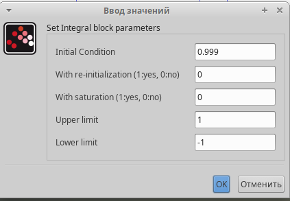{#fig:003 width=70%}

:::
::: {.column width="50%"}

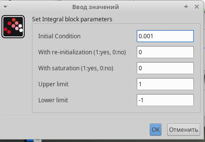{#fig:004 width=70%}

:::
::::::::::::::

## Реализация модели в xcos

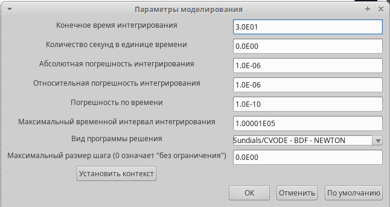{#fig:005 width=70%}

## Реализация модели в xcos

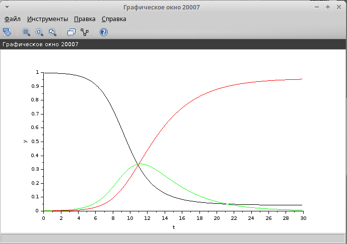{#fig:006 width=70%}

## Реализация модели с помощью блока Modelica в xcos

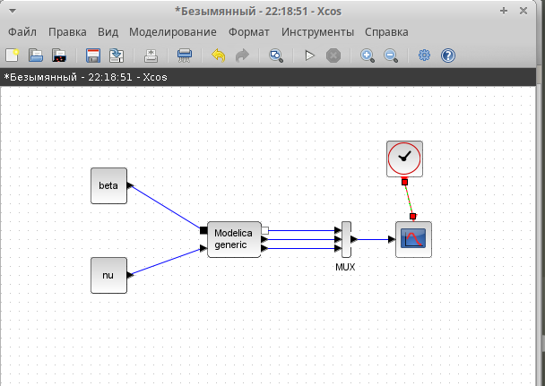{#fig:007 width=70%}

## Реализация модели с помощью блока Modelica в xcos

:::::::::::::: {.columns align=center}
::: {.column width="50%"}

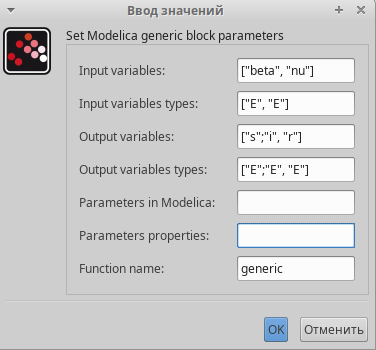{#fig:008 width=70%}

:::
::: {.column width="50%"}

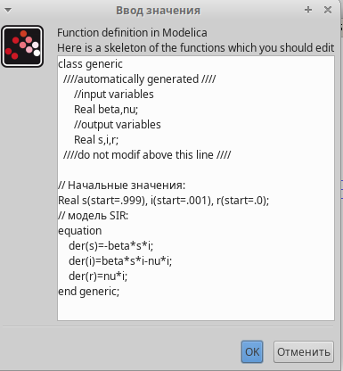{#fig:009 width=70%}

:::
::::::::::::::

## Реализация модели с помощью блока Modelica в xcos

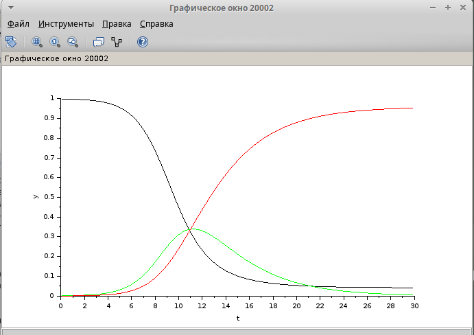{#fig:010 width=70%}

## Реализация модели в OpenModelica

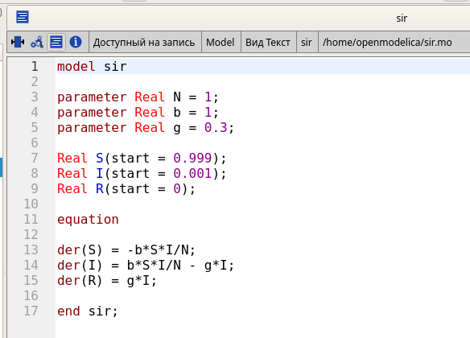{#fig:011 width=70%}

## Реализация модели в OpenModelica

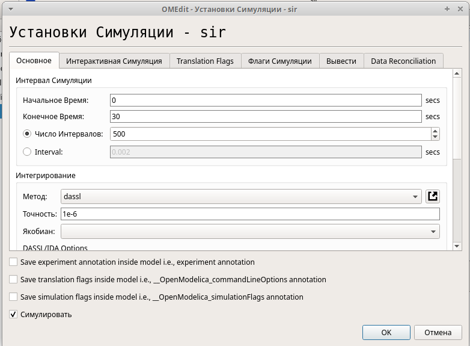{#fig:012 width=65%}

## Реализация модели в OpenModelica

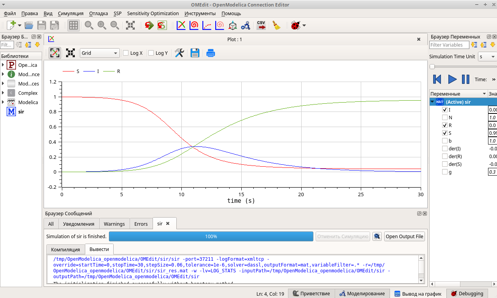{#fig:013 width=70%}

# Задание для самостоятельного выполнения

## Модель SIR с учетом демографии

$$
\begin{cases}
\frac{dS}{dt} = - \beta I S + \mu (N - S), \\
\frac{dI}{dt} = \beta I S - \gamma I - \mu I, \\
\frac{dR}{dt} = \gamma I - \mu R,
\end{cases}
$$

где $\nu$ -- константа, которая равна коэффициенту смертности и рождаемости.

## Задание

- реализовать модель SIR с учётом процесса рождения гибели особей в xcos (в том числе и с использованием блока Modelica), а также в OpenModelica;
- построить графики эпидемического порога при различных значениях параметров модели (в частности изменяя параметр μ);
- сделать анализ полученных графиков в зависимости от выбранных значений параметров модели

## Реализация модели в xcos

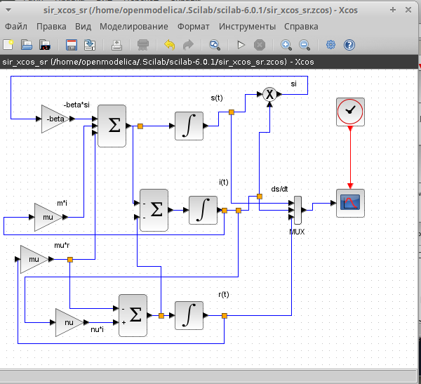{#fig:014 width=55%}

## Реализация модели в xcos

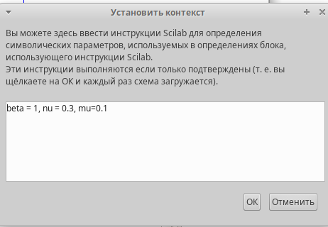{#fig:015 width=70%}

## Реализация модели в xcos

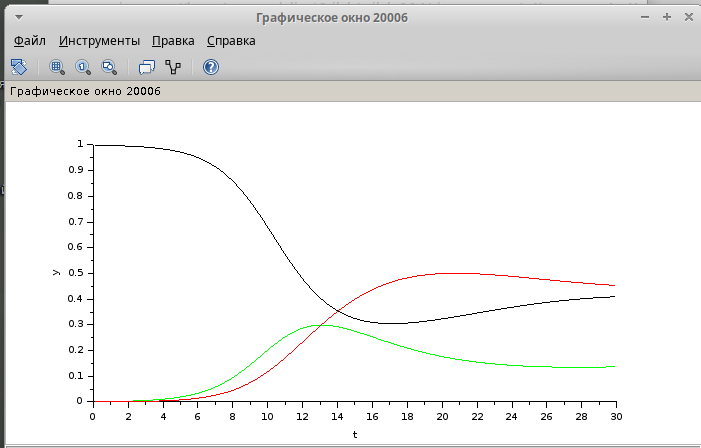{#fig:016 width=60%}

## Реализация модели с помощью блока Modelica в xcos

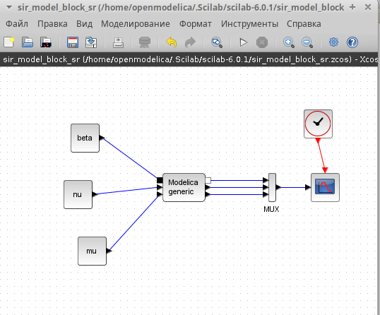{#fig:017 width=60%}

## Реализация модели с помощью блока Modelica в xcos

:::::::::::::: {.columns align=center}
::: {.column width="50%"}

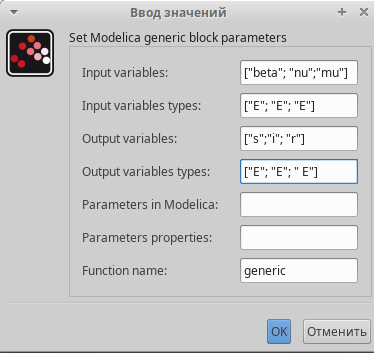{#fig:018 width=70%}

:::
::: {.column width="50%"}

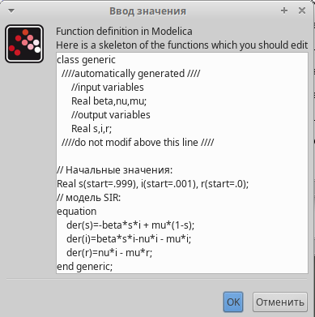{#fig:019 width=70%}

:::
::::::::::::::

## Реализация модели с помощью блока Modelica в xcos

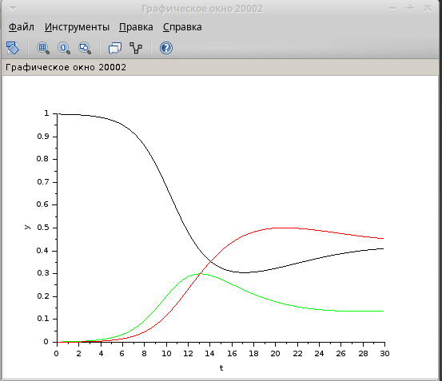{#fig:020 width=55%}

## Реализация модели в OpenModelica

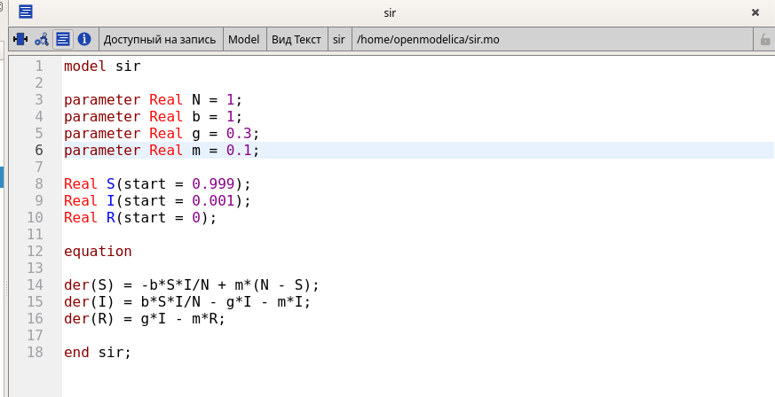{#fig:021 width=70%}

## Анализ графиков при разных параметрах модели

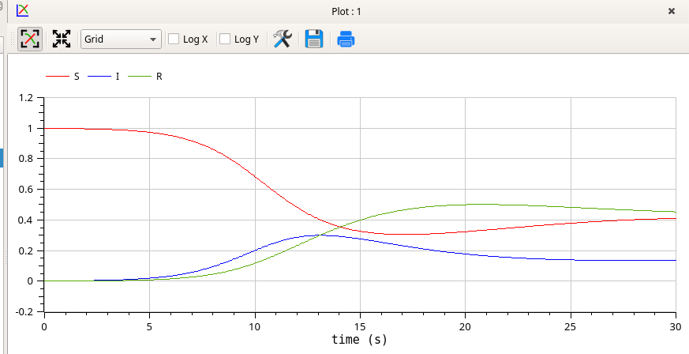{#fig:022 width=70%}

## Анализ графиков при разных параметрах модели

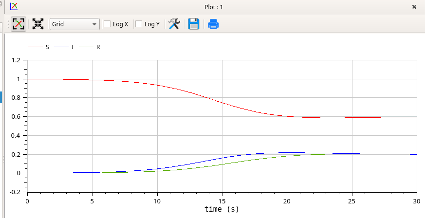{#fig:023 width=70%}

## Анализ графиков при разных параметрах модели

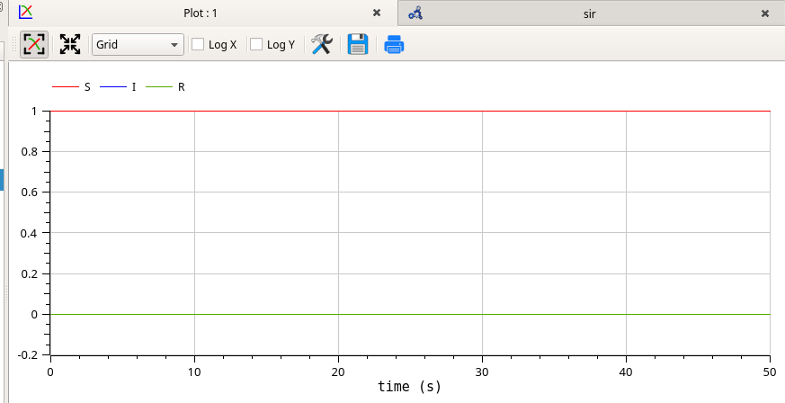{#fig:024 width=70%}

## Анализ графиков при разных параметрах модели

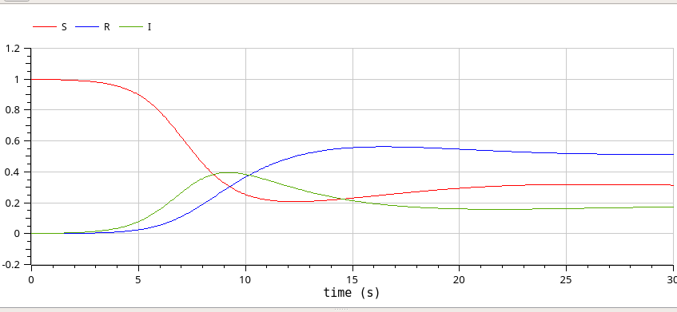{#fig:025 width=70%}

## Анализ графиков при разных параметрах модели

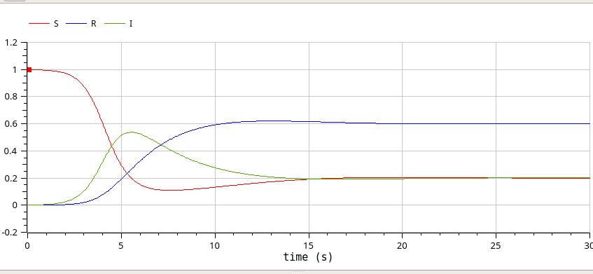{#fig:026 width=70%}

## Анализ графиков при разных параметрах модели

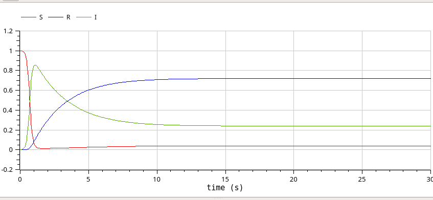{#fig:027 width=70%}

## Анализ графиков при разных параметрах модели

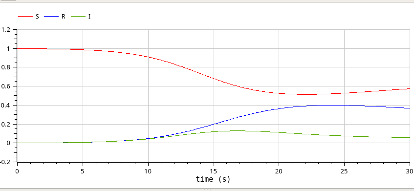{#fig:028 width=70%}

## Анализ графиков при разных параметрах модели

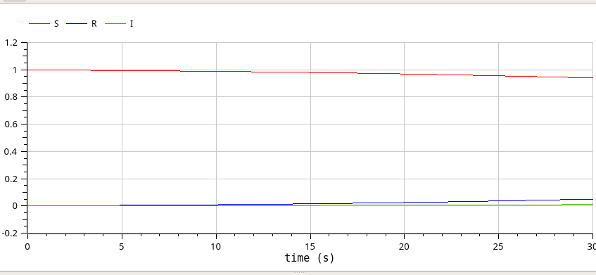{#fig:029 width=70%}

## Анализ графиков при разных параметрах модели

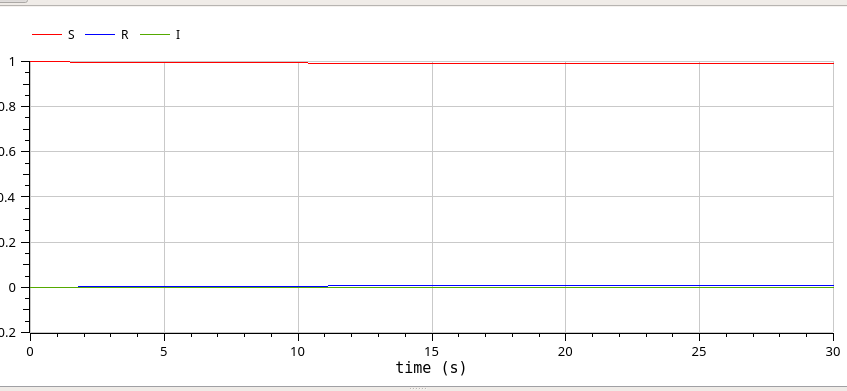{#fig:030 width=70%}

# Выводы

В результате выполнения работы была исследована модель SIR при помощи xcos и OpenModelica.

