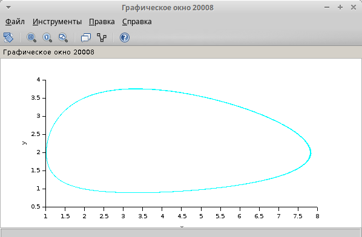
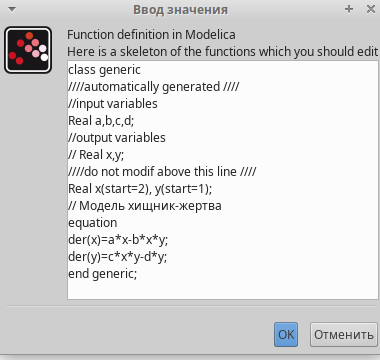
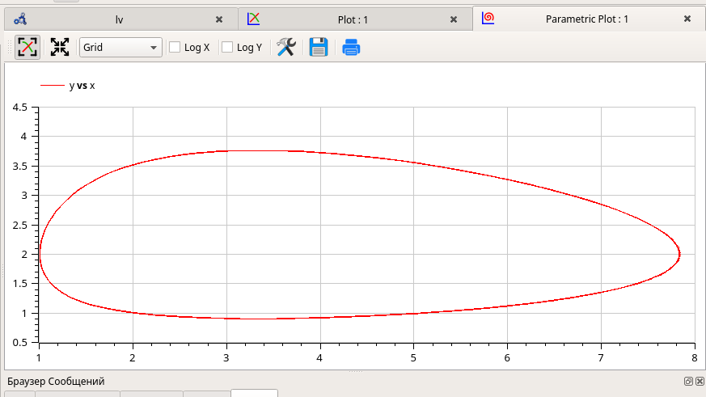

---
## Front matter
lang: ru-RU
title: Лабораторная работа № 6
subtitle: Модель хищник-жертва
author:
  - Демидова Е. А.
institute:
  - Российский университет дружбы народов, Москва, Россия
date: 3 мая 2024

## i18n babel
babel-lang: russian
babel-otherlangs: english

## Formatting pdf
toc: false
toc-title: Содержание
slide_level: 2
aspectratio: 169
section-titles: true
theme: metropolis
header-includes:
 - \metroset{progressbar=frametitle,sectionpage=progressbar,numbering=fraction}
 - '\makeatletter'
 - '\beamer@ignorenonframefalse'
 - '\makeatother'
---

# Вводная часть

## Цели и задачи

**Цель**

Исследование модели хищник-жертва с помощью xcos и OpenModelica.

**Задачи**

- Реализовать классическую систему хищник–жертва 
  - в xcos
  - в xcos с помощью блока Modelica
  - в OpenModelica

# Выполнение лабораторной работы

## Теоретическое введение

$$\begin{cases}
  &\dfrac{dx}{dt} = ax(t)-bx(t)y(t)\\
  &\dfrac{dy}{dt} = cx(t)y(t)-dy(t)
\end{cases}$$

В этой модели $x$ – число жертв, $y$ - число хищников. Коэффициент $a$ описывает скорость естественного прироста числа жертв в отсутствие хищников, $d$ - естественное вымирание хищников, лишенных пищи в виде жертв.  Каждый акт взаимодействия уменьшает популяцию жертв, но способствует увеличению популяции хищников (члены $-bxy$ и $cxy$ в правой части уравнения).  

## Реализация модели в xcos

{#fig:001 width=50%}

## Реализация модели в xcos

{#fig:002 width=60%}

## Реализация модели в xcos

:::::::::::::: {.columns align=center}
::: {.column width="50%"}

{#fig:003 width=70%}

:::
::: {.column width="50%"}

{#fig:004 width=70%}

:::
::::::::::::::

## Реализация модели в xcos

{#fig:005 width=70%}

## Реализация модели в xcos

:::::::::::::: {.columns align=center}
::: {.column width="50%"}

{#fig:006 width=70%}

:::
::: {.column width="50%"}

{#fig:007 width=70%}

:::
::::::::::::::

## Реализация модели с помощью блока Modelica в xcos

{#fig:008 width=60%}

## Реализация модели с помощью блока Modelica в xcos

:::::::::::::: {.columns align=center}
::: {.column width="50%"}

{#fig:009 width=70%}

:::
::: {.column width="50%"}

{#fig:010 width=70%}

:::
::::::::::::::

## Реализация модели в OpenModelica

{#fig:011 width=70%}

## Реализация модели в OpenModelica

{#fig:012 width=65%}

## Реализация модели в OpenModelica

:::::::::::::: {.columns align=center}
::: {.column width="50%"}

{#fig:013 width=70%}

:::
::: {.column width="50%"}

{#fig:014 width=70%}

:::
::::::::::::::

# Заключение

В результате выполнения работы была исследована модель хищник-жертва при помощи xcos и OpenModelica.

