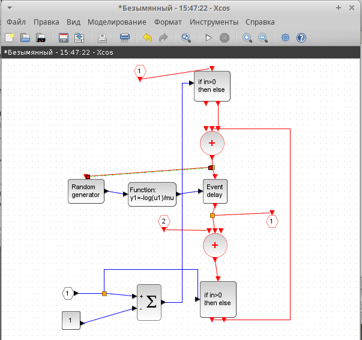

---
## Front matter
lang: ru-RU
title: Лабораторная работа № 7
subtitle: Модель СМО
author:
  - Демидова Е. А.
institute:
  - Российский университет дружбы народов, Москва, Россия
date: 10 мая 2024

## i18n babel
babel-lang: russian
babel-otherlangs: english

## Formatting pdf
toc: false
toc-title: Содержание
slide_level: 2
aspectratio: 169
section-titles: true
theme: metropolis
header-includes:
 - \metroset{progressbar=frametitle,sectionpage=progressbar,numbering=fraction}
 - '\makeatletter'
 - '\beamer@ignorenonframefalse'
 - '\makeatother'
---

# Вводная часть

## Цели и задачи

**Цель работы**

Реализовать модель $M|M|1|\infty$ с помощью xcos.

**Задание**

- Реализовать в xcos модель системы массового обслуживания типа $M|M|1|\infty$.
- Построить график, описывающий динамику размера очереди 
- Построить график, описывающий поступление и обработку заявок.

# Выполнение лабораторной работы

## Реализация модели в xcos

{#fig:001 width=70%}

## Реализация модели в xcos

{#fig:002 width=50%}

## Реализация модели в xcos

{#fig:003 width=50%}

## Реализация модели в xcos

{#fig:004 width=50%}

## Реализация модели в xcos

{#fig:005 width=70%}

## Реализация модели в xcos

{#fig:006 width=70%}

# Выводы

В результате выполнения работы была реализована модель $M|M|1|\infty$ с помощью xcos.