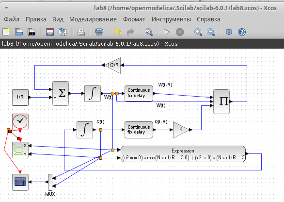
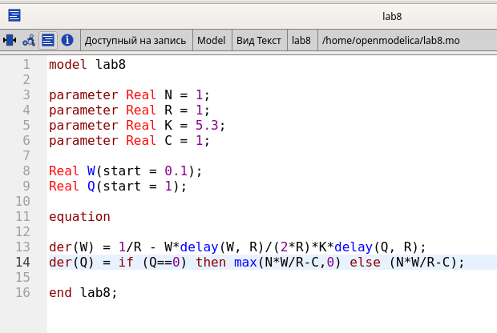
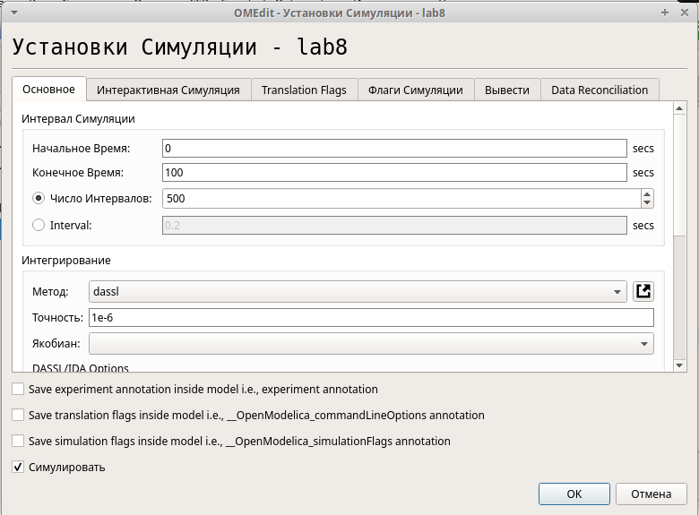

---
## Front matter
lang: ru-RU
title: Лабораторная работа № 8
subtitle: Модель TCP/AQM
author:
  - Демидова Е. А.
institute:
  - Российский университет дружбы народов, Москва, Россия
date: 12 мая 2024

## i18n babel
babel-lang: russian
babel-otherlangs: english

## Formatting pdf
toc: false
toc-title: Содержание
slide_level: 2
aspectratio: 169
section-titles: true
theme: metropolis
header-includes:
 - \metroset{progressbar=frametitle,sectionpage=progressbar,numbering=fraction}
 - '\makeatletter'
 - '\beamer@ignorenonframefalse'
 - '\makeatother'
---

# Вводная часть

## Цели и задачи

**Цель работы**

Реализовать модель TCP/AQM с помощью xcos и OpenModelica.

**Задание**

- Реализовать в xcos и OpenModelica модель TCP/AQM.
- Построить график, описывающий динамику размера очереди и TCP окна
- Построить фазовый портрет, описывающий зависимость размера очереди от TCP окна

# Выполнение лабораторной работы

## Реализация модели в xcos

{#fig:001 width=70%}

## Реализация модели в xcos

{#fig:002 width=70%}

## Реализация модели в xcos

{#fig:003 width=70%}

## Реализация модели в xcos

{#fig:004 width=70%}

## Реализация модели в xcos

{#fig:005 width=70%}

## Реализация модели в xcos

{#fig:006 width=70%}

## Реализация модели в OpenModelica

{#fig:007 width=70%}

## Реализация модели в OpenModelica

{#fig:008 width=65%}

## Реализация модели в OpenModelica

{#fig:009 width=70%}

## Реализация модели в OpenModelica

{#fig:010 width=70%}

# Выводы

В результате выполнения работы была реализована модель TCP/AQM с помощью xcos и OpenModelica.