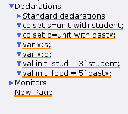
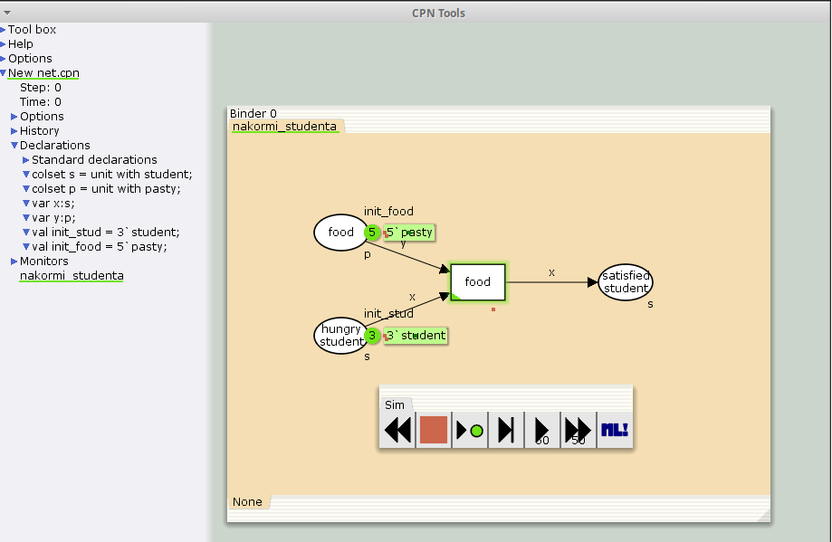
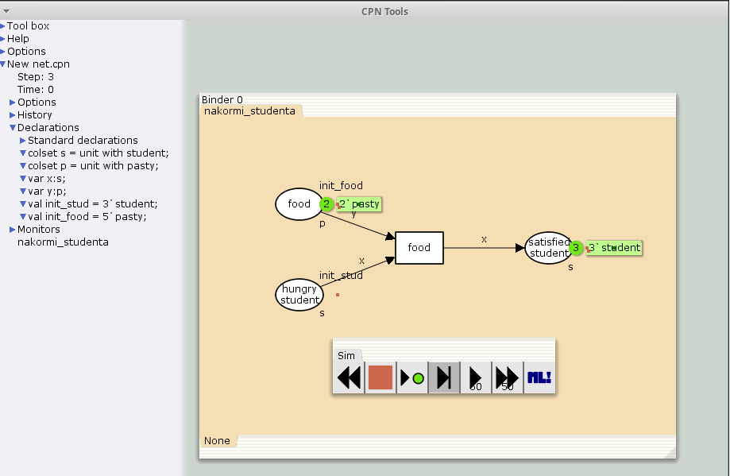
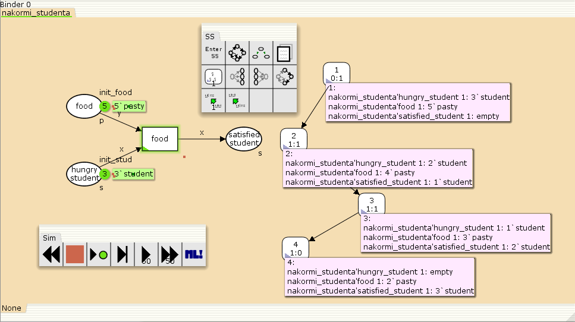

---
## Front matter
lang: ru-RU
title: Лабораторная работа № 9
subtitle: Модель «Накорми студентов»
author:
  - Демидова Е. А.
institute:
  - Российский университет дружбы народов, Москва, Россия
date: 12 мая 2024

## i18n babel
babel-lang: russian
babel-otherlangs: english

## Formatting pdf
toc: false
toc-title: Содержание
slide_level: 2
aspectratio: 169
section-titles: true
theme: metropolis
header-includes:
 - \metroset{progressbar=frametitle,sectionpage=progressbar,numbering=fraction}
 - '\makeatletter'
 - '\beamer@ignorenonframefalse'
 - '\makeatother'
---

# Вводная часть

## Цели и задачи

**Цель работы**

Реализовать в CPN Tools модель "Накорми студентов".

**Задание**

- Реализовать в CPN Tools модель "Накорми студентов".
- Вычислить пространство состояний, сформировать отчет о нем и построить граф.

# Выполнение лабораторной работы

## Реализация модели "Накорми студентов" в CPN Tools

{#fig:001 width=50%}

## Реализация модели "Накорми студентов" в CPN Tools

{#fig:002 width=70%}

## Реализация модели "Накорми студентов" в CPN Tools

{#fig:003 width=70%}

## Пространство состояний модели "Накорми студентов" в CPN Tools

{#fig:004 width=70%}

## Пространство состояний модели "Накорми студентов" в CPN Tools

```
CPN Tools state space report for:
/home/openmodelica/lab9.cpn
Report generated: Thu May 16 15:47:50 2024
 Statistics
------------------------------------------------------------------------
  State Space
     Nodes:  4
     Arcs:   3
     Secs:   0
     Status: Full
  Scc Graph
     Nodes:  4
     Arcs:   3
     Secs:   0
```

## Пространство состояний модели "Накорми студентов" в CPN Tools

```
 Boundedness Properties
------------------------------------------------------------------------
  Best Integer Bounds
                             Upper      Lower
     nakormi_studenta'food 1 5          2
     nakormi_studenta'hungry_student 1
                             3          0
     nakormi_studenta'satisfied_student 1
                             3          0
```

## Пространство состояний модели "Накорми студентов" в CPN Tools

```
  Best Upper Multi-set Bounds
     nakormi_studenta'food 1
                         5`pasty
     nakormi_studenta'hungry_student 1
                         3`student
     nakormi_studenta'satisfied_student 1
                         3`student
  Best Lower Multi-set Bounds
     nakormi_studenta'food 1
                         2`pasty
     nakormi_studenta'hungry_student 1
                         empty
     nakormi_studenta'satisfied_student 1
                         empty
```
## Пространство состояний модели "Накорми студентов" в CPN Tools

```
 Home Properties
------------------------------------------------------------------------
  Home Markings
     [4]
 Liveness Properties
------------------------------------------------------------------------
  Dead Markings
     [4]
  Dead Transition Instances
     None
  Live Transition Instances
     None
```
## Пространство состояний модели "Накорми студентов" в CPN Tools

```
 Fairness Properties
------------------------------------------------------------------------
     No infinite occurrence sequences.
```

# Выводы

В результате выполнения работы была реализована в CPN Tools модель "Накорми студентов".