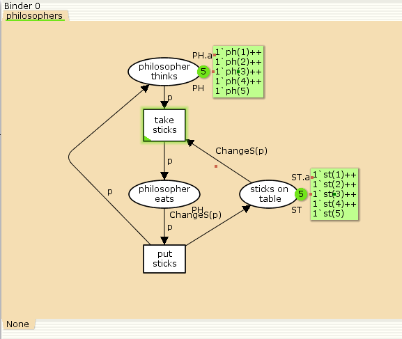
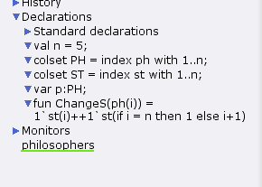
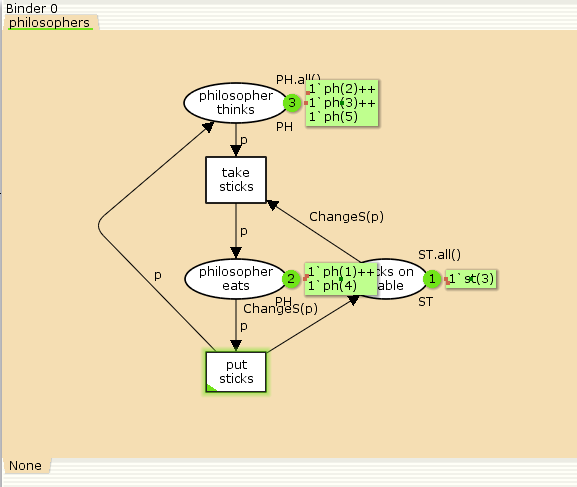
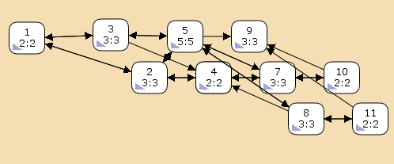

---
## Front matter
lang: ru-RU
title: Лабораторная работа № 10
subtitle: Задача об обедающих мудрецах
author:
  - Демидова Е. А.
institute:
  - Российский университет дружбы народов, Москва, Россия
date: 12 мая 2024

## i18n babel
babel-lang: russian
babel-otherlangs: english

## Formatting pdf
toc: false
toc-title: Содержание
slide_level: 2
aspectratio: 169
section-titles: true
theme: metropolis
header-includes:
 - \metroset{progressbar=frametitle,sectionpage=progressbar,numbering=fraction}
 - '\makeatletter'
 - '\beamer@ignorenonframefalse'
 - '\makeatother'
---

# Вводная часть

## Цели и задачи

**Цель работы**

Реализовать в CPN Tools задачу об обедающих мудрецах.

**Задание**

- Реализовать в CPN Tools задачу об обедающих мудрецах.
- Вычислить пространство состояний, сформировать отчет о нем и построить граф.

# Выполнение лабораторной работы

## Реализация задачи об обедающих мудрецах в CPN Tools

{#fig:001 width=60%}

## Реализация задачи об обедающих мудрецах в CPN Tools

{#fig:002 width=60%}

## Реализация задачи об обедающих мудрецах в CPN Tools

{#fig:003 width=60%}

## Пространство состояний задачи об обедающих мудрецах в CPN Tools

{#fig:004 width=70%}

## Пространство состояний задачи об обедающих мудрецах в CPN Tools

```
CPN Tools state space report for:
<unsaved net>
Report generated: Thu May 16 17:50:42 2024
 Statistics
------------------------------------------------------------------------
  State Space
     Nodes:  11
     Arcs:   30
     Secs:   0
     Status: Full
  Scc Graph
     Nodes:  1
     Arcs:   0
     Secs:   0
```

## Пространство состояний модели "Накорми студентов" в CPN Tools

```
 Boundedness Properties
 Boundedness Properties
------------------------------------------------------------------------
  Best Integer Bounds
                             Upper      Lower
     philosophers'philosopher_eats 1
                             2          0
     philosophers'philosopher_thinks 1
                             5          3
     philosophers'sticks_on_table 1
                             5          1
```

## Пространство состояний модели "Накорми студентов" в CPN Tools

```
  Best Upper Multi-set Bounds
     philosophers'philosopher_eats 1
                         1`ph(1)++
1`ph(2)++
1`ph(3)++
1`ph(4)++
1`ph(5)
     philosophers'philosopher_thinks 1
                         1`ph(1)++
1`ph(2)++
1`ph(3)++
1`ph(4)++
1`ph(5)
```

## Пространство состояний модели "Накорми студентов" в CPN Tools

```
  Best Upper Multi-set Bounds
     philosophers'sticks_on_table 1
                         1`st(1)++
1`st(2)++
1`st(3)++
1`st(4)++
1`st(5)

  Best Lower Multi-set Bounds
     philosophers'philosopher_eats 1
                         empty
     philosophers'philosopher_thinks 1
                         empty
     philosophers'sticks_on_table 1
                         empty
```

## Пространство состояний модели "Накорми студентов" в CPN Tools

```
 Home Properties
------------------------------------------------------------------------
  Home Markings
     All
 Liveness Properties
------------------------------------------------------------------------
  Dead Markings
     None
  Dead Transition Instances
     None
  Live Transition Instances
     All
```
## Пространство состояний модели "Накорми студентов" в CPN Tools

```
 Fairness Properties
------------------------------------------------------------------------
       philosophers'put_sticks 1
                         Impartial
       philosophers'take_sticks 1
                         Impartial
```

# Выводы

В результате выполнения работы была реализована в CPN Tools задача об обедающих мудрецах.