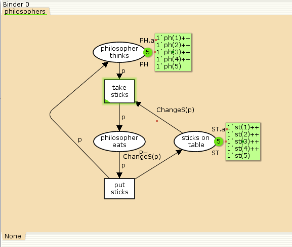
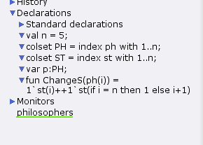
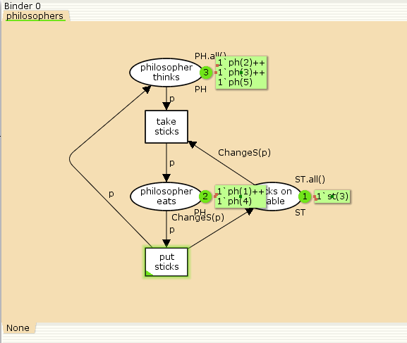
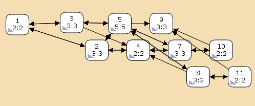

---
## Front matter
title: "Лабораторная работа № 9"
subtitle: "Задача об обедающих мудрецах"
author: "Демидова Екатерина Алексеевна"

## Generic otions
lang: ru-RU
toc-title: "Содержание"

## Bibliography
bibliography: bib/cite.bib
csl: pandoc/csl/gost-r-7-0-5-2008-numeric.csl

## Pdf output format
toc: true # Table of contents
toc-depth: 2
lof: true # List of figures
lot: false # List of tables
fontsize: 12pt
linestretch: 1.5
papersize: a4
documentclass: scrreprt
## I18n polyglossia
polyglossia-lang:
  name: russian
  options:
	- spelling=modern
	- babelshorthands=true
polyglossia-otherlangs:
  name: english
## I18n babel
babel-lang: russian
babel-otherlangs: english
## Fonts
mainfont: PT Serif
romanfont: PT Serif
sansfont: PT Sans
monofont: PT Mono
mainfontoptions: Ligatures=TeX
romanfontoptions: Ligatures=TeX
sansfontoptions: Ligatures=TeX,Scale=MatchLowercase
monofontoptions: Scale=MatchLowercase,Scale=0.9
## Biblatex
biblatex: true
biblio-style: "gost-numeric"
biblatexoptions:
  - parentracker=true
  - backend=biber
  - hyperref=auto
  - language=auto
  - autolang=other*
  - citestyle=gost-numeric
## Pandoc-crossref LaTeX customization
figureTitle: "Рис."
tableTitle: "Таблица"
listingTitle: "Листинг"
lofTitle: "Список иллюстраций"
lotTitle: "Список таблиц"
lolTitle: "Листинги"
## Misc options
indent: true
header-includes:
  - \usepackage{indentfirst}
  - \usepackage{float} # keep figures where there are in the text
  - \floatplacement{figure}{H} # keep figures where there are in the text
---

# Введение

## Цели и задачи

**Цель работы**

Реализовать в CPN Tools задачу об обедающих мудрецах.

**Задание**

- Реализовать в CPN Tools задачу об обедающих мудрецах.
- Вычислить пространство состояний, сформировать отчет о нем и построить граф.

# Выполнение лабораторной работы

## Реализация задачи об обедающих мудрецах в CPN Tools

Пять мудрецов сидят за круглым столом и могут пребывать в двух состояниях -- думать и есть. Между соседями лежит одна палочка для еды. Для приёма пищи необходимы две палочки. Палочки — пересекающийся ресурс. Необходимо синхронизировать процесс еды так, чтобы мудрецы не умерли с голода.

Рисуем граф сети. Для этого с помощью контекстного меню создаём новую сеть, добавляем позиции, переходы и дуги (рис. [-@fig:001]).

Начальные данные:
- позиции: мудрец размышляет (philosopher thinks), мудрец ест (philosopher eats)палочки находятся на столе (sticks on the table)
- переходы: взять палочки (take sticks), положить палочки (put sticks)

{#fig:001 width=70%}

В меню заданы новые декларации модели: типы фишек, начальные значения позиций, выражения для дуг:
- n -- число мудрецов и палочек (n = 5);
- p -- фишки, обозначающие мудрецов, имеют перечисляемый тип PH от 1 до n;
- s -- фишки, обозначающие палочки, имеют перечисляемый тип ST от 1 до n;
- функция ChangeS(p) ставит в соответствие мудрецам палочки (возвращает но- мера палочек, используемых мудрецами); по условию задачи мудрецы сидят по кругу и мудрец p(i) может взять i и i + 1 палочки(рис. [-@fig:002]):

{#fig:002 width=70%}

После запуска модели наблюдаем, что одновременно палочками могут воспользоваться только два из пяти мудрецов(рис. [-@fig:003]):

{#fig:003 width=70%}

## Пространство состояний задачи об обедающих мудрецах в CPN Tools

Сформируем граф пространства состояний, всего их 11(рис. [-@fig:004]):

{#fig:004 width=70%}

Затем сформируем отчет пространства состояний. Из него может увидеть:

- есть 11 состояний и 30 переходов между ними.
- Затем указаны границы значений для каждого элемента: думающие мудрецы (максимум - 5, минимум - 3), мудрецы едят (максимум - 2, минимум - 0), палочки на столе (максимум - 5, минимум - 1, минимальное значение 2, так как в конце симуляции остаются пирожки).
- Также указаны границы в виде мультимножеств.
- Маркировка home для всех состояний, так как в любую позицию мы можем попасть из любой другой маркировки.
- Маркировка dead равная None, так как нет состояний, из которых переходов быть не может.
- В конце указано, что бесконечно часто происходят события положить и взять палочку.


```
CPN Tools state space report for:
<unsaved net>
Report generated: Thu May 16 17:50:42 2024


 Statistics
------------------------------------------------------------------------

  State Space
     Nodes:  11
     Arcs:   30
     Secs:   0
     Status: Full

  Scc Graph
     Nodes:  1
     Arcs:   0
     Secs:   0


 Boundedness Properties
------------------------------------------------------------------------

  Best Integer Bounds
                             Upper      Lower
     philosophers'philosopher_eats 1
                             2          0
     philosophers'philosopher_thinks 1
                             5          3
     philosophers'sticks_on_table 1
                             5          1

  Best Upper Multi-set Bounds
     philosophers'philosopher_eats 1
                         1`ph(1)++
1`ph(2)++
1`ph(3)++
1`ph(4)++
1`ph(5)
     philosophers'philosopher_thinks 1
                         1`ph(1)++
1`ph(2)++
1`ph(3)++
1`ph(4)++
1`ph(5)
     philosophers'sticks_on_table 1
                         1`st(1)++
1`st(2)++
1`st(3)++
1`st(4)++
1`st(5)

  Best Lower Multi-set Bounds
     philosophers'philosopher_eats 1
                         empty
     philosophers'philosopher_thinks 1
                         empty
     philosophers'sticks_on_table 1
                         empty


 Home Properties
------------------------------------------------------------------------

  Home Markings
     All


 Liveness Properties
------------------------------------------------------------------------

  Dead Markings
     None

  Dead Transition Instances
     None

  Live Transition Instances
     All


 Fairness Properties
------------------------------------------------------------------------
       philosophers'put_sticks 1
                         Impartial
       philosophers'take_sticks 1
                         Impartial


```

# Выводы

В результате выполнения работы была реализована в CPN Tools задача об обедающих мудрецах.