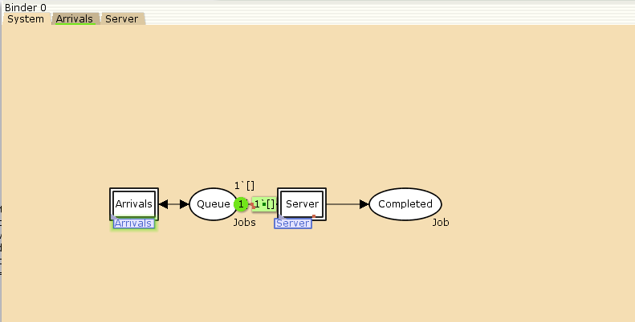

---
## Front matter
lang: ru-RU
title: Лабораторная работа № 11
subtitle: Модель системы массового обслуживания M|M|1
author:
  - Демидова Е. А.
institute:
  - Российский университет дружбы народов, Москва, Россия
date: 12 мая 2024

## i18n babel
babel-lang: russian
babel-otherlangs: english

## Formatting pdf
toc: false
toc-title: Содержание
slide_level: 2
aspectratio: 169
section-titles: true
theme: metropolis
header-includes:
 - \metroset{progressbar=frametitle,sectionpage=progressbar,numbering=fraction}
 - '\makeatletter'
 - '\beamer@ignorenonframefalse'
 - '\makeatother'
---

# Введение

## Цели и задачи

**Цель работы**

Реализовать в CPN Tools модель системы массового обслуживания M|M|1.

**Задание**

- Реализовать в CPN Tools модель системы массового обслуживания M|M|1.
- Настроить мониторинг параметров моделируемой системы и нарисовать графики очереди.

# Выполнение лабораторной работы

## Реализация модели системы массового обслуживания M|M|1 в CPN Tools

{#fig:001 width=60%}

## Реализация модели системы массового обслуживания M|M|1 в CPN Tools

{#fig:002 width=70%}

## Реализация модели системы массового обслуживания M|M|1 в CPN Tools

{#fig:003 width=70%}

## Реализация модели системы массового обслуживания M|M|1 в CPN Tools

{#fig:004 width=70%}

## Мониторинг параметров моделируемой системы

{#fig:005 width=70%}

## Мониторинг параметров моделируемой системы

```
#!/usr/bin/gnuplot -persist
# задаём текстовую кодировку,
# тип терминала, тип и размер шрифта
set encoding utf8
set term pdfcairo font "Arial,9"
# задаём выходной файл графика
set out 'qm.pdf'
# задаём стиль линии
set style line 2
plot "Queue_Delay.log" using ($4):($1) with lines
```

## Мониторинг параметров моделируемой системы

{#fig:006 width=70%}

## Мониторинг параметров моделируемой системы

{#fig:007 width=70%}

## Мониторинг параметров моделируемой системы

{#fig:008 width=55%}

## Мониторинг параметров моделируемой системы

{#fig:009 width=70%}

## Мониторинг параметров моделируемой системы

```
#!/usr/bin/gnuplot -persist
# задаём текстовую кодировку,
# тип терминала, тип и размер шрифта
set encoding utf8
set term pdfcairo font "Arial,9"
# задаём выходной файл графика
set out 'qm.pdf'
# задаём стиль линии
set style line 2
plot [0:] [0:1.2] "Long_Delay_Time.log" using ($4):($1) with lines
```

## Мониторинг параметров моделируемой системы

{#fig:010 width=70%}

# Выводы

В результате выполнения работы была реализована в CPN Tools модель системы массового обслуживания M|M|1.