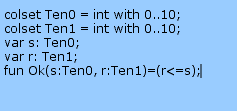

---
## Front matter
lang: ru-RU
title: Лабораторная работа № 12
subtitle: Пример моделирования простого протокола передачи данных
author:
  - Демидова Е. А.
institute:
  - Российский университет дружбы народов, Москва, Россия
date: 19 мая 2024

## i18n babel
babel-lang: russian
babel-otherlangs: english

## Formatting pdf
toc: false
toc-title: Содержание
slide_level: 2
aspectratio: 169
section-titles: true
theme: metropolis
header-includes:
 - \metroset{progressbar=frametitle,sectionpage=progressbar,numbering=fraction}
 - '\makeatletter'
 - '\beamer@ignorenonframefalse'
 - '\makeatother'
---

# Вводная часть

## Цели и задачи

**Цель работы**

Реализовать в CPN Tools простой протокол передачи данных и провести анализ.

**Задание**

- Реализовать в CPN Tools простой протокол передачи данных.
- Вычислить пространство состояний, сформировать отчет о нем и построить граф.

# Выполнение лабораторной работы

## Реализация задачи в CPN Tools

{#fig:001 width=70%}

## Реализация задачи в CPN Tools

{#fig:002 width=60%}

## Реализация задачи в CPN Tools

{#fig:003 width=60%}

## Реализация задачи в CPN Tools

{#fig:004 width=70%}

## Реализация задачи в CPN Tools

{#fig:005 width=70%}

## Пространство состояний

```
CPN Tools state space report for:
/home/openmodelica/lab12.cpn
Report generated: Fri May 17 01:59:51 2024
 Statistics
------------------------------------------------------------------------
  State Space
     Nodes:  31174
     Arcs:   520806
     Secs:   300
     Status: Partial
  Scc Graph
     Nodes:  16375
     Arcs:   438014
     Secs:   12
```

## Пространство состояний

```
 Boundedness Properties
------------------------------------------------------------------------
  Best Integer Bounds
                             Upper      Lower
     Main'A 1                21         0
     Main'B 1                10         0
     Main'C 1                7          0
     Main'D 1                5          0
     Main'NextRec 1          1          1
     Main'NextSend 1         1          1
     Main'Receiver 1         1          1
     Main'SA 1               1          1
     Main'SP 1               1          1
     Main'Send 1             8          8
```

## Пространство состояний

```
  Best Upper Multi-set Bounds
     Main'A 1            21`(1,"Modeling")++
17`(2,"g and An")++
12`(3,"alysis b")++
7`(4,"y Means ")++
2`(5,"of Colou")
```

## Пространство состояний

```
  Best Lower Multi-set Bounds
     Main'A 1            empty
     Main'B 1            empty
     Main'C 1            empty
     Main'D 1            empty
```

## Пространство состояний

```
 Home Properties
------------------------------------------------------------------------
  Home Markings
     None
 Liveness Properties
------------------------------------------------------------------------
  Dead Markings
     10991 [31174,31173,31172,31171,31170,...]
  Dead Transition Instances
     None
  Live Transition Instances
     None
```
## Пространство состояний

```
 Fairness Properties
------------------------------------------------------------------------
       Main'Received_Packet 1 No Fairness
       Main'Send_ACK 1        No Fairness
       Main'Send_Packet 1     Impartial
       Main'Transmit_ACK 1    No Fairness
       Main'Transmit_Packet 1 Impartial
```

## Пространство состояний

{#fig:006 width=70%}

# Выводы

В результате выполнения работы был реализован в CPN Tools простой протокол передачи данных и проведен анализ его пространства состояний.