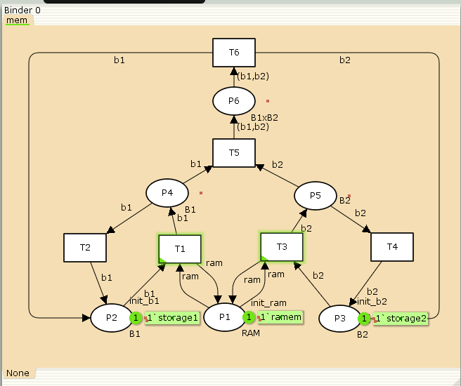
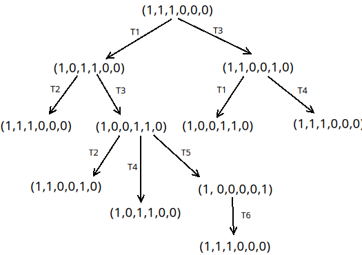
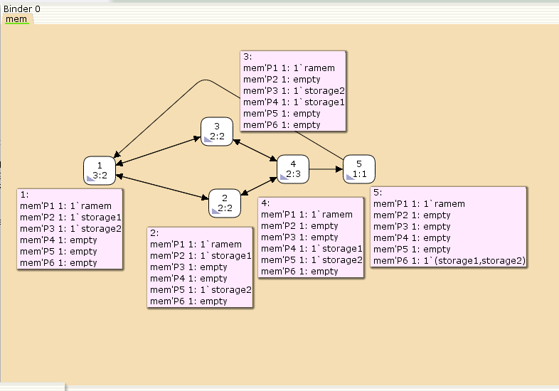

---
## Front matter
lang: ru-RU
title: Лабораторная работа № 13
subtitle: Задание для самостоятельного выполнения
author:
  - Демидова Е. А.
institute:
  - Российский университет дружбы народов, Москва, Россия
date: 23 мая 2024

## i18n babel
babel-lang: russian
babel-otherlangs: english

## Formatting pdf
toc: false
toc-title: Содержание
slide_level: 2
aspectratio: 169
section-titles: true
theme: metropolis
header-includes:
 - \metroset{progressbar=frametitle,sectionpage=progressbar,numbering=fraction}
 - '\makeatletter'
 - '\beamer@ignorenonframefalse'
 - '\makeatother'
---

# Вводная часть

## Цели и задачи

**Цель работы**

Реализовать в CPN Tools задание для самостоятельного выполнения.

**Задание**

1. Используя теоретические методы анализа сетей Петри, проведите анализ сети, изображённой на рис. 13.2 (с помощью построения дерева достижимости). Определите, является ли сеть безопасной, ограниченной, сохраняющей, имеются ли тупики.
2. Промоделируйте сеть Петри (см. рис. 13.2) с помощью CPNTools.
3. Вычислите пространство состояний. Сформируйте отчёт о пространстве состояний и проанализируйте его. Постройте граф пространства состояний.

# Выполнение лабораторной работы

## Реализация задачи в CPN Tools

{#fig:001 width=40%}

## Реализация задачи в CPN Tools

{#fig:002 width=60%}

## Анализ сети Петри 

{#fig:003 width=70%}

## Пространство состояний в CPN Tools

{#fig:004 width=70%}

## Пространство состояний в CPN Tools

```
CPN Tools state space report for:
/home/openmodelica/lab13_mip.cpn
Report generated: Sun May 19 07:47:57 2024

 Statistics
------------------------------------------------------------------------
  State Space
     Nodes:  5
     Arcs:   10
     Secs:   0
     Status: Full
  Scc Graph
     Nodes:  1
     Arcs:   0
     Secs:   0
```

## Пространство состояний в CPN Tools

```
 Boundedness Properties
------------------------------------------------------------------------
  Best Integer Bounds
                             Upper      Lower
     mem'P1 1                1          1
     mem'P2 1                1          0
     mem'P3 1                1          0
     mem'P4 1                1          0
     mem'P5 1                1          0
     mem'P6 1                1          0
```

## Пространство состояний в CPN Tools

```
  Best Upper Multi-set Bounds
     mem'P1 1            1`ramem
     mem'P2 1            1`storage1
     mem'P3 1            1`storage2
     mem'P4 1            1`storage1
     mem'P5 1            1`storage2
     mem'P6 1            1`(storage1,storage2)
```

## Пространство состояний в CPN Tools

```
  Best Lower Multi-set Bounds
     mem'P1 1            1`ramem
     mem'P2 1            empty
     mem'P3 1            empty
     mem'P4 1            empty
     mem'P5 1            empty
     mem'P6 1            empty
```

## Пространство состояний в CPN Tools

```
 Home Properties
------------------------------------------------------------------------
  Home Markings
     All
 Liveness Properties
------------------------------------------------------------------------
  Dead Markings
     None
  Dead Transition Instances
     None
  Live Transition Instances
     All
```
## Пространство состояний в CPN Tools

```
 Fairness Properties
------------------------------------------------------------------------
       mem'T1 1               No Fairness
       mem'T2 1               No Fairness
       mem'T3 1               No Fairness
       mem'T4 1               No Fairness
       mem'T5 1               Just
       mem'T6 1               Fair
```

# Выводы

В результате выполнения работы было выполнено самостоятельное задание: проведен анализ сети Петри, эта сеть была построена с помощью CPNTools, и также был построен граф состояний и проведён его анализ.