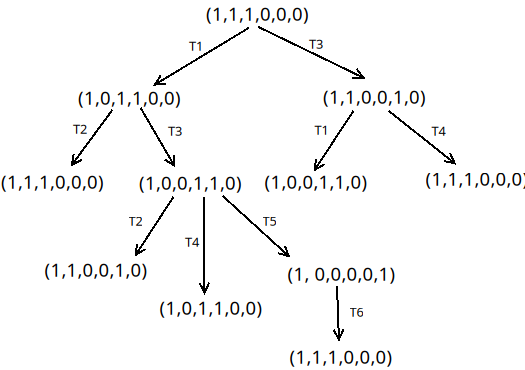
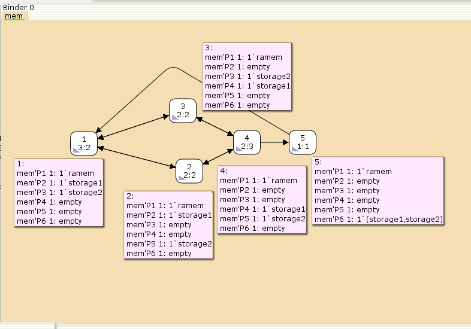

---
## Front matter
title: "Лабораторная работа № 13"
subtitle: "Задание для самостоятельного выполнения"
author: "Демидова Екатерина Алексеевна"

## Generic otions
lang: ru-RU
toc-title: "Содержание"

## Bibliography
bibliography: bib/cite.bib
csl: pandoc/csl/gost-r-7-0-5-2008-numeric.csl

## Pdf output format
toc: true # Table of contents
toc-depth: 2
lof: true # List of figures
lot: false # List of tables
fontsize: 12pt
linestretch: 1.5
papersize: a4
documentclass: scrreprt
## I18n polyglossia
polyglossia-lang:
  name: russian
  options:
	- spelling=modern
	- babelshorthands=true
polyglossia-otherlangs:
  name: english
## I18n babel
babel-lang: russian
babel-otherlangs: english
## Fonts
mainfont: PT Serif
romanfont: PT Serif
sansfont: PT Sans
monofont: PT Mono
mainfontoptions: Ligatures=TeX
romanfontoptions: Ligatures=TeX
sansfontoptions: Ligatures=TeX,Scale=MatchLowercase
monofontoptions: Scale=MatchLowercase,Scale=0.9
## Biblatex
biblatex: true
biblio-style: "gost-numeric"
biblatexoptions:
  - parentracker=true
  - backend=biber
  - hyperref=auto
  - language=auto
  - autolang=other*
  - citestyle=gost-numeric
## Pandoc-crossref LaTeX customization
figureTitle: "Рис."
tableTitle: "Таблица"
listingTitle: "Листинг"
lofTitle: "Список иллюстраций"
lotTitle: "Список таблиц"
lolTitle: "Листинги"
## Misc options
indent: true
header-includes:
  - \usepackage{indentfirst}
  - \usepackage{float} # keep figures where there are in the text
  - \floatplacement{figure}{H} # keep figures where there are in the text
---

# Введение

## Цели и задачи

**Цель работы**

Реализовать в CPN Tools задание для самостоятельного выполнения.

**Задание**

1. Используя теоретические методы анализа сетей Петри, проведите анализ сети, изображённой на рис. 13.2 (с помощью построения дерева достижимости). Определите, является ли сеть безопасной, ограниченной, сохраняющей, имеются ли тупики.
2. Промоделируйте сеть Петри (см. рис. 13.2) с помощью CPNTools.
3. Вычислите пространство состояний. Сформируйте отчёт о пространстве состояний и проанализируйте его. Постройте граф пространства состояний.

# Выполнение лабораторной работы

## Реализация задачи в CPN Tools

Сеть Петри моделируемой системы представлена на рис. 13.2.
Множество позиций:
- P1 -- состояние оперативной памяти (свободна / занята);
- P2 -- состояние внешнего запоминающего устройства B1 (свободно / занято);
- P3 -- состояние внешнего запоминающего устройства B2 (свободно / занято);
- P4 -- работа на ОП и B1 закончена;
- P5 -- работа на ОП и B2 закончена;
- P6 -- работа на ОП, B1 и B2 закончена;
Множество переходов:
- T1 -- ЦП работает только с RAM и B1;
- T2 -- обрабатываются данные из RAM и с B1 переходят на устройство вывода;
- T3 -- CPU работает только с RAM и B2;
- T4 -- обрабатываются данные из RAM и с B2 переходят на устройство вывода;
- T5 -- CPU работает только с RAM и с B1, B2;
- T6 -- обрабатываются данные из RAM, B1, B2 и переходят на устройство вывода.
Функционирование сети Петри можно расматривать как срабатывание переходов, в ходе которого происходит перемещение маркеров по позициям:
- работа CPU с RAM и B1 отображается запуском перехода T1 (удаление маркеров из P1, P2 и появление в P1, P4), что влечет за собой срабатывание перехода T2, т.е. передачу данных с RAM и B1 на устройство вывода;
- работа CPU с RAM и B2 отображается запуском перехода T3 (удаление маркеров из P1 и P3 и появление в P1 и P5), что влечет за собой срабатывание перехода T4, т.е. передачу данных с RAM и B2 на устройство вывода;
- работа CPU с RAM, B1 и B2 отображается запуском перехода T5 (удаление маркеров из P4 и P5 и появление в P6), далее срабатывание перехода T6, и данные из RAM, B1 и B2 передаются на устройство вывода;
- состояние устройств восстанавливается при срабатывании: RAM — переходов T1 или T2; B1 -- переходов T2 или T6; B2 -- переходов T4 или T6.

В меню заданы новые декларации модели: типы фишек, начальные значения позиций, выражения для дуг(рис. [-@fig:001]).
- ram -- оперативная память типа RAM;
- b1 -- первое накопительное устройство типа B1;
- b2 -- второе накопительное устройство типа B2;
- B1xB2 -- тип для передачи b1 и b2;
- Начальные состояния P1, P2, P3 содержат один элемент типа RAM, B1, B2 соответственно

{#fig:001 width=70%}

Рисуем граф сети. Для этого с помощью контекстного меню создаём новую сеть, добавляем позиции, переходы и дуги, а также зададим типы данных и начальные состояния(рис. [-@fig:002]):

{#fig:002 width=70%}

## Анализ сети Петри 

Построим граф достижимости(рис. [-@fig:003]):

{#fig:003 width=70%}

Можно увидеть, что рассматриваемая сеть Петри:
- безопасна, так как число фишек в каждой позиции не
может превысить 1;
- ограничена, так как существует такое целое k, что число фишек в каждой позиции не может превысить k(в нашем случае k = 1);
- не имеет тупиков;
- не является сохраняющей, так как при переходе T5 теряется 1 фишка, а при T6 -- порождается;

## Пространство состояний в CPN Tools

Сформируем граф пространства состояний, всего их 5(рис. [-@fig:004]):

{#fig:004 width=70%}

Затем сформируем отчет пространства состояний. Из него может увидеть:

- есть 5 состояний и 10 переходов между ними, strongly connected components (SCC) graph содержит 1 вершину и 0 переходов, так как нет состояний, из которых можно попасть во все остальные.
- Затем указаны границы значений для каждого элемента: состояние P1 всегда заполнено 1 элементом, а остальные содержат максимум 1 элемент, минимум -- 0.
- Также указаны границы в виде мультимножеств.
- Маркировка home для всех состояний, так как в любую позицию мы можем попасть из любой другой маркировки.
- Маркировка dead равная None, так как нет состояний, из которых переходов быть не может.
- В конце указано, что бесконечно часто могут происходить переходы T1, T2, T3, T4, но не обязательно, также состояние T5 необходимо для того, чтобы система не попадала в тупик, то есть были бесконечные циклы, а состояние T6 происходит всегда, если доступно.


```
CPN Tools state space report for:
/home/openmodelica/lab13_mip.cpn
Report generated: Sun May 19 07:47:57 2024


 Statistics
------------------------------------------------------------------------

  State Space
     Nodes:  5
     Arcs:   10
     Secs:   0
     Status: Full

  Scc Graph
     Nodes:  1
     Arcs:   0
     Secs:   0


 Boundedness Properties
------------------------------------------------------------------------

  Best Integer Bounds
                             Upper      Lower
     mem'P1 1                1          1
     mem'P2 1                1          0
     mem'P3 1                1          0
     mem'P4 1                1          0
     mem'P5 1                1          0
     mem'P6 1                1          0

  Best Upper Multi-set Bounds
     mem'P1 1            1`ramem
     mem'P2 1            1`storage1
     mem'P3 1            1`storage2
     mem'P4 1            1`storage1
     mem'P5 1            1`storage2
     mem'P6 1            1`(storage1,storage2)

  Best Lower Multi-set Bounds
     mem'P1 1            1`ramem
     mem'P2 1            empty
     mem'P3 1            empty
     mem'P4 1            empty
     mem'P5 1            empty
     mem'P6 1            empty


 Home Properties
------------------------------------------------------------------------

  Home Markings
     All


 Liveness Properties
------------------------------------------------------------------------

  Dead Markings
     None

  Dead Transition Instances
     None

  Live Transition Instances
     All


 Fairness Properties
------------------------------------------------------------------------
       mem'T1 1               No Fairness
       mem'T2 1               No Fairness
       mem'T3 1               No Fairness
       mem'T4 1               No Fairness
       mem'T5 1               Just
       mem'T6 1               Fair
```

# Выводы

В результате выполнения работы было выполнено самостоятельное задание: проведен анализ сети Петри, эта сеть была построена с помощью CPNTools, и также был построен граф состояний и проведён его анализ.