---
## Front matter
lang: ru-RU
title: Лабораторная работа № 14
subtitle: Модели обработки заказов
author:
  - Демидова Е. А.
institute:
  - Российский университет дружбы народов, Москва, Россия
date: 26 мая 2024

## i18n babel
babel-lang: russian
babel-otherlangs: english

## Formatting pdf
toc: false
toc-title: Содержание
slide_level: 2
aspectratio: 169
section-titles: true
theme: metropolis
header-includes:
 - \metroset{progressbar=frametitle,sectionpage=progressbar,numbering=fraction}
 - '\makeatletter'
 - '\beamer@ignorenonframefalse'
 - '\makeatother'
---

# Вводная часть

## Цели и задачи

**Цель**

Реализовать разные модели обслуживания клиентов и провести анализ результатов.

**Задачи**

Реализовать с помощью gpss:

- модель оформления заказов клиентов одним оператором с разными входными данными
- построение гистограммы распределения заявок в очереди
- модель обслуживания двух типов заказов от клиентов в интернет-магазине
- одель оформления заказов несколькими операторами

# Выполнение лабораторной работы

# Модель оформления заказов клиентов одним оператором

## Модель оформления заказов клиентов одним оператором

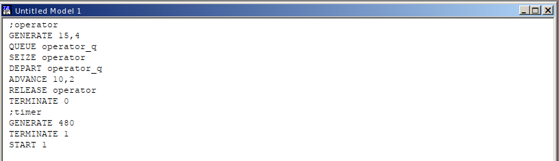{#fig:001 width=90%}

## Модель оформления заказов клиентов одним оператором

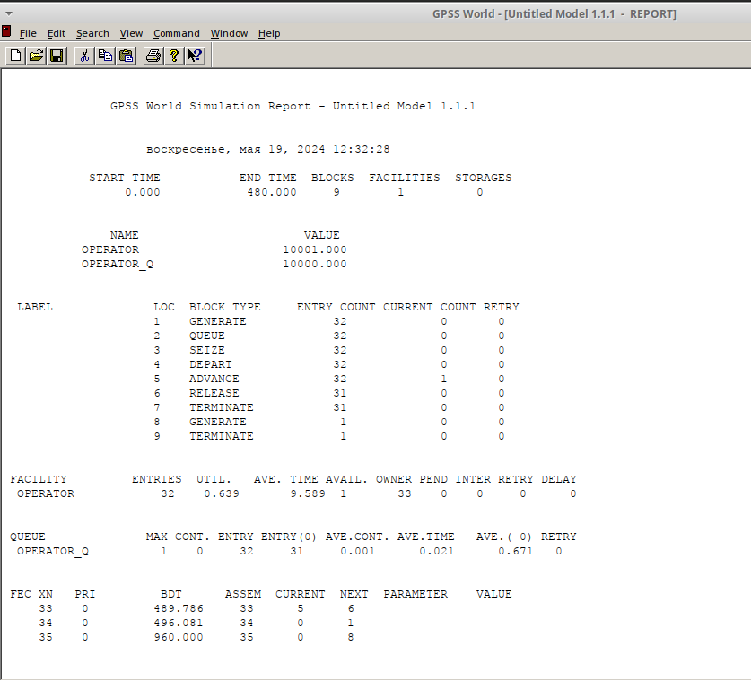{#fig:002 width=50%}

## Упражнение

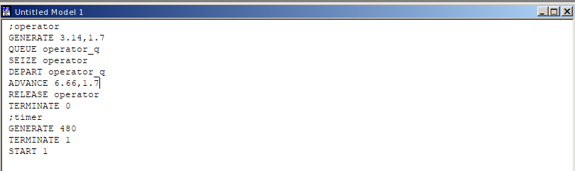{#fig:003 width=80%}

## Упражнение

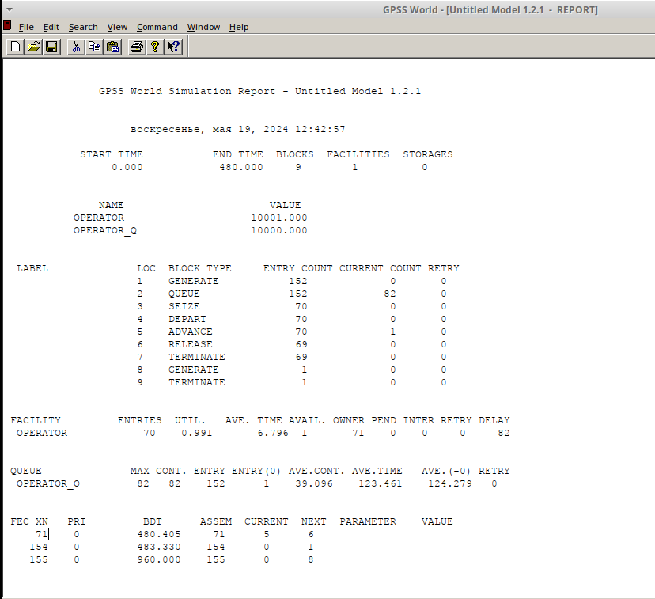{#fig:004 width=50%}

# Построение гистограммы распределения заявок в очереди
 
## Построение гистограммы распределения заявок в очереди

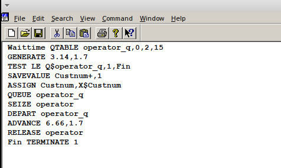{#fig:005 width=70%}

## Построение гистограммы распределения заявок в очереди

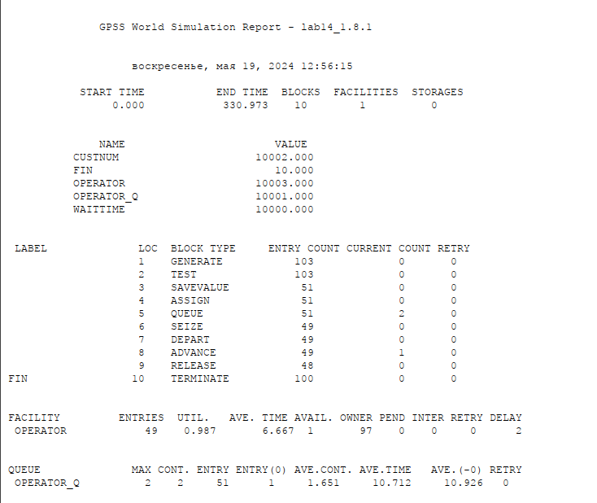{#fig:006 width=50%}

## Построение гистограммы распределения заявок в очереди

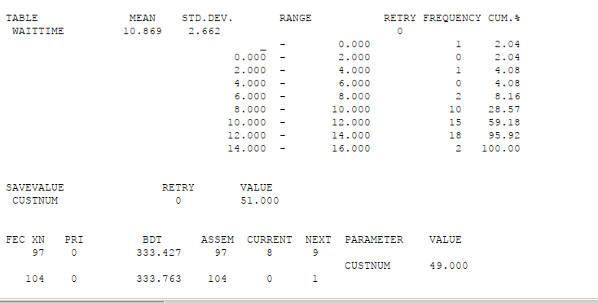{#fig:007 width=70%}

## Построение гистограммы распределения заявок в очереди

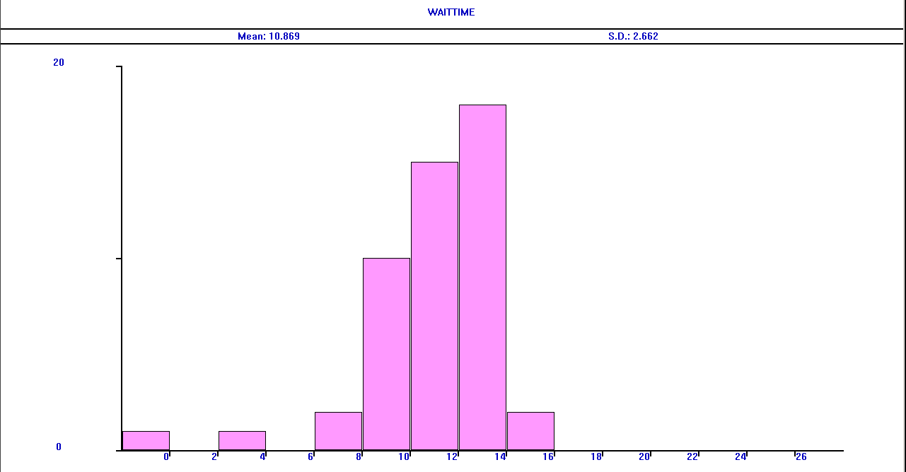{#fig:008 width=70%}

# Модель обслуживания двух типов заказов от клиентов в интернет-магазине

## Модель обслуживания двух типов заказов от клиентов в интернет-магазине

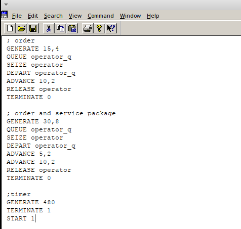{#fig:009 width=50%}

## Модель обслуживания двух типов заказов от клиентов в интернет-магазине

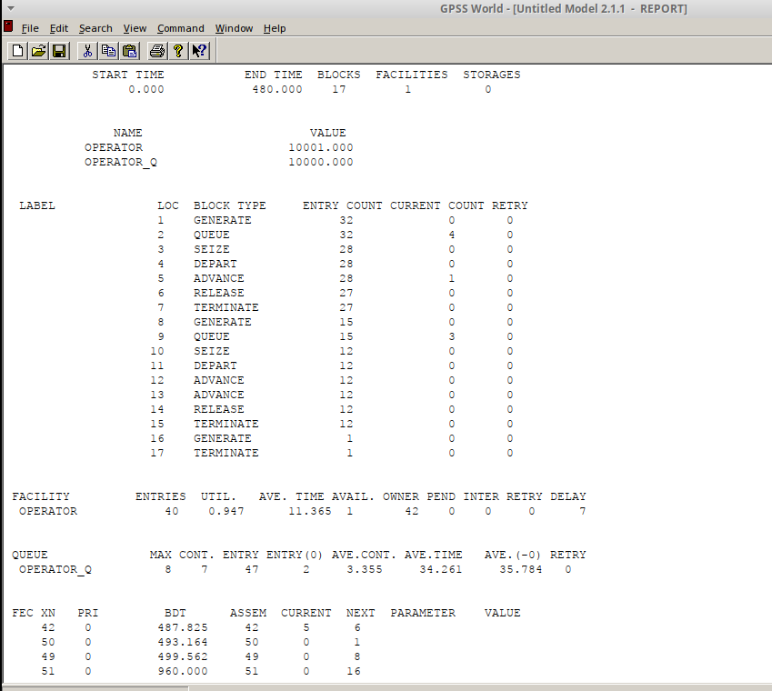{#fig:010 width=50%}

## Упражнение

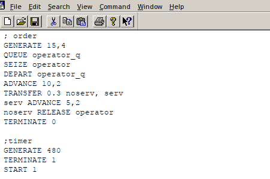{#fig:011 width=70%}

## Упражнение

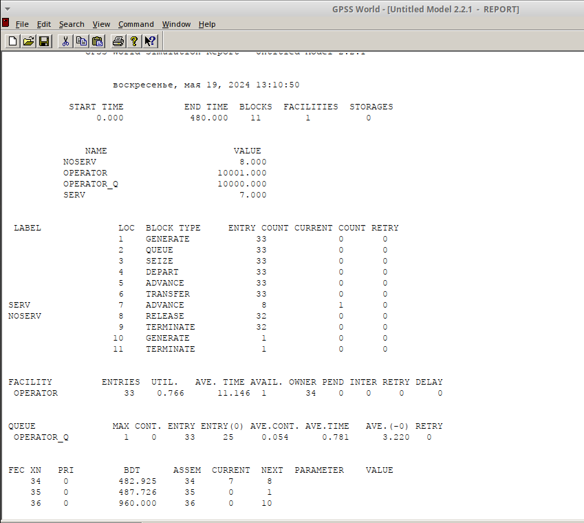{#fig:012 width=50%}

# Модель оформления заказов несколькими операторами

## Модель оформления заказов несколькими операторами

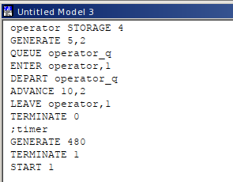{#fig:013 width=60%}

## Модель оформления заказов несколькими операторами

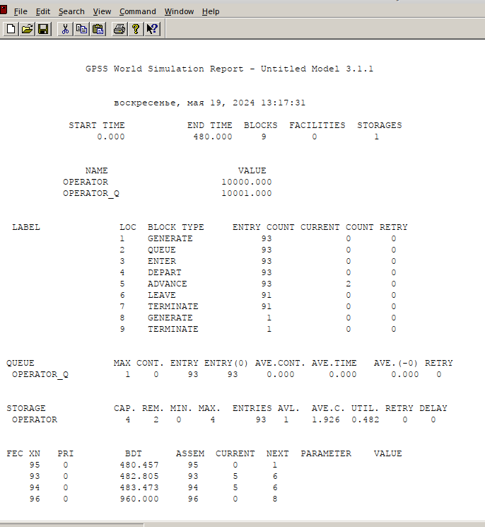{#fig:014 width=40%}

## Упражнение

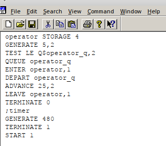{#fig:015 width=50%}

## Упражнение

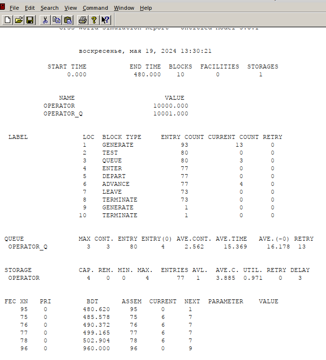{#fig:016 width=40%}

# Выводы

В результате выполнения работы были реализованы с помощью gpss:
  - модель оформления заказов клиентов одним оператором с разными входными данными
  - построение гистограммы распределения заявок в очереди
  - модель обслуживания двух типов заказов от клиентов в интернет-магазине
  - одель оформления заказов несколькими операторами