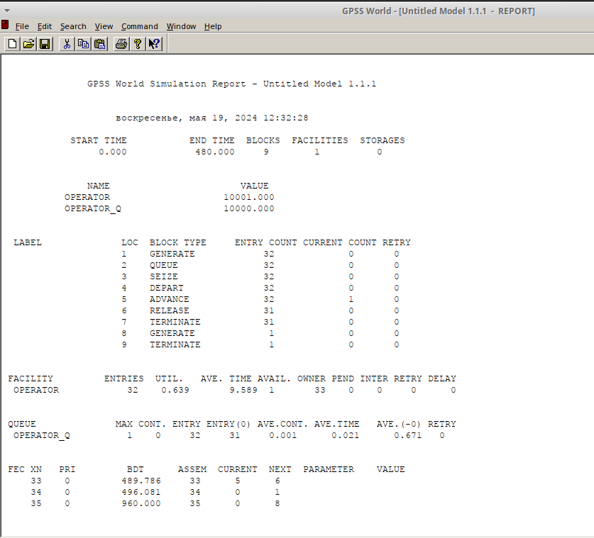
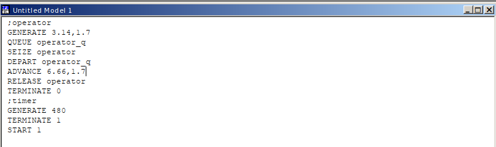
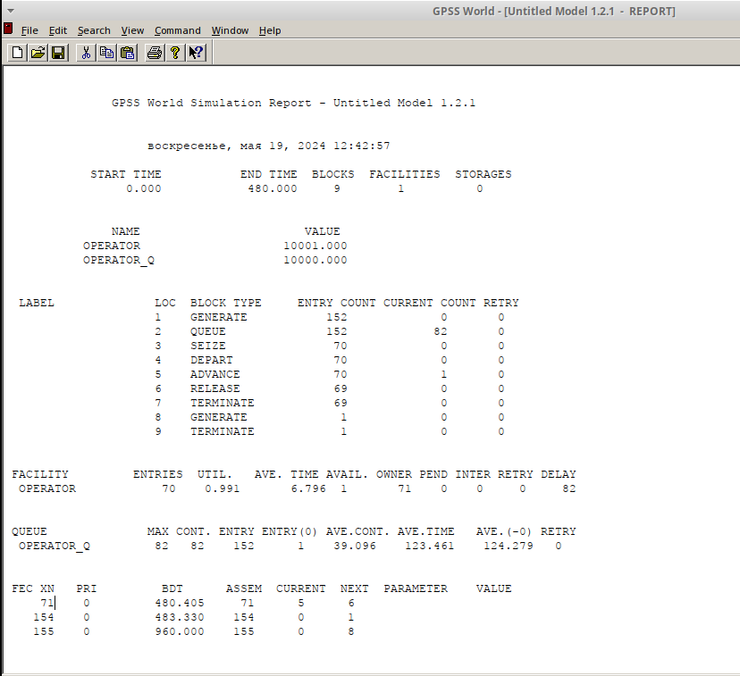
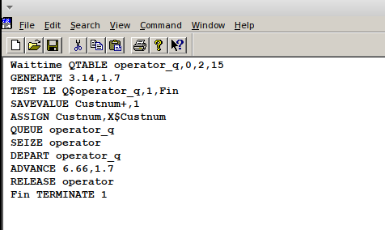
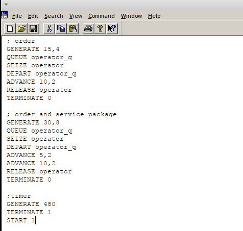
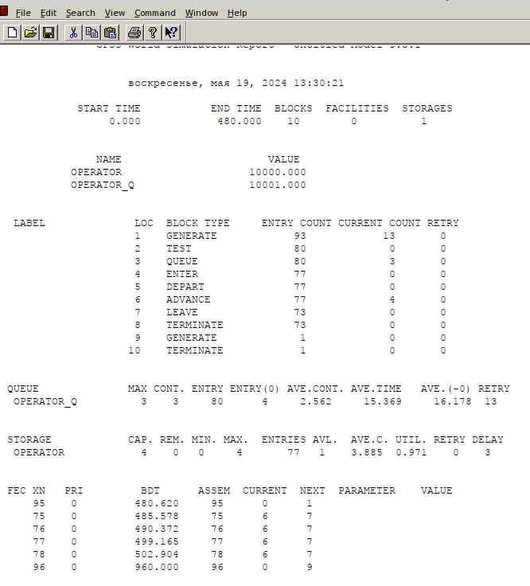

---
## Front matter
title: "Лабораторная работа № 14"
subtitle: "Модели обработки заказов"
author: "Демидова Екатерина Алексеевна"

## Generic otions
lang: ru-RU
toc-title: "Содержание"

## Bibliography
bibliography: bib/cite.bib
csl: pandoc/csl/gost-r-7-0-5-2008-numeric.csl

## Pdf output format
toc: true # Table of contents
toc-depth: 2
lof: true # List of figures
lot: false # List of tables
fontsize: 12pt
linestretch: 1.5
papersize: a4
documentclass: scrreprt
## I18n polyglossia
polyglossia-lang:
  name: russian
  options:
	- spelling=modern
	- babelshorthands=true
polyglossia-otherlangs:
  name: english
## I18n babel
babel-lang: russian
babel-otherlangs: english
## Fonts
mainfont: PT Serif
romanfont: PT Serif
sansfont: PT Sans
monofont: PT Mono
mainfontoptions: Ligatures=TeX
romanfontoptions: Ligatures=TeX
sansfontoptions: Ligatures=TeX,Scale=MatchLowercase
monofontoptions: Scale=MatchLowercase,Scale=0.9
## Biblatex
biblatex: true
biblio-style: "gost-numeric"
biblatexoptions:
  - parentracker=true
  - backend=biber
  - hyperref=auto
  - language=auto
  - autolang=other*
  - citestyle=gost-numeric
## Pandoc-crossref LaTeX customization
figureTitle: "Рис."
tableTitle: "Таблица"
listingTitle: "Листинг"
lofTitle: "Список иллюстраций"
lotTitle: "Список таблиц"
lolTitle: "Листинги"
## Misc options
indent: true
header-includes:
  - \usepackage{indentfirst}
  - \usepackage{float} # keep figures where there are in the text
  - \floatplacement{figure}{H} # keep figures where there are in the text
---

# Цель работы

Реализовать разные модели обслуживания клиентов и провести анализ результатов.

# Задание

Реализовать с помощью gpss:

- модель оформления заказов клиентов одним оператором с разными входными данными
- построение гистограммы распределения заявок в очереди
- модель обслуживания двух типов заказов от клиентов в интернет-магазине
- одель оформления заказов несколькими операторами

# Выполнение лабораторной работы

## Модель оформления заказов клиентов одним оператором

Порядок блоков в модели соответствует порядку фаз обработки заказа в реальной системе:

1) клиент оставляет заявку на заказ в интернет-магазине;
2) если необходимо, заявка от клиента ожидает в очереди освобождения оператора для оформления заказа;
3) заявка от клиента принимается оператором для оформления заказа;
4) оператор оформляет заказ;
5) клиент получает подтверждение об оформлении заказа (покидает систему).

Модель будет состоять из двух частей: моделирование обработки заказов в интернет-магазине и задание времени моделирования. Для задания равномерного распределения поступления заказов используем блок GENERATE, для задания равномерного времени обслуживания (задержки в системе) -- ADVANCE. Для моделирования ожидания заявок клиентов в очереди используем блоки QUEUE и DEPART, в которых в качестве имени очереди укажем operator_q Для моделирования поступления заявок для оформления заказов к оператору используем блоки SEIZE и RELEASE с параметром operator — имени «устройства обслуживания».

Требуется, чтобы модельное время было 8 часов. Соответственно, параметр блока GENERATE -- 480 (8 часов по 60 минут, всего 480 минут). Работа программы начи- нается с оператора START с начальным значением счётчика завершений, равным 1; заканчивается -- оператором TERMINATE с параметром 1, что задаёт ординарность потока в модели.

Таким образом, имеем(рис. [-@fig:001]).

{#fig:001 width=90%}

После запуска симуляции получаем отчёт(рис. [-@fig:002]).

{#fig:002 width=90%}

Результаты работы модели:
- модельное время в начале моделирования: START TIME=0.0;
- абсолютное время или момент, когда счетчик завершений принял значение 0: END TIME=480.0;
- количество блоков, использованных в текущей модели, к моменту завершения моделирования: BLOCKS=9;
- количество одноканальных устройств, использованных в модели к моменту завершения моделирования: FACILITIES=1;
- количество многоканальных устройств, использованных в текущей модели к моменту завершения моделирования: STORAGES=0. Имена, используемые в программе модели: operator, operator_q. 

Далее идёт информация о блоках текущей модели, в частности, ENTRY COUNT -- количество транзактов, вошедших в блок с начала процедуры моделирования. 

Затем идёт информация об одноканальном устройстве FACILITY (оператор, оформляющий заказ), откуда видим, что к оператору попало 33 заказа от клиентов (значение поля OWNER=33), но одну заявку оператор не успел принять в обработку до окончания рабочего времени (значение поля ENTRIES=32). Полезность работы оператора составила 0, 639. При этом среднее время занятости оператора составило 9, 589 мин.

Далее информация об очереди:
- QUEUE=operator_q -- имя объекта типа «очередь»;
- MAX=1 -- в очереди находилось не более одной ожидающей заявки от клиента;
- CONT=0 -- на момент завершения моделирования очередь была пуста;
- ENTRIES=32 -- общее число заявок от клиентов, прошедших через очередь в течение периода моделирования;
- ENTRIES(O)=31 -- число заявок от клиентов, попавших к оператору без ожидания в очереди;
- AVE.CONT=0, 001 заявок от клиентов в среднем были в очереди;
- AVE.TIME=0.021 минут в среднем заявки от клиентов провели в очереди (с учётом всех входов в очередь);
- AVE.(–0)=0, 671 минут в среднем заявки от клиентов провели в очереди (без учета «нулевых» входов в очередь).

В конце отчёта идёт информация о будущих событиях:
- XN=33 -- порядковый номер заявки от клиента, ожидающей поступления для оформления заказа у оператора;
- PRI=0 -- все клиенты (из заявки) равноправны;
- BDT=489, 786 -- время назначенного события, связанного с данным транзактом;
- ASSEM=33 -- номер семейства транзактов;
- CURRENT=5 -- номер блока, в котором находится транзакт;
- NEXT=6 -- номер блока, в который должен войти транзакт.

### Упражнение

Изменим интервалы постпуления заказов и время оформления клиентов(рис. [-@fig:003], [-@fig:004]).

{#fig:003 width=90%}

{#fig:004 width=90%}

Результаты работы модели:
- модельное время в начале моделирования: START TIME=0.0;
- абсолютное время или момент, когда счетчик завершений принял значение 0: END TIME=480.0;
- количество блоков, использованных в текущей модели, к моменту завершения моделирования: BLOCKS=9;
- количество одноканальных устройств, использованных в модели к моменту завершения моделирования: FACILITIES=1;
- количество многоканальных устройств, использованных в текущей модели к моменту завершения моделирования: STORAGES=0. 

Имена, используемые в программе модели: operator, operator_q. 

- количество транзактов, вошедших в блок с начала процедуры моделирования ENTRY COUNT = 152;

Затем идёт информация об одноканальном устройстве FACILITY (оператор, оформляющий заказ), откуда видим, что к оператору попало 71 заказ от клиентов (значение поля OWNER=71), но оператор успел принять в обработку до окончания рабочего времени только 70 (значение поля ENTRIES=70). Полезность работы оператора составила 0,987. При этом среднее время занятости оператора составило 6,796 мин.

Далее информация об очереди:
- QUEUE=operator_q -- имя объекта типа «очередь»;
- MAX=82 -- в очереди находилось не более двух ожидающих заявок от клиента;
- CONT=82 -- на момент завершения моделирования в очереди было два клиента;
- ENTRIES=82 -- общее число заявок от клиентов, прошедших через очередь в течение периода моделирования;
- ENTRIES(O)=1 -- число заявок от клиентов, попавших к оператору без ожидания в очереди;
- AVE.CONT=39,096 заявок от клиентов в среднем были в очереди;
- AVE.TIME=123.461 минут в среднем заявки от клиентов провели в очереди (с учётом всех входов в очередь);
- AVE.(-0)=123,279 минут в среднем заявки от клиентов провели в очереди (без учета «нулевых» входов в очередь).

В конце отчёта идёт информация о будущих событиях:
- XN=71 -- порядковый номер заявки от клиента, ожидающей поступления для оформления заказа у оператора;
- PRI=0 -- все клиенты (из заявки) равноправны;
- BDT=480,405 -- время назначенного события, связанного с данным транзактом;
- ASSEM=71 -- номер семейства транзактов;
- CURRENT=5 -- номер блока, в котором находится транзакт;
- NEXT=6 -- номер блока, в который должен войти транзакт.

Аналогичные поля для остальных.

## Построение гистограммы распределения заявок в очереди

Требуется построить гистограмму распределения заявок, ожидающих обработки в очереди в примере из предыдущего упражнения. Для построения гистограммы необходимо сформировать таблицу значений заявок в очереди, записываемых в неё с определённой частотой.

Команда описания такой таблицы QTABLE имеет следующий формат: `Name QTABLE A,B,C,D`
Здесь Name -- метка, определяющая имя таблицы. Далее должны быть заданы операнды: А задается элемент данных, чьё частотное распределение будет заноситься в таблицу (может быть именем, выражением в скобках или системным числовым атрибутом (СЧА)); B задается верхний предел первого частотного интервала; С задает ширину частотного интервала — разницу между верхней и нижней границей каждого частотного класса; D задаёт число частотных интервалов. 

Код программы будет следующим(рис. [-@fig:005]).

{#fig:005 width=90%}

Здесь Waittime — метка оператора таблицы очередей QTABLE, в данном случае название таблицы очереди заявок на заказы. Строка с оператором TEST по смыслу аналогично действиям оператора IF и означает, что если в очереди 0 или 1 заявка, то осуществляется переход к следующему оператору, в данном случае к оператору SAVEVALUE, в противном случае (в очереди более одной заявки) происходит переход к оператору с меткой Fin, то есть заявка удаляется из системы, не попадая на обслуживание. Строка с оператором SAVEVALUE с помощью операнда Custnum подсчитывает число заявок на заказ, попавших в очередь. Далее оператору ASSIGN присваивается значение СЧА оператора Custnum.

Проанализируем отчет симуляции(рис. [-@fig:006], [-@fig:007]).

{#fig:006 width=90%}

{#fig:007 width=90%}

Результаты работы модели:
- модельное время в начале моделирования: START TIME=0.0;
- абсолютное время или момент, когда счетчик завершений принял значение 0: END TIME=330.0;
- количество блоков, использованных в текущей модели, к моменту завершения моделирования: BLOCKS=10;
- количество одноканальных устройств, использованных в модели к моменту завершения моделирования: FACILITIES=1;
- количество многоканальных устройств, использованных в текущей модели к моменту завершения моделирования: STORAGES=0. 

Имена, используемые в программе модели: operator, operator_q. 

- количество транзактов, вошедших в блок с начала процедуры моделирования ENTRY COUNT = 103;

Затем идёт информация об одноканальном устройстве FACILITY (оператор, оформляющий заказ), откуда видим, что к оператору попало 97 заказов от клиентов (значение поля OWNER=97), но оператор успел принять в обработку до окончания рабочего времени только 49 (значение поля ENTRIES=49). Полезность работы оператора составила 0,987. При этом среднее время занятости оператора составило 6,667 мин.

Далее информация об очереди:
- QUEUE=operator_q -- имя объекта типа «очередь»;
- MAX=2 -- в очереди находилось не более двух ожидающих заявок от клиента;
- CONT=2 -- на момент завершения моделирования в очереди было два клиента;
- ENTRIES=51 -- общее число заявок от клиентов, прошедших через очередь в течение периода моделирования;
- ENTRIES(O)=1 -- число заявок от клиентов, попавших к оператору без ожидания в очереди;
- AVE.CONT=1,651 заявок от клиентов в среднем были в очереди;
- AVE.TIME=10.712 минут в среднем заявки от клиентов провели в очереди (с учётом всех входов в очередь);
- AVE.(-0)=10,926 минут в среднем заявки от клиентов провели в очереди (без учета «нулевых» входов в очередь).

Также появилась таблица с информацией для гистограмы: частотность разделена на 15 частотных интервалов с шагом 2 и началом в 0(как мы и задавали). Наибольшее количество заявок(18) обрабатывалось 12-14 минут, чуть меньше (15) -- 10-12 минут, ещё меньше(10) -- 8-10 минут, в остальных диапазонах 0-2 заявки. 

В конце отчёта идёт информация о будущих событиях:
- XN=97 -- порядковый номер заявки от клиента, ожидающей поступления для оформления заказа у оператора;
- PRI=0 -- все клиенты (из заявки) равноправны;
- BDT=333,427 -- время назначенного события, связанного с данным транзактом;
- ASSEM=97 -- номер семейства транзактов;
- CURRENT=8 -- номер блока, в котором находится транзакт;
- NEXT=9 -- номер блока, в который должен войти транзакт.

Аналогичные поля для остальных.

Проанализируем гистограмму(рис. [-@fig:008]).

{#fig:008 width=90%}

Частотность разделена на 15 частотных интервалов с шагом 2 и началом в 0(как мы и задавали). Наибольшее количество заявок(18) обрабатывалось 12-14 минут, чуть меньше (15) -- 10-12 минут, ещё меньше(10) -- 8-10 минут, в остальных диапазонах 0-2 заявки. 

## Модель обслуживания двух типов заказов от клиентов в интернет-магазине

Необходимо реализовать отличие в оформлении обычных заказов и заказов с дополнительным пакетом услуг. Такую систему можно промоделировать с помощью двух сегментов. Один из них моделирует оформление обычных заказов, а второй -- заказов с дополнительным пакетом услуг. В каждом из сегментов пара QUEUE–DEPART должна описывать одну и ту же очередь, а пара блоков SEIZE–RELEASE должна описывать в каждом из двух сегментов одно и то же устройство и моделировать работу оператора.
Код и отчет результатов моделирования следующие(рис. [-@fig:009], [-@fig:010]).

{#fig:009 width=90%}

{#fig:010 width=90%}

Результаты работы модели:
- модельное время в начале моделирования: START TIME=0.0;
- абсолютное время или момент, когда счетчик завершений принял значение 0: END TIME=480.0;
- количество блоков, использованных в текущей модели, к моменту завершения моделирования: BLOCKS=17;
- количество одноканальных устройств, использованных в модели к моменту завершения моделирования: FACILITIES=1;
- количество многоканальных устройств, использованных в текущей модели к моменту завершения моделирования: STORAGES=0. 

Имена, используемые в программе модели: operator, operator_q. 

- количество транзактов, вошедших в блок певрого типа заказов с начала процедуры моделирования ENTRY COUNT = 32, а второго типа(с дополнительными услугами) ENTRY COUNT = 15; обарботано 12+27 = 39;

Затем идёт информация об одноканальном устройстве FACILITY (оператор, оформляющий заказ), откуда видим, что к оператору попало 42 заказ от клиентов (значение поля OWNER=42), но оператор успел принять в обработку до окончания рабочего времени только 40 (значение поля ENTRIES=40). Полезность работы оператора составила 0,947. При этом среднее время занятости оператора составило 11,365 мин.

Далее информация об очереди:
- QUEUE=operator_q -- имя объекта типа «очередь»;
- MAX=8 -- в очереди находилось не более двух ожидающих заявок от клиента;
- CONT=7 -- на момент завершения моделирования в очереди было 7 клиентов;
- ENTRIES=47 -- общее число заявок от клиентов, прошедших через очередь в течение периода моделирования;
- ENTRIES(O)=2 -- число заявок от клиентов, попавших к оператору без ожидания в очереди;
- AVE.CONT=3,355 заявок от клиентов в среднем были в очереди;
- AVE.TIME=34.261 минут в среднем заявки от клиентов провели в очереди (с учётом всех входов в очередь);
- AVE.(-0)=35,784 минут в среднем заявки от клиентов провели в очереди (без учета «нулевых» входов в очередь).

В конце отчёта идёт информация о будущих событиях:
- XN=42 -- порядковый номер заявки от клиента, ожидающей поступления для оформления заказа у оператора;
- PRI=0 -- все клиенты (из заявки) равноправны;
- BDT=487,825 -- время назначенного события, связанного с данным транзактом;
- ASSEM=42 -- номер семейства транзактов;
- CURRENT=5 -- номер блока, в котором находится транзакт;
- NEXT=6 -- номер блока, в который должен войти транзакт.

Аналогичные поля для остальных.

### Упражнение

Скорректируем модель так, чтобы учитывалось условие, что число заказов с дополнительным пакетом услуг составляет 30% от общего числа заказов.

Будем использовать один блок order, а разделим типы заявок с помощью переходов оператором TRANSFER. Каждый заказ обрабатывается $10 \pm 2$ минуты, после этого зададим оператор TRANSER, в котором укажем, что с вероятность 0.7 происходит обработка заявки(пере
ход к блоку noserv RELEASE operator), а с вероятностью 0.3 дополнительно заказ обрабатывается еще $5 \pm 2$ минуты и только после этого является обработанным(рис. [-@fig:011]).

{#fig:011 width=90%}

Проанализируем результаты моделирования(рис. [-@fig:012]).

{#fig:012 width=65%}

Результаты работы модели:
- модельное время в начале моделирования: START TIME=0.0;
- абсолютное время или момент, когда счетчик завершений принял значение 0: END TIME=480.0;
- количество блоков, использованных в текущей модели, к моменту завершения моделирования: BLOCKS=11;
- количество одноканальных устройств, использованных в модели к моменту завершения моделирования: FACILITIES=1;
- количество многоканальных устройств, использованных в текущей модели к моменту завершения моделирования: STORAGES=0. 

Имена, используемые в программе модели: operator, operator_q. 

- количество транзактов, вошедших в блок заказов с начала процедуры моделирования ENTRY COUNT = 33(их стало меньше, так как раньше второго типа заказов было почти 50% и они генерировались дополнительно к обыным, а теперь это они "выбираются" из обычных), при этом из них второго типа(с дополнительными услугами) ENTRY COUNT = 8, это не 30%, а 0,24%, что связано с погрешностью при генерации заявок(стремится к 30%); обарботано 32 заказа;

Затем идёт информация об одноканальном устройстве FACILITY (оператор, оформляющий заказ), откуда видим, что к оператору попало 33 заказа от клиентов (значение поля OWNER=34), но оператор успел принять в обработку до окончания рабочего времени только 33 (значение поля ENTRIES=33). Полезность работы оператора составила 0,766. При этом среднее время занятости оператора составило 11,146 мин.

Далее информация об очереди:
- QUEUE=operator_q -- имя объекта типа «очередь»;
- MAX=1 -- в очереди находилось не более двух ожидающих заявок от клиента;
- CONT=0 -- на момент завершения моделирования в очереди было ноль клиентов;
- ENTRIES=33 -- общее число заявок от клиентов, прошедших через очередь в течение периода моделирования;
- ENTRIES(O)=25 -- число заявок от клиентов, попавших к оператору без ожидания в очереди;
- AVE.CONT=0,054 заявок от клиентов в среднем были в очереди;
- AVE.TIME=0.781 минут в среднем заявки от клиентов провели в очереди (с учётом всех входов в очередь);
- AVE.(-0)=3,220 минут в среднем заявки от клиентов провели в очереди (без учета «нулевых» входов в очередь).

В конце отчёта идёт информация о будущих событиях:
- XN=34 -- порядковый номер заявки от клиента, ожидающей поступления для оформления заказа у оператора;
- PRI=0 -- все клиенты (из заявки) равноправны;
- BDT=482,925 -- время назначенного события, связанного с данным транзактом;
- ASSEM=34 -- номер семейства транзактов;
- CURRENT=7 -- номер блока, в котором находится транзакт;
- NEXT=8 -- номер блока, в который должен войти транзакт.

Аналогичные поля для остальных.

## Модель оформления заказов несколькими операторами

В интернет-магазине заказы принимают 4 оператора. Интервалы поступления заказов распределены равномерно с интервалом $5 \pm 2$ мин. Время оформления заказа каждым оператором также распределено равномерно на интервале $10 \pm 2$ мин. обработка поступивших заказов происходит в порядке очереди (FIFO). Требуется определить характеристики очереди заявок на оформление заказов при условии, что заявка может обрабатываться одним из 4-х операторов в течение восьмичасового рабочего дня

С помощью строки `operator STORAGE 4` указываем, что у нас 4 оператора, затем к обычной процедуре генерации и обработки заявки добавляется, что заявку обрабатывает один оператор `operator,1`, сегмент моделирования времени остается без изменений(рис. [-@fig:013], [~@fig:014]).

{#fig:013 width=90%}

{#fig:014 width=90%}

Результаты работы модели:
- модельное время в начале моделирования: START TIME=0.0;
- абсолютное время или момент, когда счетчик завершений принял значение 0: END TIME=480.0;
- количество блоков, использованных в текущей модели, к моменту завершения моделирования: BLOCKS=9;
- количество одноканальных устройств, использованных в модели к моменту завершения моделирования: FACILITIES=1;
- количество многоканальных устройств, использованных в текущей модели к моменту завершения моделирования: STORAGES=0. 

Имена, используемые в программе модели: operator, operator_q. 

- количество транзактов, вошедших в блок заказов с начала процедуры моделирования ENTRY COUNT = 93; обарботан 91 заказ;

Далее информация об очереди:
- QUEUE=operator_q -- имя объекта типа «очередь»;
- MAX=1 -- в очереди находилось не более двух ожидающих заявок от клиента;
- CONT=0 -- на момент завершения моделирования в очереди было ноль клиентов;
- ENTRIES=93 -- общее число заявок от клиентов, прошедших через очередь в течение периода моделирования;
- ENTRIES(O)=93 -- число заявок от клиентов, попавших к оператору без ожидания в очереди;
- AVE.CONT=0,000 -- заявок от клиентов в среднем были в очереди;
- AVE.TIME=0.000 минут в среднем заявки от клиентов провели в очереди (с учётом всех входов в очередь);
- AVE.(-0)=0,000 минут в среднем заявки от клиентов провели в очереди (без учета «нулевых» входов в очередь).

Затем идёт информация об одноканальном устройстве FACILITY (оператор, оформляющий заказ), откуда видим, что к операторам попало 93 заказа от клиентов (значение поля OWNER=93), но не указано, сколько операторы успели принять в обработку. Полезность работы операторов составила 0,482. При этом среднее время занятости оператора составило 1,926 мин. Также появились значения, характерные для STORAGE: вместительность 4, максимум не занято 4 оператора, минимум -- 0.

В конце отчёта идёт информация о будущих событиях:
- XN=95 -- порядковый номер заявки от клиента, ожидающей поступления для оформления заказа у оператора;
- PRI=0 -- все клиенты (из заявки) равноправны;
- BDT=480,457 -- время назначенного события, связанного с данным транзактом;
- ASSEM=95 -- номер семейства транзактов;
- CURRENT=0 -- номер блока, в котором находится транзакт;
- NEXT=1 -- номер блока, в который должен войти транзакт.

Аналогичные поля для остальных.

### Упражнение

Изменим модель: требуется учесть в ней возможные отказы клиентов от заказа -- когда при подаче заявки на заказ клиент видит в очереди более двух других заявок, он отказывается от подачи заявки, то есть отказывается от обслуживания (используем блок TEST и стандартный числовой атрибут Qj текущей длины очереди j).

Добавим строчку `TEST LE Q$operator_q,2`, которая проверяет больше ли в очереди клиентов, чем два, если нет -- клиент поступает на обработку, иначе уходит. Также в ранее проанализированном отчете видно, что клиентов в очереди не было больше 2, поэтому увеличим время обработки заказов до $25 \pm 2$ мин., чтобы проверить результаты изменений модели(рис. [-@fig:015]).

{#fig:015 width=90%}

Проаналзируем полученный отчет(рис. [~@fig:016]).

{#fig:016 width=90%}

Результаты работы модели:
- модельное время в начале моделирования: START TIME=0.0;
- абсолютное время или момент, когда счетчик завершений принял значение 0: END TIME=480.0;
- количество блоков, использованных в текущей модели, к моменту завершения моделирования: BLOCKS=9;
- количество одноканальных устройств, использованных в модели к моменту завершения моделирования: FACILITIES=1;
- количество многоканальных устройств, использованных в текущей модели к моменту завершения моделирования: STORAGES=0. 

Имена, используемые в программе модели: operator, operator_q. 

- количество транзактов, вошедших в блок заказов с начала процедуры моделирования ENTRY COUNT = 93; обарботано 73 заказа;

Далее информация об очереди:
- QUEUE=operator_q -- имя объекта типа «очередь»;
- MAX=3 -- в очереди находилось не более трех ожидающих заявок от клиента(как и было указано);
- CONT=3 -- на момент завершения моделирования в очереди было ноль клиентов;
- ENTRIES=80 -- общее число заявок от клиентов, прошедших через очередь в течение периода моделирования;
- ENTRIES(O)=4 -- число заявок от клиентов, попавших к оператору без ожидания в очереди;
- AVE.CONT=2,562 -- заявок от клиентов в среднем были в очереди;
- AVE.TIME=15.369 минут в среднем заявки от клиентов провели в очереди (с учётом всех входов в очередь);
- AVE.(-0)=16,178 минут в среднем заявки от клиентов провели в очереди (без учета «нулевых» входов в очередь).

Затем идёт информация об одноканальном устройстве FACILITY (оператор, оформляющий заказ), откуда видим, что к операторам попало 77 заказов от клиентов (значение поля OWNER=93). Полезность работы операторов составила 0,971. При этом среднее время занятости оператора составило 3,885 мин. Также появились значения, характерные для STORAGE: вместительность 4, максимум не занято 4 оператора, минимум -- 0.

В конце отчёта идёт информация о будущих событиях:
- XN=95 -- порядковый номер заявки от клиента, ожидающей поступления для оформления заказа у оператора;
- PRI=0 -- все клиенты (из заявки) равноправны;
- BDT=480,620 -- время назначенного события, связанного с данным транзактом;
- ASSEM=95 -- номер семейства транзактов;
- CURRENT=0 -- номер блока, в котором находится транзакт;
- NEXT=1 -- номер блока, в который должен войти транзакт.

Аналогичные поля для остальных.

# Выводы

В результате выполнения работы были реализованы с помощью gpss:
  - модель оформления заказов клиентов одним оператором с разными входными данными
  - построение гистограммы распределения заявок в очереди
  - модель обслуживания двух типов заказов от клиентов в интернет-магазине
  - одель оформления заказов несколькими операторами