---
## Front matter
lang: ru-RU
title: Лабораторная работа № 16
subtitle: Задачи оптимизации. Модель двух стратегий обслуживания
author:
  - Демидова Е. А.
institute:
  - Российский университет дружбы народов, Москва, Россия
date: 31 мая 2024

## i18n babel
babel-lang: russian
babel-otherlangs: english

## Formatting pdf
toc: false
toc-title: Содержание
slide_level: 2
aspectratio: 169
section-titles: true
theme: metropolis
header-includes:
 - \metroset{progressbar=frametitle,sectionpage=progressbar,numbering=fraction}
 - '\makeatletter'
 - '\beamer@ignorenonframefalse'
 - '\makeatother'
---

# Вводная часть

**Цель работы**

Реализовать с помощью gpss модель двух стратегий обслуживания и оценить оптимальные параметрыю

**Задание**

Реализовать с помощью gpss:

- модель с двумя очередями
- модель с одной очередью
- изменить модели для 1-4 пропускных пунктов и выбрать оптимальное количество

# Выполнение лабораторной работы

## Модель двух стратегий обслуживания

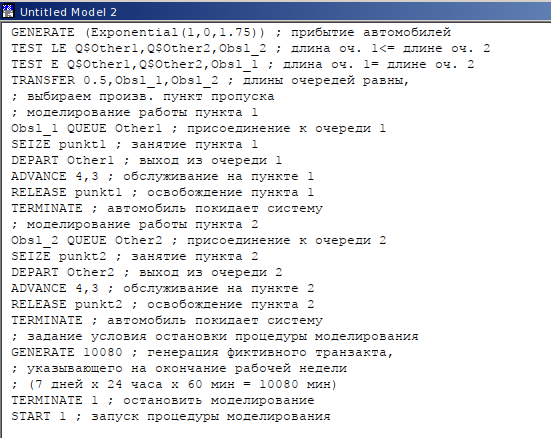{#fig:001 width=50%}

## Модель двух стратегий обслуживания

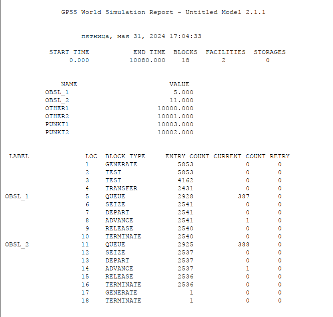{#fig:002 width=50%}

## Модель двух стратегий обслуживания

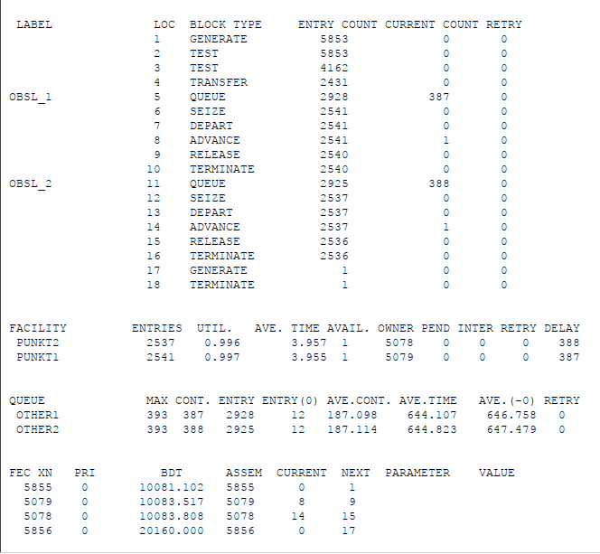{#fig:003 width=50%}

## Модель двух стратегий обслуживания

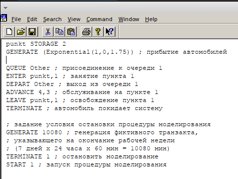{#fig:004 width=50%}

## Модель двух стратегий обслуживания

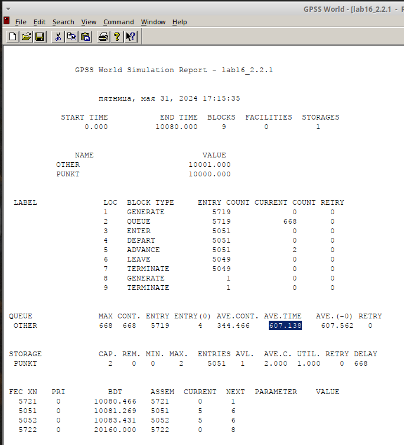{#fig:005 width=50%}

## Модель двух стратегий обслуживания

: Сравнение стратегий:

| Показатель                 | стратегия 1 |         |          |  стратегия 2 |
|----------------------------|-------------|---------|----------|--------------|
|                            | пункт 1     | пункт 2 | в целом  |              |
| Поступило автомобилей      | 2928        | 2925    | 5853     | 5719         |
| Обслужено автомобилей      | 2540        | 2536    | 5076     | 5049         |
| Коэффициент загрузки       | 0,997       | 0,996   | 0,9965   | 1            |
| Максимальная длина очереди | 393         | 393     | 786      | 668          |
| Средняя длина очереди      | 187,098     | 187,114 | 374,212  | 344,466      |
| Среднее время ожидания     | 644,107     | 644,823 | 644,465  | 607,138      |

## Оптимизация модели двух стратегий обслуживания

Изменим модели, чтобы определить оптимальное число пропускных пунктов (от 1 до 4). 

- коэффициент загрузки пропускных пунктов принадлежит интервалу [0, 5; 0, 95];
- среднее число автомобилей, одновременно находящихся на контрольно пропускном пункте, не должно превышать 3;
- среднее время ожидания обслуживания не должно превышать 4 мин.

## Оптимизация модели двух стратегий обслуживания

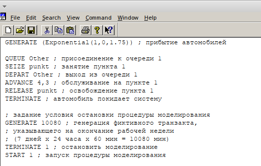{#fig:006 width=50%}

## Оптимизация модели двух стратегий обслуживания

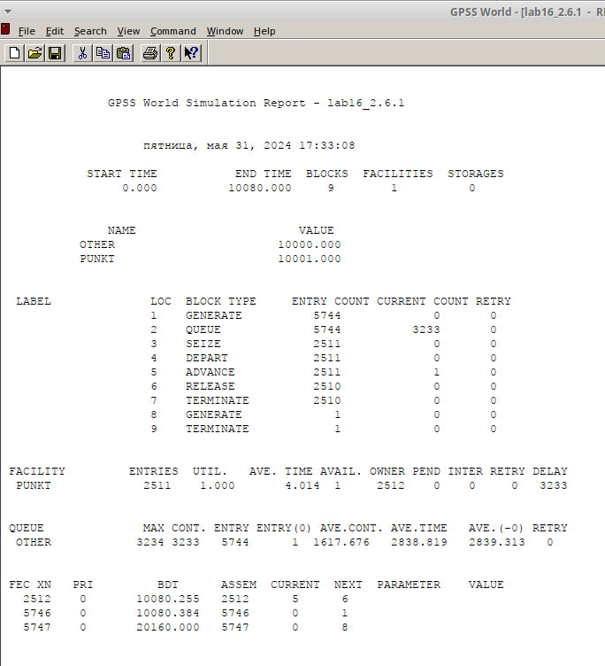{#fig:007 width=50%}

## Оптимизация модели двух стратегий обслуживания

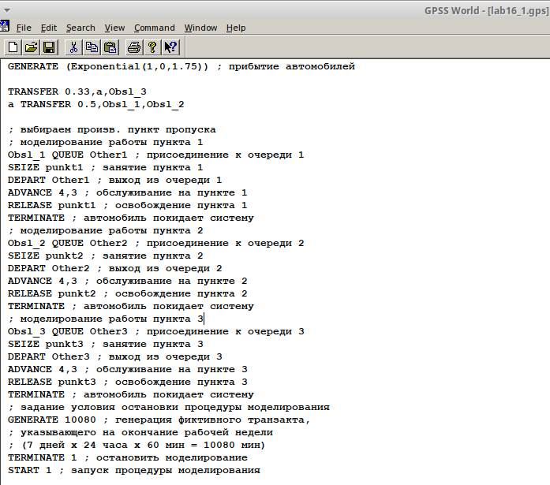{#fig:008 width=50%}

## Оптимизация модели двух стратегий обслуживания

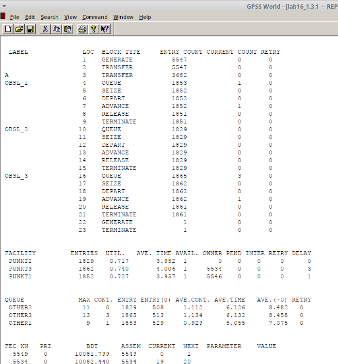{#fig:009 width=50%}

## Оптимизация модели двух стратегий обслуживания

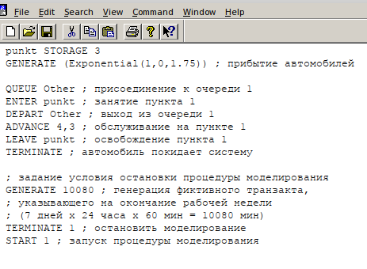{#fig:010 width=50%}

## Оптимизация модели двух стратегий обслуживания

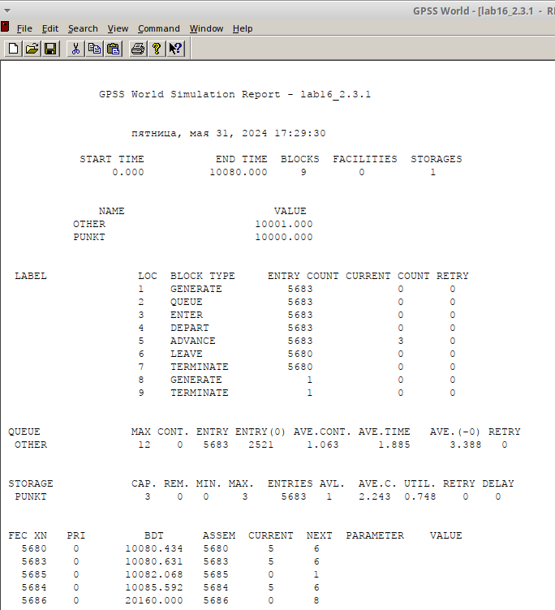{#fig:011 width=50%}

## Оптимизация модели двух стратегий обслуживания

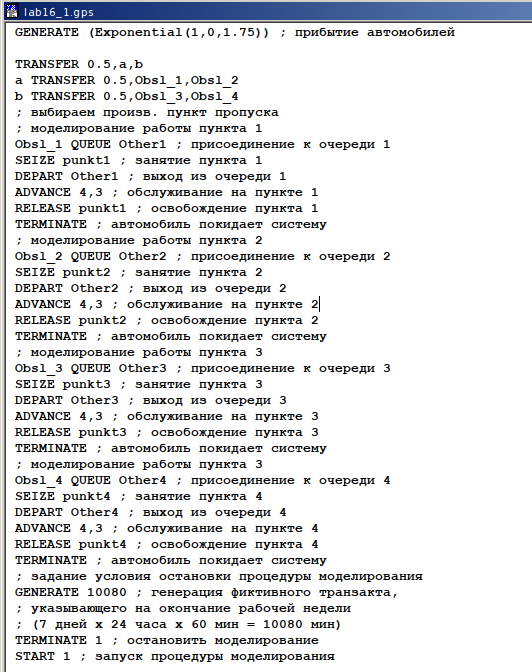{#fig:012 width=50%}

## Оптимизация модели двух стратегий обслуживания

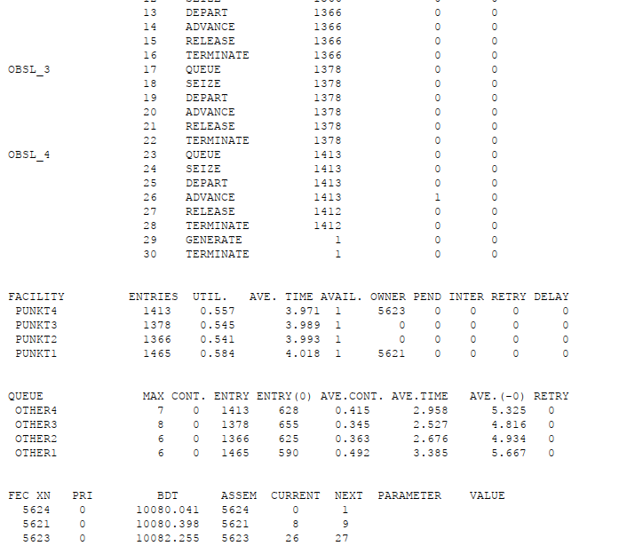{#fig:013 width=50%}

## Оптимизация модели двух стратегий обслуживания

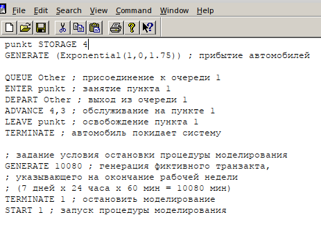{#fig:014 width=50%}

## Оптимизация модели двух стратегий обслуживания

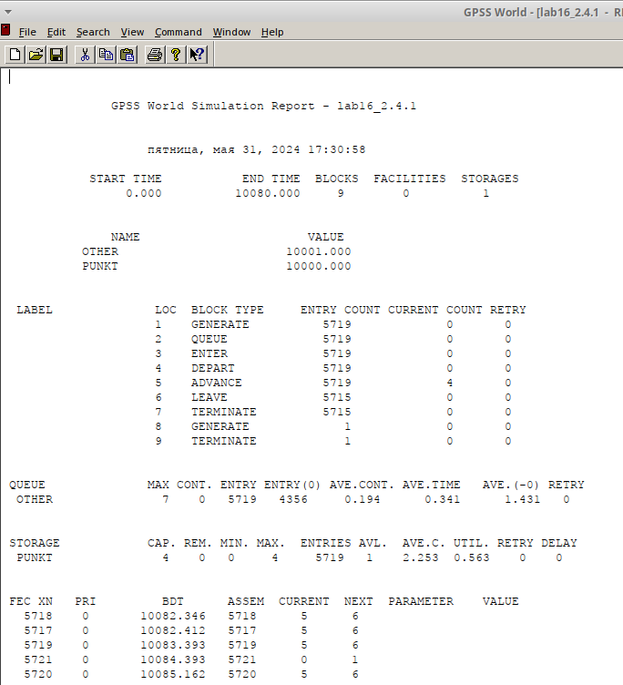{#fig:015 width=50%}

# Выводы

В результате выполнения работы были реализованы с помощью gpss:

- модель с двумя очередями
- модель с одной очередью
- изменение модели для 1-4 пропускных пунктов и выбрано оптимальное количество