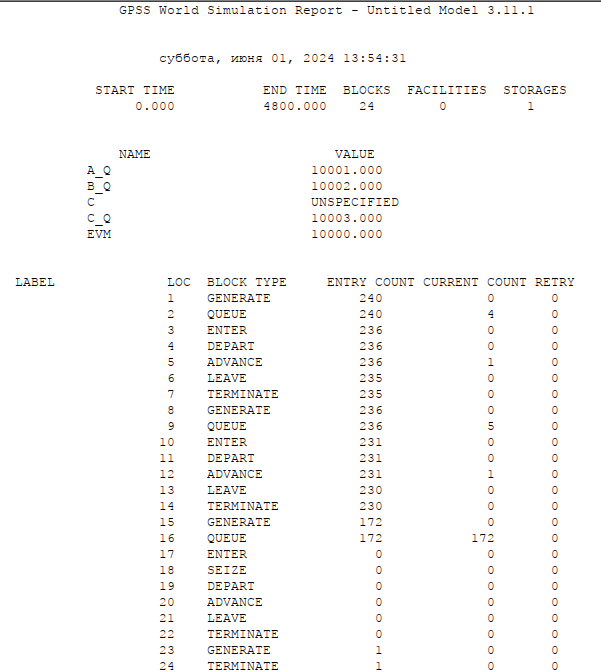
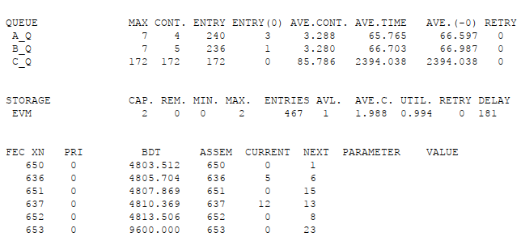
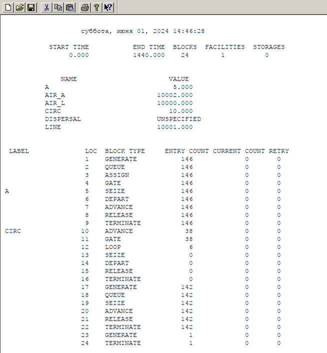
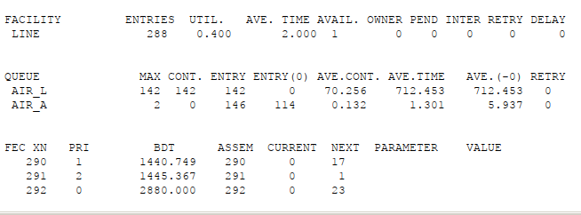
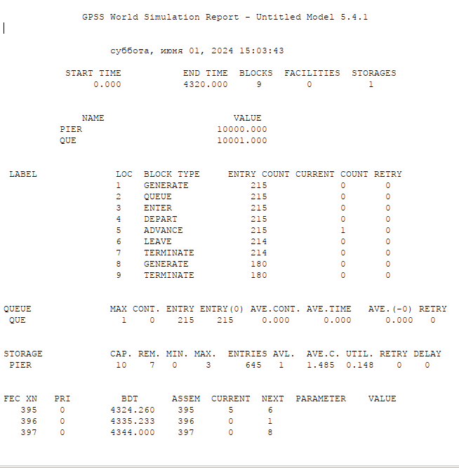
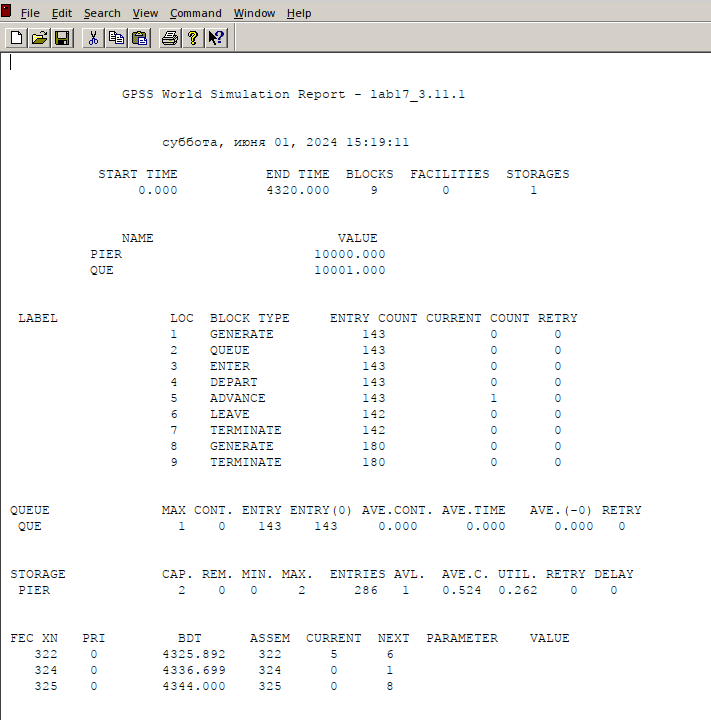

---
## Front matter
lang: ru-RU
title: Лабораторная работа № 17
subtitle: Задания для самостоятельной работы
author:
  - Демидова Е. А.
institute:
  - Российский университет дружбы народов, Москва, Россия
date: 6 июня 2024

## i18n babel
babel-lang: russian
babel-otherlangs: english

## Formatting pdf
toc: false
toc-title: Содержание
slide_level: 2
aspectratio: 169
section-titles: true
theme: metropolis
header-includes:
 - \metroset{progressbar=frametitle,sectionpage=progressbar,numbering=fraction}
 - '\makeatletter'
 - '\beamer@ignorenonframefalse'
 - '\makeatother'
---

# Вводная часть

**Цель работы**

Реализовать с помощью gpss модели работы вычислительного центра, аэропорта и морского порта.

**Задание**

Реализовать с помощью gpss:

- модель работы вычислительного центра
- модель работы аэропорта
- модель работы морского порта


# Выполнение лабораторной работы

## Моделирование работы вычислительного центра

```
evm STORAGE 2
;A
GENERATE 20,5
QUEUE A_q
ENTER evm,1
DEPART A_q
ADVANCE 20,5
LEAVE evm,1
TERMINATE 0
```

## Моделирование работы вычислительного центра

```
;B
GENERATE 20,10
QUEUE B_q
ENTER evm,1
DEPART B_q
ADVANCE 21,3
LEAVE evm,1
TERMINATE 0
```

## Моделирование работы вычислительного центра

```
;C
GENERATE 28,5
QUEUE C_q
ENTER evm,2
SEIZE C
DEPART C_q
ADVANCE 28,5
LEAVE evm,2
TERMINATE 0

;timer
GENERATE 4800
TERMINATE 1
START 1
```

## Моделирование работы вычислительного центра

{#fig:001 width=45%}

## Моделирование работы вычислительного центра

{#fig:002 width=70%}

## Модель работы аэропорта

```
;arrive
GENERATE 10,5,,,2
QUEUE air_a
ASSIGN 1,5
GATE NU line,circ
a SEIZE line
DEPART air_a
ADVANCE 2
RELEASE line
TERMINATE 0
```

## Модель работы аэропорта

```
;wait
circ ADVANCE 5
GATE U line,a
LOOP 1,circ
SEIZE dispersal
DEPART air_a
RELEASE dispersal
TERMINATE 0
```

## Модель работы аэропорта

```
;leave
GENERATE 10,2,,,1
QUEUE air_l
SEIZE line
ADVANCE 2
RELEASE line
TERMINATE 0

;timer
GENERATE 1440
TERMINATE 1
START 1
```

## Модель работы аэропорта

{#fig:003 width=45%}

## Модель работы аэропорта

{#fig:004 width=70%}

## Моделирование работы морского порта

```
pier STORAGE 10

GENERATE 20,5
QUEUE que
ENTER pier,3
DEPART que
ADVANCE 10,3
LEAVE pier,3
TERMINATE 0
;timer
GENERATE 24 ; день
TERMINATE 1
START 180 ; полгода
```

## Моделирование работы морского порта

{#fig:005 width=45%}

## Моделирование работы морского порта

{#fig:006 width=45%}

## Моделирование работы морского порта

```
pier STORAGE 6

GENERATE 30,10
QUEUE que
ENTER pier,2
DEPART que
ADVANCE 8,4
LEAVE pier,2
TERMINATE 0
;timer
GENERATE 24 ; день
TERMINATE 1
START 180 ; полгода
```

## Моделирование работы морского порта

{#fig:007 width=45%}

## Моделирование работы морского порта

{#fig:008 width=45%}

# Выводы

В результате выполнения работы были реализованы с помощью gpss:

- модель работы вычислительного центра
- модель работы аэропорта
- модель работы морского порта